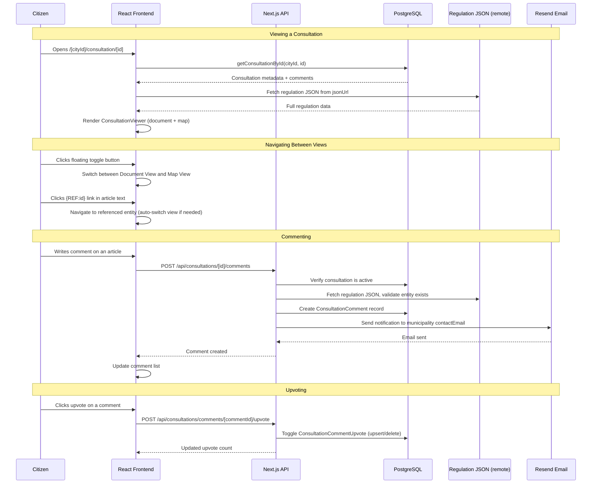

# Public Consultations

## Concept

A regulation viewer and public feedback platform that enables municipalities to publish consultations on regulatory texts. Citizens can read structured regulation documents, explore geographic areas on an interactive map, leave comments on specific articles or locations, and upvote other comments. The system is driven by a JSON regulation file that defines chapters, articles, and geosets with geographic geometries.

## Architectural Overview

The consultation feature operates as a JSON-driven, dual-view interface:

1. **Regulation JSON**: Each consultation points to a remote JSON file (`jsonUrl`) that defines the entire regulation structure — chapters, articles, geographic areas, cross-references, and definitions. The schema is defined in [`json-schemas/regulation.schema.json`](../../json-schemas/regulation.schema.json).
2. **Database Layer**: Prisma stores consultation metadata (name, end date, active status), comments, and upvotes. Comments are entity-scoped — tied to a specific chapter, article, geoset, or geometry by `entityType` + `entityId`.
3. **Frontend Layer**: A `ConsultationViewer` client component orchestrates two views — a Document View (chapters/articles with markdown content) and a Map View (Mapbox-powered geographic visualization). A floating action button toggles between them.
4. **Comment System**: Authenticated users can leave HTML-rich comments on any entity. Comments support upvoting and trigger email notifications to the municipality's contact address.
5. **Admin Geo-Editor**: Administrators can draw missing geometries directly on the map when regulation text defines areas textually but lacks GeoJSON coordinates. Edits are stored in localStorage and exported as a complete updated regulation JSON.

The consultation feature is gated per-city via the `consultationsEnabled` flag on the City model.

## Regulation JSON Structure

The regulation JSON file is the core data source for each consultation. It follows a schema defined in [`json-schemas/regulation.schema.json`](../../json-schemas/regulation.schema.json).

**Root properties:**
- `title`, `summary` — regulation metadata (summary supports markdown with `{REF:id}` and `{DEF:id}` references)
- `contactEmail`, `ccEmails` — where citizen feedback emails are sent
- `sources` — array of source documents (`{title, url, description?}`)
- `definitions` — dictionary of terms that can be referenced via `{DEF:id}` in markdown
- `defaultVisibleGeosets` — which geosets are visible on the map by default
- `regulation` — array of `Chapter` and `GeoSet` items (the main content)

**Chapter** (`type: "chapter"`):
- `num`, `id`, `title`, `summary`, `preludeBody` (intro markdown before articles)
- `articles[]` — each with `num`, `id`, `title`, `summary`, `body` (markdown)

**GeoSet** (`type: "geoset"`):
- `id`, `name`, `description`, `color` (hex)
- `geometries[]` — individual geographic shapes

**Geometry** types:
- `point` — single location with GeoJSON Point
- `circle` — point with radius
- `polygon` — area boundary with GeoJSON Polygon
- `derived` — computed from other geosets via `buffer` (zone around source) or `difference` (subtract geosets from base) operations

**Cross-Reference System:**
Markdown content can include `{REF:id}` to link to any chapter, article, geoset, or geometry. When clicked, the viewer navigates to the referenced entity (switching views if needed). `{DEF:id}` links to term definitions shown inline.

## Sequence Diagram

## Key Component Pointers

* **Data Models**:
    * `Consultation`: [`prisma/schema.prisma`](../../prisma/schema.prisma) (id, name, jsonUrl, endDate, isActive, cityId)
    * `ConsultationComment`: [`prisma/schema.prisma`](../../prisma/schema.prisma) (entity-scoped via entityType + entityId)
    * `ConsultationCommentUpvote`: [`prisma/schema.prisma`](../../prisma/schema.prisma) (unique constraint on userId + commentId)
    * `City.consultationsEnabled`: Feature flag gating the consultations tab

* **JSON Schema**:
    * Regulation schema: [`json-schemas/regulation.schema.json`](../../json-schemas/regulation.schema.json) (JSON Schema Draft 7 defining chapters, articles, geosets, geometries, references, definitions)

* **Database Functions**:
    * `getConsultationsForCity()`: [`src/lib/db/consultations.ts`](../../src/lib/db/consultations.ts) (active consultations only, ordered by end date)
    * `getAllConsultationsForCity()`: [`src/lib/db/consultations.ts`](../../src/lib/db/consultations.ts) (all consultations including inactive, used on listing page)
    * `getConsultationById()`: [`src/lib/db/consultations.ts`](../../src/lib/db/consultations.ts) (single consultation with computed active status)
    * `addConsultationComment()`: [`src/lib/db/consultations.ts`](../../src/lib/db/consultations.ts) (validates entity exists in regulation JSON, sends email)
    * `toggleCommentUpvote()`: [`src/lib/db/consultations.ts`](../../src/lib/db/consultations.ts) (toggle on/off, returns new count)
    * `deleteConsultationComment()`: [`src/lib/db/consultations.ts`](../../src/lib/db/consultations.ts) (owner-only, cascades to upvotes)
    * `isConsultationActive()`: [`src/lib/db/consultations.ts`](../../src/lib/db/consultations.ts) (checks isActive flag AND end date with timezone awareness)

* **API Endpoints**:
    * `GET/POST /api/consultations/[id]/comments`: [`src/app/api/consultations/[id]/comments/route.ts`](../../src/app/api/consultations/%5Bid%5D/comments/route.ts) (list and create comments)
    * `POST /api/consultations/comments/[commentId]/upvote`: [`src/app/api/consultations/comments/[commentId]/upvote/route.ts`](../../src/app/api/consultations/comments/%5BcommentId%5D/upvote/route.ts) (toggle upvote)
    * `DELETE /api/consultations/comments/[commentId]/delete`: [`src/app/api/consultations/comments/[commentId]/delete/route.ts`](../../src/app/api/consultations/comments/%5BcommentId%5D/delete/route.ts) (owner-only deletion)

* **Pages**:
    * Consultations listing: [`src/app/[locale]/(city)/[cityId]/(other)/(tabs)/consultations/page.tsx`](../../src/app/%5Blocale%5D/(city)/%5BcityId%5D/(other)/(tabs)/consultations/page.tsx) (all consultations for a city)
    * Consultation detail: [`src/app/[locale]/(city)/[cityId]/consultation/[id]/page.tsx`](../../src/app/%5Blocale%5D/(city)/%5BcityId%5D/consultation/%5Bid%5D/page.tsx) (viewer with document + map)
    * Comments print view: [`src/app/[locale]/(city)/[cityId]/consultation/[id]/comments/page.tsx`](../../src/app/%5Blocale%5D/(city)/%5BcityId%5D/consultation/%5Bid%5D/comments/page.tsx) (print-friendly comment summary)
    * Layout: [`src/app/[locale]/(city)/[cityId]/consultation/[id]/layout.tsx`](../../src/app/%5Blocale%5D/(city)/%5BcityId%5D/consultation/%5Bid%5D/layout.tsx) (header, footer, feature-flag check)

* **Frontend Components** (all under `src/components/consultations/`):
    * `ConsultationViewer`: Master orchestrator — manages view state (document/map), URL hash navigation, chapter expansion, reference click handling
    * `ConsultationHeader`: Title, status badge (Active/Inactive), end date, comment count
    * `ConsultationDocument`: Renders chapters/articles with expand/collapse, AI summary cards, sources list
    * `ChapterView` / `ArticleView`: Individual chapter and article renderers with comment counts, permalinks, collapsible content
    * `MarkdownContent`: Renders markdown with `{REF:id}` and `{DEF:id}` pattern handling as interactive links
    * `ConsultationMap`: Mapbox map with geoset rendering, layer controls, detail panel, derived geometry computation (buffer/difference)
    * `LayerControlsPanel` / `LayerControlsButton`: Sidebar for toggling geoset/geometry visibility with checkbox tree UI
    * `DetailPanel`: Side sheet showing selected geoset/geometry info with description, textual definition, and comments
    * `GeoSetItem` / `GeometryItem`: Tree items in layer controls with checkboxes, color swatches, and comment counts
    * `CommentSection`: Rich text editor (ReactQuill), authentication check, comment display with upvotes and delete
    * `CommentsOverviewSheet`: Modal listing all comments with sort options (recent/likes), entity type badges, navigation
    * `AISummaryCard`: Collapsible card for AI-generated summaries on chapters/articles
    * `SourcesList`: Regulation source documents and contact information
    * `PermalinkButton`: Copy-to-clipboard link for any entity
    * `DocumentNavigation`: Sticky sidebar with chapter/article outline
    * `ViewToggleButton`: Floating button to switch between document and map views
    * `EditingToolsPanel`: Admin drawing tools for map geometry editing
    * `PrintButton`: Triggers native print dialog on comments page

* **City-Level Component**:
    * `CityConsultations`: [`src/components/cities/CityConsultations.tsx`](../../src/components/cities/CityConsultations.tsx) (card grid listing for city consultations tab)

* **Types**:
    * `RegulationData`, `Chapter`, `Article`, `GeoSet`, `Geometry`, etc.: [`src/components/consultations/types.ts`](../../src/components/consultations/types.ts)

* **Email**:
    * Template: [`src/lib/email/templates/consultation-comment.tsx`](../../src/lib/email/templates/consultation-comment.tsx) (React Email HTML template with entity permalink)
    * Sender: [`src/lib/email/consultation.ts`](../../src/lib/email/consultation.ts) (sends via Resend to contactEmail + ccEmails)

## Business Rules & Assumptions

### Feature Gating
1. Consultations are only visible for cities where `consultationsEnabled` is `true`
2. The consultation listing page and detail page both check this flag

### Active Status
1. A consultation is active when **both** `isActive` is `true` in the database **and** `endDate` has not passed
2. End date comparison is timezone-aware using the city's timezone (via `date-fns-tz`)
3. Inactive consultations are visible on the listing page but comments are disabled

### Comments
1. Only authenticated users can create comments
2. Comments are entity-scoped: each comment targets a specific `entityType` (CHAPTER, ARTICLE, GEOSET, GEOMETRY) and `entityId`
3. Before saving, the API fetches the regulation JSON and validates the target entity actually exists
4. Comment body is validated: non-empty, max 5000 characters
5. HTML in comments is sanitized to allow only safe tags (`p`, `strong`, `em`, `a`, `ul`, `ol`, `li`)
6. Comments can only be deleted by their author
7. Upvotes use a unique constraint (`userId`, `commentId`) for toggle behavior
8. Each new comment triggers an email notification to the municipality (`contactEmail` from the regulation JSON, CC'd to `ccEmails`)

### Regulation JSON
1. The regulation JSON is fetched from a remote URL stored in `Consultation.jsonUrl`
2. It is fetched at page load on the detail page and cached for entity validation in comment creation
3. The schema supports both static geometries (with GeoJSON coordinates) and derived geometries (computed via buffer/difference operations)
4. Geometries may have a `textualDefinition` but null `geojson` — the admin geo-editor addresses this gap

### Map & Geo-Editor
1. The map uses Mapbox GL with custom styling for different geosets (each has a `color`)
2. `defaultVisibleGeosets` in the regulation JSON controls initial map layer visibility
3. Derived geometries are computed client-side using Turf.js operations
4. The admin geo-editor stores drawn geometries in browser `localStorage` until exported
5. Export produces a complete updated `regulation.json` merging local edits with original data
6. Only super-administrators can access editing mode

### Navigation
1. URL hash anchors (`#chapter-1`, `#article-3`, `#geoset-prohibited_areas`) enable deep linking to specific entities
2. `{REF:id}` links in markdown content navigate to the referenced entity, switching between document and map views as needed
3. The comments print page orders comments by document structure (chapters/articles first, then geosets/geometries)

### Multi-Tenancy
1. All consultation data is city-scoped — queries always filter by `cityId`
2. Comments store both `consultationId` and `cityId` for multi-tenant isolation
3. Database indexes optimize queries on `(cityId, isActive)` and `(consultationId, entityType, entityId)`
