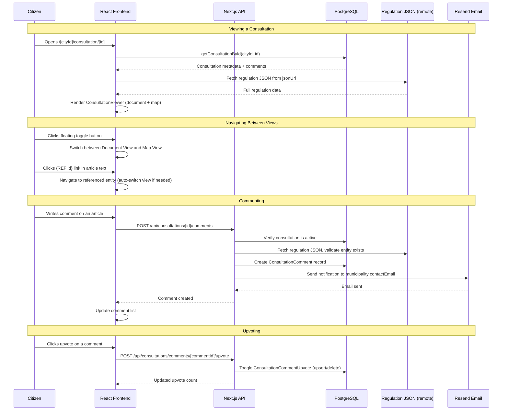

# Public Consultations

## Concept

A regulation viewer and public feedback platform that enables municipalities to publish consultations on regulatory texts. Citizens can read structured regulation documents, explore geographic areas on an interactive map, leave comments on specific articles or locations, and upvote other comments. The system is driven by a JSON regulation file that defines chapters, articles, and geosets with geographic geometries.

## Architectural Overview

The consultation feature is a JSON-driven viewer with a few plain screens:

1. **Regulation JSON**: Each consultation points to a remote JSON file (`jsonUrl`) that defines the entire regulation structure — chapters, articles, geographic areas, cross-references, and definitions. The schema is defined in [`json-schemas/regulation.schema.json`](../../json-schemas/regulation.schema.json).
2. **Database Layer**: Prisma stores consultation metadata (name, end date, active status), comments, and upvotes. Comments are entity-scoped — tied to a specific chapter, article, geoset, or geometry by `entityType` + `entityId`.
3. **Frontend Layer**: A `ConsultationViewer` client component shows one screen at a time. The screen is the `view` query parameter: `home` asks for the reader's address, `street` shows what changes at it, `map` shows every place, `comment` is the form for one entity, `plan` shows the summary cards, `comments` lists every comment, and `document` is the full text. On a phone each screen is a page. On a computer the map stays on screen and a side panel shows the screen.
4. **Comment System**: Readers leave plain-text comments on any entity. A signed-in reader's comment goes live at once. A signed-out reader gives a name and an email, and the comment goes live when they open the link in the email. Comments support upvoting and trigger email notifications to the municipality's contact address.
5. **Admin Geo-Editor**: Administrators can draw missing geometries directly on the map when regulation text defines areas textually but lacks GeoJSON coordinates. Edits are stored in localStorage and exported as a complete updated regulation JSON.

The consultation feature is gated per-city via the `consultationsEnabled` flag on the City model.

## Regulation JSON Structure

The regulation JSON file is the core data source for each consultation. It follows a schema defined in [`json-schemas/regulation.schema.json`](../../json-schemas/regulation.schema.json).

**Root properties:**
- `title`, `summary` — regulation metadata (summary supports markdown with `{REF:id}` and `{DEF:id}` references)
- `contactEmail`, `ccEmails` — where citizen feedback emails are sent
- `sources` — array of source documents (`{title, url, description?}`)
- `definitions` — dictionary of terms that can be referenced via `{DEF:id}` in markdown
- `defaultView` — the first screen (`"map"` or `"document"`) when the regulation has no `addressLookup` and no `overview`. With either of them the first screen is `home`
- `defaultVisibleGeosets` — which geosets are visible on the map by default
- `addressLookup` — what the `street` screen shows for the reader's address ("Βρες τον δρόμο σου"). Without it the start screen has no address box:
    - `zoneGeoSetId` — the area geoset that answers "which zone am I in"
    - `streetGeoSetIds`, `streetRadiusMeters` (30), `streetMaxItems` (4) — the area geometries on the reader's street, nearest first. The default is every area geoset except the zone geoset
    - `nearbyGeoSetIds`, `nearbyRadiusMeters` (400) — the nearest geometry of each of these geosets. The default is every point geoset
    - `noZoneText` — markdown for an address outside every zone
- `overview` — the cards of the `plan` screen ("the plan in two minutes"): `{id, title, body, commentOn?, commentLabel?, explains?, linkLabel?}`. `body` is markdown. `commentOn` is the entity that the card's comment link targets. `explains` lists the geosets that the card explains: a place of those geosets links to the card, with `linkLabel` as the link text. Without `overview` there is no `plan` screen
- `regulation` — array of `Chapter` and `GeoSet` items (the main content). Order is draw order on the map: a later geoset draws on top and wins clicks, so put large areas (zones, communities) first and small clickable shapes after them

**Chapter** (`type: "chapter"`):
- `num`, `id`, `title`, `summary`, `preludeBody` (intro markdown before articles)
- `articles[]` — each with `num`, `id`, `title`, `summary`, `body` (markdown)

**GeoSet** (`type: "geoset"`):
- `id`, `name`, `description`, `color` (hex)
- `legend` — the short label of the geoset's filter chip on the map. A chip also controls the unlabelled geosets of its colour. When no geoset has a `legend`, the map shows one chip per geoset, labelled with its `name`
- `mapStyle` — optional rendering hints: `fillOpacity` (default 0.4), `strokeWidth` (px; the circle radius for points), `showLabels` (false: no map labels for this geoset, e.g. hundreds of parking strips that would hide the street names), `hover` (false: no hover highlight for areas that sit under other clickable shapes)
- `geometries[]` — individual geographic shapes

**Geometry** text: every screen names a place the same way. The geoset's `name` says what it is ("Θέσεις κατοίκων"). The geometry's `name` says where it is ("Βουτσινά, δεξιά πλευρά, από Κύπρου προς Αναστάσεως"). `textualDefinition` gives one detail ("περίπου 12 θέσεις"). `description` gives one sentence of meaning.

**Geometry** types:
- `point` — single location with GeoJSON Point
- `circle` — point with radius
- `polygon` — area boundary with GeoJSON Polygon or MultiPolygon
- `derived` — computed from other geosets via `buffer` (zone around source) or `difference` (subtract geosets from base) operations

**Cross-Reference System:**
Markdown content can include `{REF:id}` to link to any chapter, article, geoset, or geometry. When clicked, the viewer navigates to the referenced entity (switching views if needed). `{DEF:id}` links to term definitions shown inline.

## Sequence Diagram

```mermaid
sequenceDiagram
    participant Citizen as Citizen
    participant Frontend as React Frontend
    participant API as Next.js API
    participant DB as PostgreSQL
    participant JSON as Regulation JSON (remote)
    participant Email as Resend Email

    Note over Citizen, Email: Viewing a Consultation
    Citizen->>Frontend: Opens /[cityId]/consultation/[id]
    Frontend->>DB: getConsultationById(cityId, id)
    DB-->>Frontend: Consultation metadata + comments
    Frontend->>JSON: Fetch regulation JSON from jsonUrl
    JSON-->>Frontend: Full regulation data
    Frontend->>Frontend: Render ConsultationViewer (document + map)

    Note over Citizen, Email: Navigating Between Views
    Citizen->>Frontend: Clicks floating toggle button
    Frontend->>Frontend: Switch between Document View and Map View
    Citizen->>Frontend: Clicks {REF:id} link in article text
    Frontend->>Frontend: Navigate to referenced entity (auto-switch view if needed)

    Note over Citizen, Email: Commenting
    Citizen->>Frontend: Writes comment on an article
    Frontend->>API: POST /api/consultations/[id]/comments
    API->>DB: Verify consultation is active
    API->>JSON: Fetch regulation JSON, validate entity exists
    API->>DB: Create ConsultationComment record
    API->>Email: Send notification to municipality contactEmail
    Email-->>API: Email sent
    API-->>Frontend: Comment created
    Frontend->>Frontend: Update comment list

    Note over Citizen, Email: Upvoting
    Citizen->>Frontend: Clicks upvote on a comment
    Frontend->>API: POST /api/consultations/comments/[commentId]/upvote
    API->>DB: Toggle ConsultationCommentUpvote (upsert/delete)
    API-->>Frontend: Updated upvote count
```

## Key Component Pointers

* **Data Models**:
    * `Consultation`: [`prisma/schema.prisma`](../../prisma/schema.prisma) (id, name, jsonUrl, endDate, isActive, cityId)
    * `ConsultationComment`: [`prisma/schema.prisma`](../../prisma/schema.prisma) (entity-scoped via entityType + entityId)
    * `ConsultationCommentUpvote`: [`prisma/schema.prisma`](../../prisma/schema.prisma) (unique constraint on userId + commentId)
    * `PendingConsultationComment`: [`prisma/schema.prisma`](../../prisma/schema.prisma) (a signed-out reader's comment until they confirm their email)
    * `City.consultationsEnabled`: Feature flag gating the consultations tab

* **JSON Schema**:
    * Regulation schema: [`json-schemas/regulation.schema.json`](../../json-schemas/regulation.schema.json) (JSON Schema Draft 7 defining chapters, articles, geosets, geometries, references, definitions)

* **Database Functions**:
    * `getConsultationsForCity()`: [`src/lib/db/consultations.ts`](../../src/lib/db/consultations.ts) (active consultations only, ordered by end date)
    * `getAllConsultationsForCity()`: [`src/lib/db/consultations.ts`](../../src/lib/db/consultations.ts) (all consultations including inactive, used on listing page)
    * `getConsultationById()`: [`src/lib/db/consultations.ts`](../../src/lib/db/consultations.ts) (single consultation with computed active status)
    * `addConsultationComment()`: [`src/lib/db/consultations.ts`](../../src/lib/db/consultations.ts) (signed-in reader: validates that the entity exists in the regulation JSON, stores the plain text as HTML, sends email)
    * `submitPendingConsultationComment()`: [`src/lib/db/consultations.ts`](../../src/lib/db/consultations.ts) (signed-out reader: finds or creates the user by email, stores a pending comment, sends a magic link back to the comment screen)
    * `publishPendingConsultationComments()`: [`src/lib/db/consultationComments.ts`](../../src/lib/db/consultationComments.ts) (called by the Auth.js `signIn` event; publishes the reader's pending comments)
    * `toggleCommentUpvote()`: [`src/lib/db/consultations.ts`](../../src/lib/db/consultations.ts) (toggle on/off, returns new count)
    * `deleteConsultationComment()`: [`src/lib/db/consultations.ts`](../../src/lib/db/consultations.ts) (owner-only, cascades to upvotes)
    * `isConsultationActive()`: [`src/lib/db/consultations.ts`](../../src/lib/db/consultations.ts) (checks isActive flag AND end date with timezone awareness)

* **API Endpoints**:
    * `GET/POST /api/consultations/[id]/comments`: [`src/app/api/consultations/[id]/comments/route.ts`](../../src/app/api/consultations/%5Bid%5D/comments/route.ts) (list and create comments; a POST without a session but with `name` and `email` stores a pending comment and returns 202)
    * `POST /api/consultations/comments/[commentId]/upvote`: [`src/app/api/consultations/comments/[commentId]/upvote/route.ts`](../../src/app/api/consultations/comments/%5BcommentId%5D/upvote/route.ts) (toggle upvote)
    * `DELETE /api/consultations/comments/[commentId]/delete`: [`src/app/api/consultations/comments/[commentId]/delete/route.ts`](../../src/app/api/consultations/comments/%5BcommentId%5D/delete/route.ts) (owner-only deletion)

* **Pages**:
    * Consultations listing: [`src/app/[locale]/(city)/[cityId]/(other)/(tabs)/consultations/page.tsx`](../../src/app/%5Blocale%5D/(city)/%5BcityId%5D/(other)/(tabs)/consultations/page.tsx) (all consultations for a city)
    * Consultation detail: [`src/app/[locale]/(city)/[cityId]/consultation/[id]/page.tsx`](../../src/app/%5Blocale%5D/(city)/%5BcityId%5D/consultation/%5Bid%5D/page.tsx) (renders the site header and passes it to the viewer)
    * Comments print view: [`src/app/[locale]/(city)/[cityId]/consultation/[id]/comments/page.tsx`](../../src/app/%5Blocale%5D/(city)/%5BcityId%5D/consultation/%5Bid%5D/comments/page.tsx) (print-friendly comment summary)
    * Layout: [`src/app/[locale]/(city)/[cityId]/consultation/[id]/layout.tsx`](../../src/app/%5Blocale%5D/(city)/%5BcityId%5D/consultation/%5Bid%5D/layout.tsx) (feature-flag and existence checks only; the viewer places the site header, and the print page draws the header and footer itself)

* **Frontend Components** (all under `src/components/consultations/`):
    * `ConsultationViewer`: Reads the screen from the URL, keeps the reader's address in session storage, computes the address lookup, and lays the screens out for a phone or a computer
    * `consultationUrl.ts`: The URL model. `comment` and `plan` keep any entity; `home`, `street` and `comments` take none; for `map` and `document` the entity's type decides the screen
    * `entityDisplay.ts`: `describeEntity()` gives every screen the same what, where, detail and meaning for an entity
    * `addressLookup.ts`: `computeAddressLookup()` finds the zone, the street's geometries and the nearby points for an address
    * `views/`: One component per screen — `HomeView`, `StreetView` (with `MiniMap` on a phone), `PlaceView` (the phone's card over the map, the computer's panel), `CommentView`, `PlanView`, `CommentsView` (with `CommentList`) and `StudyView`. `views/ui.tsx` holds the shared styles and `ViewLink`
    * `ConsultationBar`: The computer's bar under the site header — title, deadline, and links to the plan, the comments and the study
    * `ConsultationMap`: Mapbox map with geoset rendering, the address search bar (`views/AddressSearchBar`), filter chips, the address pin, selection and street outlines, derived geometry computation (buffer/difference), and the superadmin geo-editor
    * `ConsultationDocument`: Renders chapters and articles with expand/collapse and the sources list
    * `ChapterView` / `ArticleView`: Chapter and article renderers with comment counts, permalinks, and a link to the comment screen
    * `MarkdownContent`: Renders markdown with `{REF:id}` and `{DEF:id}` pattern handling as interactive links
    * `LayerControlsPanel`, `GeoSetItem`, `GeometryItem`, `EditingToolsPanel`: The geo-editor (superadmins only)
    * `SourcesList`: Regulation source documents and contact information
    * `PermalinkButton`: Copy-to-clipboard link for any entity
    * `DocumentNavigation`: Fixed outline of the current chapter and article, on wide screens only
    * `PrintButton`: Triggers native print dialog on comments page

* **City-Level Component**:
    * `CityConsultations`: [`src/components/cities/CityConsultations.tsx`](../../src/components/cities/CityConsultations.tsx) (card grid listing for city consultations tab)

* **Types**:
    * `RegulationData`, `Geometry`, `CurrentUser`, `GeoSetData`, `SEARCH_COLORS`, etc.: [`src/components/consultations/types.ts`](../../src/components/consultations/types.ts) (shared types used across all consultation components)

* **Email**:
    * Template: [`src/lib/email/templates/consultation-comment.tsx`](../../src/lib/email/templates/consultation-comment.tsx) (React Email HTML template with entity permalink)
    * Sender: [`src/lib/email/consultation.ts`](../../src/lib/email/consultation.ts) (sends via Resend to contactEmail + ccEmails)

## Scripts & Tooling

Regulation JSON files are produced through a pipeline of scripts. Each consultation may use a different subset depending on the source material.

### PDF-to-JSON Conversion

[`scripts/convert-regulation-pdf.ts`](../../scripts/convert-regulation-pdf.ts)

Converts a regulation PDF into a structured regulation JSON file using Claude AI. The script extracts text from the PDF, sends it to the Anthropic API with the regulation JSON schema as guidance, and validates the output against `json-schemas/regulation.schema.json`. Best suited for text-heavy regulations with chapters and articles.

**Used by**: Scooter regulation — the source PDF contained the full legal text, chapter structure, and coordinate data embedded in textual definitions.

### Coordinate Transformation

[`scripts/transform-regulation-coordinates.ts`](../../scripts/transform-regulation-coordinates.ts)

Transforms coordinates embedded in regulation JSON from GGRS87 (Greek Grid) projection to WGS84 (standard GeoJSON). Parses `textualDefinition` and `description` fields for coordinate patterns like `X: 123456, Y: 789012`, converts them using proj4, and writes GeoJSON Point geometries back into the file.

**Used by**: Scooter regulation — the source PDF contained GGRS87 coordinates that needed transformation to WGS84 for Mapbox rendering.

### Address Geocoding

[`scripts/geocode-regulation-addresses.ts`](../../scripts/geocode-regulation-addresses.ts)

Geocodes point geometries that have a `textualDefinition` (street address) but no `geojson` coordinates. Uses the Google Geocoding API scoped to Athens with bounds biasing. Validates that results fall within Athens municipality bounds. Produces a failures report for addresses that need manual coordinate entry via the admin geo-editor.

**Options**: `--dry-run` (preview without API calls), `--force` (re-geocode existing), `--delay=N` (rate limiting in ms).

**Used by**: Cooking oil regulation — the source PDF contained 210 street addresses/intersections that needed geocoding to map coordinates.

### Consultation-Specific Generators

Some consultations require a custom generator script when the source material isn't a structured PDF suitable for AI extraction (e.g., tabular address lists, data scraped from documents).

[`scripts/generate-cooking-oil-regulation.ts`](../../scripts/generate-cooking-oil-regulation.ts)

Generates the complete regulation JSON for the Athens cooking oil collection bin consultation. Contains all 210 addresses across 7 Municipal Communities (Δημοτικές Κοινότητες) extracted manually from the source PDF. Each community becomes a geoset with a distinct color, and each address becomes a point geometry.

### Typical Pipeline

| Step | Scooter Regulation | Cooking Oil Regulation | Papagou Parking (ΣΕΣ) |
|------|-------------------|----------------------|----------------------|
| 1. Extract structure | `convert-regulation-pdf.ts` (AI) | `generate-cooking-oil-regulation.ts` (manual) | `python -m ses docx` (report .docx → chapters, tables, figures) |
| 2. Resolve coordinates | `transform-regulation-coordinates.ts` (GGRS87→WGS84) | `geocode-regulation-addresses.ts` (address→lat/lng) | `python -m ses build` (CAD PDF vectors georeferenced against OSM) |
| 3. Fix failures | Admin geo-editor | Admin geo-editor (4 addresses) | `config/street-aliases.json`, `config/id-aliases.json`, `out/diff-report.md` |
| 4. Upload JSON to S3 | Admin dashboard upload | Admin dashboard upload | `generate-parking-regulation.ts` then admin dashboard upload |
| 5. Create DB record | Prisma seed | Admin consultations page | Admin consultations page |

### Parking Consultation Pipeline (Papagou-Cholargou)

[`scripts/parking-consultation/`](../../scripts/parking-consultation/README.md) (Python) and [`scripts/generate-parking-regulation.ts`](../../scripts/generate-parking-regulation.ts)

The source material is two AutoCAD PDF plots (zones, parking organisation per street side) and a technical report. The Python pipeline georeferences each plot from its street labels against OpenStreetMap, reads the filled shapes by colour, joins the triangles that AutoCAD plots for one strip, groups the parking strips into block-side units with stable transliterated ids, clusters the spot symbols, derives the zone areas from the street network's blocks, and converts the report to markdown. The TypeScript generator assembles the regulation JSON from those outputs, names and links every unit, and validates it with the shared [`scripts/lib/regulation-schema.ts`](../../scripts/lib/regulation-schema.ts) plus checks for duplicate ids and dangling `{REF:}` references. The README covers setup, the re-run procedure and the sanity numbers.

## Hosting Regulation JSON Files

Regulation JSON files must be hosted at a publicly accessible URL. The URL is stored in `Consultation.jsonUrl` and fetched by the frontend at page load and by the API during comment validation.

### Uploading via Admin Dashboard

The admin consultations page (`/admin/consultations`) supports uploading and managing regulation JSON files:

1. **New consultation**: In the "Create Consultation" form, either paste a URL directly into the "Regulation JSON URL" field, or click the upload button (↑) to upload a `.json` file to S3. The upload returns a public URL that auto-fills the field.

2. **Update existing consultation**: In the consultations table, hover over the JSON URL column and click the pencil icon to enter edit mode. You can either paste a new URL or click the upload button to replace the file on S3.

### Storage on DigitalOcean Spaces (S3)

Files are uploaded via the `/api/upload` endpoint which:
- Requires authentication (admin or authorized editor)
- Generates a random UUID filename (preserving the `.json` extension)
- Stores files under the `uploads/` prefix in the configured DO Spaces bucket
- Sets `public-read` ACL so the URL is publicly accessible
- Returns the full public URL (e.g., `https://{bucket}.{region}.digitaloceanspaces.com/uploads/{uuid}.json`)

### Workflow for a New Consultation

1. Generate the regulation JSON using the appropriate script (see [Scripts & Tooling](#scripts--tooling))
2. Validate it against `json-schemas/regulation.schema.json`
3. Go to `/admin/consultations` and create a new consultation:
   - Upload the JSON file (or paste an already-hosted URL)
   - Select the city, set name and end date
4. After creation, use the admin geo-editor on the consultation map to draw any missing geometries
5. Export the updated JSON from the geo-editor and re-upload it via the admin table's edit button

### Local Development

For local development, you can place regulation JSON files in the `public/` directory and use relative URLs (e.g., `/regulation-cooking-oil.json`). However, for production and shared environments, always use S3-hosted URLs so the files are accessible regardless of the deployment.

## Business Rules & Assumptions

### Feature Gating
1. Consultations are only visible for cities where `consultationsEnabled` is `true`
2. The consultation listing page and detail page both check this flag

### Active Status
1. A consultation is active when **both** `isActive` is `true` in the database **and** `endDate` has not passed
2. End date comparison is timezone-aware using the city's timezone (via `date-fns-tz`)
3. Inactive consultations are visible on the listing page but comments are disabled

### Comments
1. A signed-in reader's comment goes live at once. A signed-out reader's comment waits in `PendingConsultationComment` until they open the magic link. The Auth.js `signIn` event then publishes it with its original time. A pending comment older than 7 days, or on a consultation that is no longer active, is not published
2. Comments are entity-scoped: each comment targets a specific `entityType` (CHAPTER, ARTICLE, GEOSET, GEOMETRY) and `entityId`
3. Before saving, the API fetches the regulation JSON and validates the target entity actually exists
4. Comment body is validated: non-empty, max 5000 characters
5. Readers write plain text. The server escapes it and stores it as paragraphs and line breaks. Rendering still sanitizes the HTML of older rich-text comments, allowing only safe tags (`p`, `strong`, `em`, `a`, `ul`, `ol`, `li`)
6. Comments can only be deleted by their author
7. Upvotes use a unique constraint (`userId`, `commentId`) for toggle behavior
8. Each new comment triggers an email notification to the municipality (`contactEmail` from the regulation JSON, CC'd to `ccEmails`)

### Regulation JSON
1. The regulation JSON is fetched from a remote URL stored in `Consultation.jsonUrl`
2. It is fetched at page load on the detail page and cached for entity validation in comment creation
3. The schema supports both static geometries (with GeoJSON coordinates) and derived geometries (computed via buffer/difference operations)
4. Geometries may have a `textualDefinition` but null `geojson` — the admin geo-editor addresses this gap

### Map & Geo-Editor
1. The map uses Mapbox GL with custom styling for different geosets (each has a `color`) and always-on street labels
2. `defaultVisibleGeosets` in the regulation JSON controls initial map layer visibility
3. The map auto-fits to all visible features on initial load (unless a hash navigation targets a specific entity)
4. The reader gives an address on the start screen or in the map's search bar. Both use the `useLocationSearch` hook, the same Google Places search as the notifications signup. The `street` screen shows its zone, the geometries on its street (outlined on the map), and the nearest points. The address stays in the tab's session storage and never goes in the URL, so analytics do not record it
5. Clicking any geometry (polygon or point) opens that geometry's card without moving the camera. A click tolerates a few pixels of miss. It prefers a point over a polygon, and an exact polygon hit over a near one, but a polygon within the tolerance beats an area under it (`mapStyle.hover: false`). Deep links and list clicks zoom to the geometry
6. The filter chips show and hide geosets for the current visit
7. Point labels (addresses) appear at higher zoom levels; polygon labels are always on unless the geoset sets `mapStyle.showLabels: false`
8. Derived geometries are computed client-side using buffer/difference operations
9. The admin geo-editor stores drawn geometries in browser `localStorage` until exported
10. Export produces a complete updated `regulation.json` merging local edits with original data
11. Only super-administrators can access editing mode (via the pencil button beside the map's search)

### Phone and Computer Layouts
1. The layout switches at 1024px. Below it each screen is a page with a back link. From it the site header and the consultation bar stay at the top, the map fills the left, and a side panel shows the screen. The study (`document`) is a page on both
2. The layout for the screen comes from CSS, so the server renders the panel. Only the map waits until the browser knows the screen size
3. On a phone the map screen fills the screen without the site header. A tapped place opens a card at the bottom, and zooms keep clear of it
4. Every screen but the phone's map shows the site header

### Navigation
1. The URL holds the screen and the entity: `?view=map&entity=<id>`, `?view=comment&entity=<id>`, `?view=plan&entity=<card id>`. Old hash links (`#article-3`) and a view that does not match the entity are rewritten in place
2. Links between screens change only the query string, through the history API. This avoids a server round trip, and with it a new download of the regulation, on every tap
3. `{REF:id}` links in markdown content open the referenced entity on the map or in the study
4. The comment screen's back link returns to the previous screen. Opened from the email link, it returns to the entity on the map or in the study
5. The comments print page orders comments by document structure (chapters/articles first, then geosets/geometries)

### Multi-Tenancy
1. All consultation data is city-scoped — queries always filter by `cityId`
2. Comments store both `consultationId` and `cityId` for multi-tenant isolation
3. Database indexes optimize queries on `(cityId, isActive)` and `(consultationId, entityType, entityId)`
