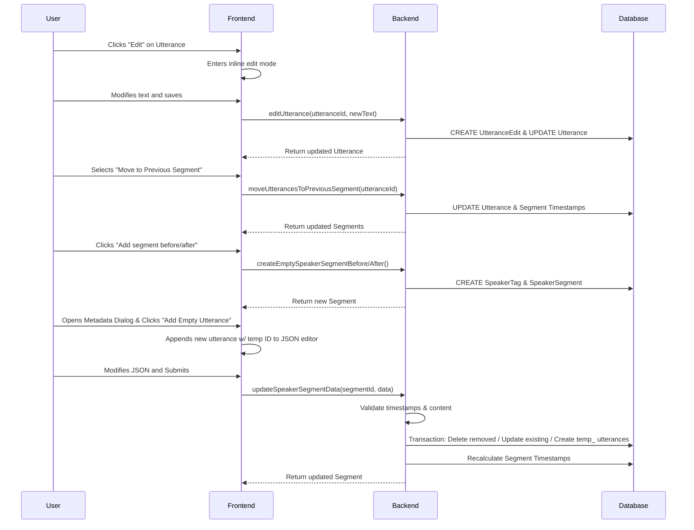

# Editing Interface

**Concept**

The Editing Interface allows authorized users to correct transcript text and reorganize the structure of meeting records. It provides inline text editing with full history tracking and structural tools to move utterances between speaker segments, ensuring accurate and verifiable meeting transcripts.

**Architectural Overview**

The system divides editing into three distinct categories: **Text Content Editing**, **Structural Editing**, and **Segment Management**.

1.  **Text Content Editing**:
    *   Handled by the `Utterance` component in the transcript view.
    *   Users edit text directly inline.
    *   Updates are sent to the backend via the `editUtterance` server action.
    *   **History Tracking**: Critical for auditability, every text change is logged in the `UtteranceEdit` table, preserving the `beforeText`, `afterText`, and the user who made the change. The `Utterance` model itself tracks the `lastModifiedBy` (user or task).

2.  **Structural Editing**:
    *   Handled via context menus or actions on the `Utterance` component.
    *   Includes operations like "Move to Previous Segment" or "Move to Next Segment".
    *   Processed by `moveUtterancesToSegment` in the backend.
    *   These operations modify the `speakerSegmentId` of the utterance and recalculate the timestamps of the affected `SpeakerSegments`.

3.  **Segment Management**:
    *   **Creation**: Users can create new empty speaker segments either after an existing segment or before the very first segment (useful for missed introductions).
    *   **Metadata Inspection**: Super Admins can view detailed metadata (IDs, exact timestamps, word counts) via the `SpeakerSegmentMetadataDialog`.
    *   **Advanced Editing**: The system supports complex segment updates via `updateSpeakerSegmentData`, accessible through the metadata dialog. This allows:
        *   Batch updates of utterances (text, timestamps).
        *   **Adding Utterances**: Users can click "Add Empty Utterance" to append a new placeholder utterance to the segment's JSON data. The backend recognizes these via temporary IDs (`temp_...`) and creates actual records.
        *   Deleting utterances (by removing them from the JSON array).
        *   Automatic recalculation of segment boundaries.

4.  **Automated Corrections**:
    *   Background tasks (like `fixTranscript`) can also modify utterances.
    *   These are treated similarly to user edits but are attributed to 'task' in the `lastModifiedBy` field and `UtteranceEdit` records.

**Sequence Diagram**

**Key Component Pointers**

*   **Data Models**:
    *   `Utterance`: [`prisma/schema.prisma`](../../prisma/schema.prisma)
    *   `UtteranceEdit`: [`prisma/schema.prisma`](../../prisma/schema.prisma)
    *   `SpeakerSegment`: [`prisma/schema.prisma`](../../prisma/schema.prisma)

*   **Frontend Components**:
    *   `Utterance`: [`src/components/meetings/transcript/Utterance.tsx`](../../src/components/meetings/transcript/Utterance.tsx)
    *   `SpeakerSegment`: [`src/components/meetings/transcript/SpeakerSegment.tsx`](../../src/components/meetings/transcript/SpeakerSegment.tsx) (Manages segment display and add/edit actions)
    *   `SpeakerSegmentMetadataDialog`: [`src/components/meetings/transcript/SpeakerSegmentMetadataDialog.tsx`](../../src/components/meetings/transcript/SpeakerSegmentMetadataDialog.tsx) (SuperAdmin tool for inspecting segment data)
    *   `useSpeakerSegmentEditor`: [`src/hooks/useSpeakerSegmentEditor.ts`](../../src/hooks/useSpeakerSegmentEditor.ts) (Hook handling JSON manipulation, including adding temporary utterances)
    *   `TranscriptOptionsContext`: [`src/contexts/TranscriptOptionsContext.tsx`](../../src/contexts/TranscriptOptionsContext.tsx)
    *   `CouncilMeetingDataContext`: [`src/components/meetings/CouncilMeetingDataContext.tsx`](../../src/components/meetings/CouncilMeetingDataContext.tsx)

*   **Backend Logic**:
    *   `editUtterance`: [`src/lib/db/utterance.ts`](../../src/lib/db/utterance.ts)
    *   `moveUtterancesToSegment`: [`src/lib/db/speakerSegments.ts`](../../src/lib/db/speakerSegments.ts)
    *   `createEmptySpeakerSegmentBefore/After`: [`src/lib/db/speakerSegments.ts`](../../src/lib/db/speakerSegments.ts) (Handles creating new segments with "New speaker segment" tag)
    *   `updateSpeakerSegmentData`: [`src/lib/db/speakerSegments.ts`](../../src/lib/db/speakerSegments.ts) (Handles batch updates, utterance creation/deletion, and timestamp recalculation)

**Business Rules & Assumptions**

*   **Authorization**: Only authorized users (admin/editor permissions for the city) can perform edits. Authorization is checked via `withUserAuthorizedToEdit`.
*   **History Immutability**: `UtteranceEdit` records are never updated or deleted; they serve as a permanent audit log.
*   **Structural Integrity**: Moving utterances must maintain the chronological order of timestamps within segments. The backend logic automatically adjusts segment start/end timestamps to boundary utterances.
*   **Segment Creation**:
    *   Creating a segment *after* an existing one sets its start time to the previous segment's end time (+0.01s).
    *   Creating a segment *before* the first segment is only possible if there is available time (start > 0). It defaults to a small duration before the first segment's start.
*   **Complex Segment Edits**: When updating a whole segment via `updateSpeakerSegmentData`, at least one utterance must remain. Timestamps must be valid (start < end).
    *   New utterances added via the JSON editor use temporary IDs (starting with `temp_`) which are detected by the backend and replaced with real DB records.
*   **Edit Attribution**: All text edits must be attributed to either a specific `User` or a `task`.
