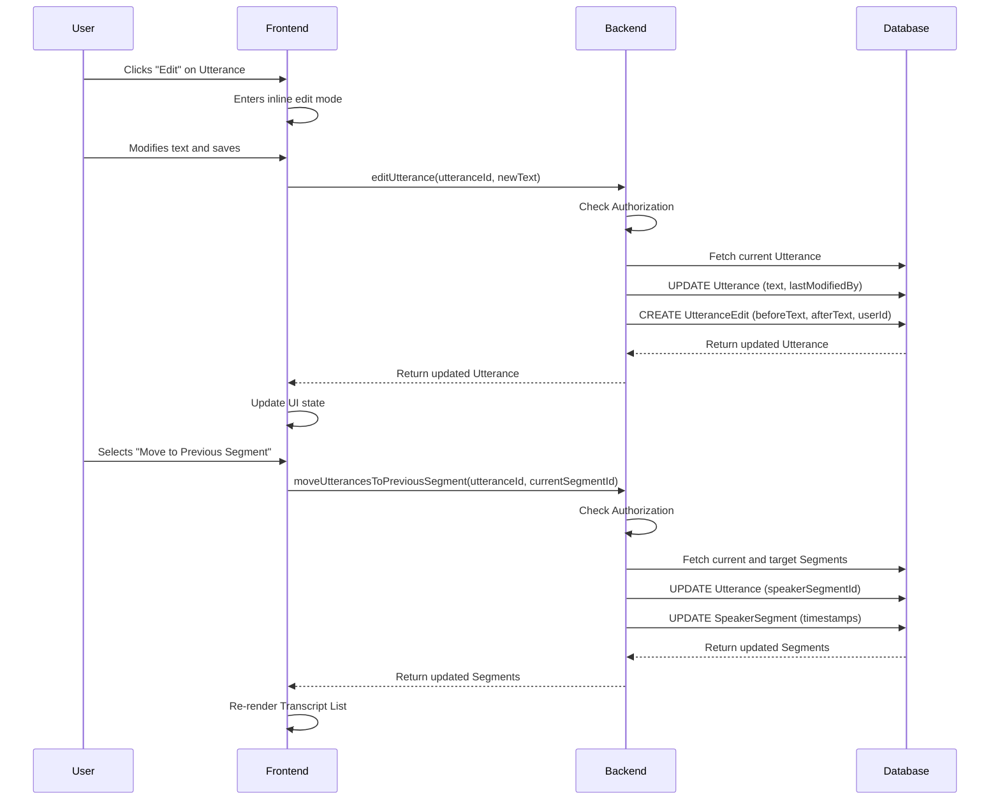

# Editing Interface

**Concept**

The Editing Interface allows authorized users to correct transcript text and reorganize the structure of meeting records. It provides inline text editing with full history tracking and structural tools to move utterances between speaker segments, ensuring accurate and verifiable meeting transcripts.

**Architectural Overview**

The system divides editing into two distinct categories: **Text Content Editing** and **Structural Editing**.

1.  **Text Content Editing**:
    *   Handled by the `Utterance` component in the transcript view.
    *   Users edit text directly inline.
    *   Updates are sent to the backend via the `editUtterance` server action.
    *   **History Tracking**: Critical for auditability, every text change is logged in the `UtteranceEdit` table, preserving the `beforeText`, `afterText`, and the user who made the change. The `Utterance` model itself tracks the `lastModifiedBy` (user or task).

2.  **Structural Editing**:
    *   Handled via context menus or actions on the `Utterance` component.
    *   Includes operations like "Move to Previous Segment" or "Move to Next Segment".
    *   Processed by `moveUtterancesToSegment` in the backend.
    *   These operations modify the `speakerSegmentId` of the utterance and recalculate the timestamps of the affected `SpeakerSegments`. They do *not* generate `UtteranceEdit` records as the text content remains unchanged.

3.  **Automated Corrections**:
    *   Background tasks (like `fixTranscript`) can also modify utterances.
    *   These are treated similarly to user edits but are attributed to 'task' in the `lastModifiedBy` field and `UtteranceEdit` records.

**Sequence Diagram**

**Key Component Pointers**

*   **Data Models**:
    *   `Utterance`: [`prisma/schema.prisma`](../../prisma/schema.prisma) (Stores current text and modification metadata)
    *   `UtteranceEdit`: [`prisma/schema.prisma`](../../prisma/schema.prisma) (Immutable history of text changes)
    *   `SpeakerSegment`: [`prisma/schema.prisma`](../../prisma/schema.prisma) (Grouping of utterances by speaker)

*   **Frontend Components**:
    *   `Utterance`: [`src/components/meetings/transcript/Utterance.tsx`](../../src/components/meetings/transcript/Utterance.tsx) (Main component handling display, inline editing, and context actions)
    *   `TranscriptOptionsContext`: [`src/contexts/TranscriptOptionsContext.tsx`](../../src/contexts/TranscriptOptionsContext.tsx) (Controls whether editing features are enabled/visible)
    *   `CouncilMeetingDataContext`: [`src/components/meetings/CouncilMeetingDataContext.tsx`](../../src/components/meetings/CouncilMeetingDataContext.tsx) (Exposes structural edit methods like `moveUtterancesToPrevious`)

*   **Backend Logic**:
    *   `editUtterance`: [`src/lib/db/utterance.ts`](../../src/lib/db/utterance.ts) (Handles text updates and history creation)
    *   `moveUtterancesToSegment`: [`src/lib/db/speakerSegments.ts`](../../src/lib/db/speakerSegments.ts) (Handles moving utterances and recalculating segment timestamps)
    *   `fixTranscript`: [`src/lib/tasks/fixTranscript.ts`](../../src/lib/tasks/fixTranscript.ts) (Example of automated task editing utterances)

**Business Rules & Assumptions**

*   **Authorization**: Only authorized users (admin/editor permissions for the city) can perform edits. Authorization is checked via `withUserAuthorizedToEdit`.
*   **History Immutability**: `UtteranceEdit` records are never updated or deleted; they serve as a permanent audit log.
*   **Structural Integrity**: Moving utterances must maintain the chronological order of timestamps within segments. The backend logic automatically adjusts segment start/end timestamps to boundary utterances.
*   **Edit Attribution**: All text edits must be attributed to either a specific `User` or a `task`.
*   **Structural Edits vs Text Edits**: Only text changes trigger an entry in the `UtteranceEdit` history table. Reassigning an utterance to a different speaker (structural edit) updates the relation but does not currently create a history record.

