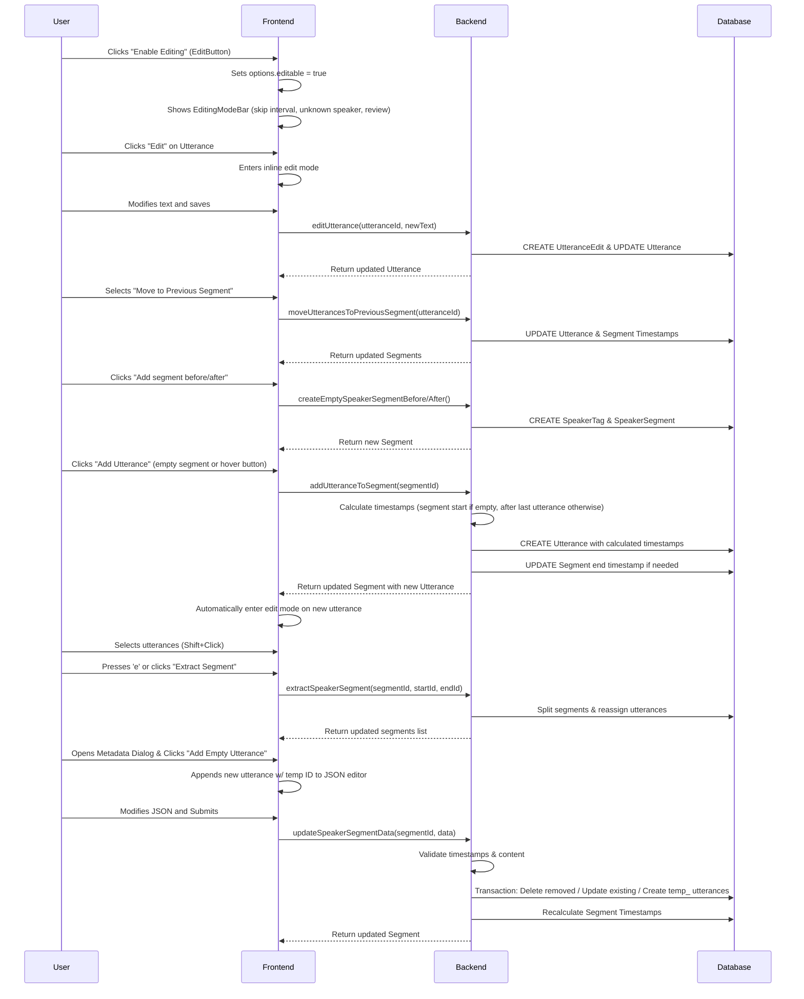

# Editing Interface

**Concept**

The Editing Interface allows authorized users to correct transcript text and reorganize the structure of meeting records. It provides inline text editing with full history tracking and structural tools to move utterances between speaker segments, ensuring accurate and verifiable meeting transcripts.

**Architectural Overview**

The system divides editing into distinct categories and modes:

1.  **Editing Mode Lifecycle**:
    *   **Activation**: Users enter "Editing Mode" via the `EditButton` in the global header. This activates `options.editable` in the `TranscriptOptionsContext`.
    *   **Context Bar**: When active, the `EditingModeBar` appears at the top of the transcript, providing specialized controls:
        *   **Skip Interval**: Configure time skip interval for Shift+Arrow navigation (2-30 seconds, default 5s)
        *   **Next Unknown Speaker**: Jump to next segment with unidentified speaker
        *   **Speakers Overview**: View statistics and navigate by speaker
        *   **Complete Review**: Mark transcript review as complete
        *   **Editing Guide**: Access keyboard shortcuts and workflow documentation
        *   **Exit**: Return to read-only mode
    *   **Exclusivity**: Editing Mode is mutually exclusive with **Highlight Mode**. Users cannot create highlights while editing the transcript, and vice versa.

2.  **Text Content Editing** (in Editing Mode):
    *   Handled by the `Utterance` component in the transcript view.
    *   Users edit text directly inline. Browser-native spellcheck is enabled.
    *   **Timestamp Editing**: While editing an utterance, users can adjust start/end timestamps:
        *   Set timestamps to current video time using clock icon buttons or keyboard shortcuts (`Shift+[` for start, `Shift+]` for end)
        *   Timestamp changes are displayed in real-time in the editing UI
        *   **Important**: Timestamp changes are saved only when the utterance edit is saved (via Enter key or Save button), not immediately when clicking the clock icon
        *   After saving, parent segment timestamps automatically recalculate based on contained utterances
    *   **Visual Feedback**:
        *   **User Edited**: Distinguished by a **green underline** (`decoration-green-500`), making human verification immediately visible.
        *   **AI Corrected**: Distinguished by a **blue underline** (`decoration-blue-500`) for automated fixes.
    *   **Optimistic Updates**: Changes are reflected immediately in the UI while saving to the backend in the background, ensuring a responsive editing experience.
    *   Updates are sent to the backend via the `editUtterance` and `updateUtteranceTimestamps` server actions.
    *   **History Tracking**: Critical for auditability, every text change is logged in the `UtteranceEdit` table.

3.  **Structural Editing**:
    *   **Speaker Assignment**: The `PersonBadge` component handles speaker identification. It includes an explicit "Unknown Speaker" (`Άγνωστος Ομιλητής`) option and improved autocomplete to quickly assign speakers. The system can also auto-number unknown speakers (e.g., "Άγνωστος Ομιλητής 1").
    *   **Segment Operations**: Handled via context menus (e.g., "Move to Previous Segment").
    *   **Extract Segment**: Users can select a range of utterances (Shift+Click) within a segment and extract them into a new independent segment with a new, unassigned speaker tag. The range can start at the first utterance of the segment or end at the last one.
        *   **Selection**: Visualized with bold text.
        *   **Validation**: Prevents extracting all utterances (leaving nothing behind). Use "Change Speaker" for that case.
        *   **Extraction is not a move**: "Move to Previous/Next Segment" re-assigns utterances to the speaker of the adjacent segment. Extraction gives them a new, unassigned speaker. A speaker change at a segment boundary therefore needs extraction, not a move.
    *   Processed by `moveUtterancesToSegment` and `extractSpeakerSegment` in the backend.

4.  **Segment Management**:
    *   **Creation**: Users can create new empty speaker segments either after an existing segment or before the very first segment.
    *   **Adding Utterances to Empty Segments**:
        *   **Main UI (Primary Method)**: When editing mode is active and a segment has no utterances, an empty state UI is automatically displayed with a prominent "Add Utterance" button. Clicking this button:
            *   Creates a new empty utterance with timestamps calculated from the segment boundaries
            *   Start timestamp = segment start (or after the last utterance if segment is not empty)
            *   Duration = 1 second
            *   Immediately enables inline editing so the user can type the utterance text
            *   Uses the unified `addUtteranceToSegment` backend function
        *   **Adding to Non-Empty Segments**: A small inline "+" button appears at the end of each segment's text on hover, allowing users to naturally add new utterances at the end.
        *   **Advanced Method (Super Admin)**: The `SpeakerSegmentMetadataDialog` provides JSON-level editing for batch operations and complex edits.
    *   **Metadata Inspection**: Super Admins can view detailed metadata via the `SpeakerSegmentMetadataDialog`.
    *   **Advanced Editing**: The system supports complex segment updates via 
    `updateSpeakerSegmentData`, accessible through the metadata dialog. This allows:
        *   Batch updates of utterances (text, timestamps).
        *   **Adding Multiple Utterances**: Users can click "Add Empty Utterance" to append new 
        placeholder utterances to the segment's JSON data. The backend recognizes these via 
        temporary IDs (`temp_...`) and creates actual records.
        *   Deleting utterances (by removing them from the JSON array).
        *   Automatic recalculation of segment boundaries.

5.  **Automated Corrections**:
    *   Background tasks (like `fixTranscript`) can also modify utterances.
    *   These are treated similarly to user edits but are attributed to 'task' in the `lastModifiedBy` field and `UtteranceEdit` records.

6.  **Interaction Enhancements**:
    *   **Keyboard Shortcuts**: `ACTION_DEFINITIONS` in `KeyboardShortcutsContext` states what each shortcut is bound to. The in-app `EditingGuideDialog` renders its keys from that list. The guide therefore cannot show a key that the dispatcher does not honour. Do not write the key list down a second time. The rules that the code does not state are:
        *   **Editing mode claims the bare arrows.** In editing mode the four arrow keys drive playback from anywhere on the page. Focus can stay on the transcript.
        *   **A reader gets seek, but not speed.** `ArrowLeft` and `ArrowRight` do not scroll a transcript, so a reader keeps them as seek. `ArrowUp` and `ArrowDown` stay scroll keys for a reader. The chosen speed persists in `localStorage`. One stray press would therefore change the speed of every later meeting. A reader changes the speed from the playback dock.
        *   **A control that owns the keyboard keeps it.** Menus, listboxes, sliders, tab lists, comboboxes and selects keep every key. A focused button keeps only `Space` and `Enter`, which activate it. The button passes every other key to its shortcut. The playback dock's timeline strip claims no arrow key.
        *   **The utterance editor holds its own keys.** `Utterance` handles the Shift-based shortcuts on its textarea. The dispatcher ignores keys that a user types into a text field.
    *   **Selection Mode**: Managed via `EditingContext`. Supports **Shift+Click** for range selection (selecting multiple sequential utterances) and **Ctrl+Click** for toggling individual selections.
    *   **Speakers Overview**: A dedicated sheet (`SpeakersOverviewSheet`) provides real-time statistics (duration, segment count) and navigation for every speaker in the meeting.
    *   **In-App Guide**: A comprehensive `EditingGuideDialog` provides immediate access to shortcuts and workflow instructions.

**Sequence Diagram**

```mermaid
sequenceDiagram
    participant User
    participant Frontend
    participant Backend
    participant Database

    %% Mode Activation
    User->>Frontend: Clicks "Enable Editing" (EditButton)
    Frontend->>Frontend: Sets options.editable = true
    Frontend->>Frontend: Shows EditingModeBar (skip interval, unknown speaker, review)

    %% Text Editing Flow
    User->>Frontend: Clicks "Edit" on Utterance
    Frontend->>Frontend: Enters inline edit mode
    User->>Frontend: Modifies text and saves
    Frontend->>Backend: editUtterance(utteranceId, newText)
    Backend->>Database: CREATE UtteranceEdit & UPDATE Utterance
    Backend-->>Frontend: Return updated Utterance

    %% Structural Editing Flow
    User->>Frontend: Selects "Move to Previous Segment"
    Frontend->>Backend: moveUtterancesToPreviousSegment(utteranceId)
    Backend->>Database: UPDATE Utterance & Segment Timestamps
    Backend-->>Frontend: Return updated Segments

    %% Segment Creation Flow
    User->>Frontend: Clicks "Add segment before/after"
    Frontend->>Backend: createEmptySpeakerSegmentBefore/After()
    Backend->>Database: CREATE SpeakerTag & SpeakerSegment
    Backend-->>Frontend: Return new Segment

    %% Add Utterance to Segment Flow
    User->>Frontend: Clicks "Add Utterance" (empty segment or hover button)
    Frontend->>Backend: addUtteranceToSegment(segmentId)
    Backend->>Backend: Calculate timestamps (segment start if empty, after last utterance otherwise)
    Backend->>Database: CREATE Utterance with calculated timestamps
    Backend->>Database: UPDATE Segment end timestamp if needed
    Backend-->>Frontend: Return updated Segment with new Utterance
    Frontend->>Frontend: Automatically enter edit mode on new utterance

    %% Extraction Flow
    User->>Frontend: Selects utterances (Shift+Click)
    User->>Frontend: Presses 'e' or clicks "Extract Segment"
    Frontend->>Backend: extractSpeakerSegment(segmentId, startId, endId)
    Backend->>Database: Split segments & reassign utterances
    Backend-->>Frontend: Return updated segments list

    %% Advanced Segment Editing
    User->>Frontend: Opens Metadata Dialog & Clicks "Add Empty Utterance"
    Frontend->>Frontend: Appends new utterance w/ temp ID to JSON editor
    User->>Frontend: Modifies JSON and Submits
    Frontend->>Backend: updateSpeakerSegmentData(segmentId, data)
    Backend->>Backend: Validate timestamps & content
    Backend->>Database: Transaction: Delete removed / Update existing / Create temp_ utterances
    Backend->>Database: Recalculate Segment Timestamps
    Backend-->>Frontend: Return updated Segment
```

**Business Rules & Assumptions**

*   **Authorization**: Only authorized users (admin/editor permissions for the city) can perform edits. Authorization is checked via `withUserAuthorizedToEdit`.
*   **History Immutability**: `UtteranceEdit` records are never updated or deleted; they serve as a permanent audit log.
*   **Structural Integrity**: Moving utterances must maintain the chronological order of timestamps within segments. The backend logic automatically adjusts segment start/end timestamps to boundary utterances.
*   **Segment Creation**:
    *   Creating a segment *after* an existing one sets its start time to the previous segment's end time (+0.01s).
    *   Creating a segment *before* the first segment is only possible if there is available time (start > 0). It defaults to a small duration before the first segment's start.
*   **Adding Utterances to Segments**:
    *   Available for both empty and non-empty segments via `addUtteranceToSegment`.
    *   Timestamps are automatically calculated:
        *   **Empty segment**: `start = segment.startTimestamp`, `duration = min(1 second, segment duration)`
        *   **Non-empty segment**: `start = last utterance's end timestamp`, `duration = 1 second`
        *   If the new utterance extends beyond the segment's end, the segment's `endTimestamp` is automatically updated.
        *   `end = start + duration`
    *   After creation, the utterance is immediately editable inline (frontend automatically focuses the new utterance).
*   **Complex Segment Edits**: When updating a whole segment via `updateSpeakerSegmentData`, at least one utterance must remain. Timestamps must be valid (start < end).
    *   New utterances added via the JSON editor use temporary IDs (starting with `temp_`) which are detected by the backend and replaced with real DB records.
*   **Edit Attribution**: All text edits must be attributed to either a specific `User` or a `task`.
