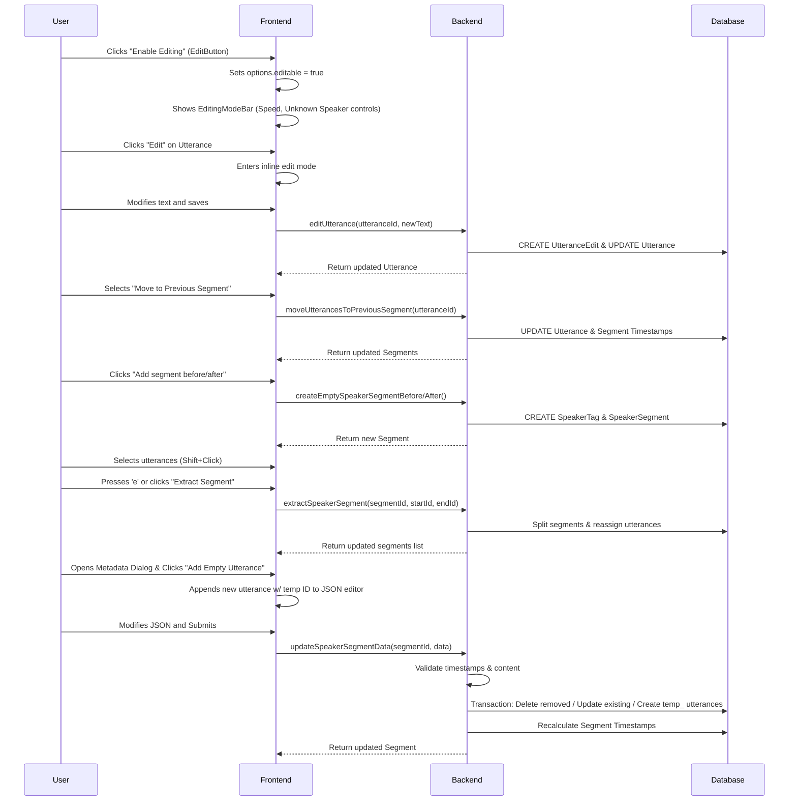

# Editing Interface

**Concept**

The Editing Interface allows authorized users to correct transcript text and reorganize the structure of meeting records. It provides inline text editing with full history tracking and structural tools to move utterances between speaker segments, ensuring accurate and verifiable meeting transcripts.

**Architectural Overview**

The system divides editing into distinct categories and modes:

1.  **Editing Mode Lifecycle**:
    *   **Activation**: Users enter "Editing Mode" via the `EditButton` in the global header. This activates `options.editable` in the `TranscriptOptionsContext`.
    *   **Context Bar**: When active, the `EditingModeBar` appears at the top of the transcript, providing specialized controls (Playback Speed, Next Unknown Speaker, Exit).
    *   **Exclusivity**: Editing Mode is mutually exclusive with **Highlight Mode**. Users cannot create highlights while editing the transcript, and vice versa.

2.  **Text Content Editing** (in Editing Mode):
    *   Handled by the `Utterance` component in the transcript view.
    *   Users edit text directly inline. Browser-native spellcheck is enabled.
    *   **Visual Feedback**: User-edited utterances are distinguished by a **green underline** (`decoration-green-500`), making human verification immediately visible without compromising readability.
    *   Updates are sent to the backend via the `editUtterance` server action.
    *   **History Tracking**: Critical for auditability, every text change is logged in the `UtteranceEdit` table.

3.  **Structural Editing**:
    *   **Speaker Assignment**: The `PersonBadge` component handles speaker identification. It includes an explicit "Unknown Speaker" (`Άγνωστος`) option and improved autocomplete to quickly assign speakers.
    *   **Segment Operations**: Handled via context menus (e.g., "Move to Previous Segment").
    *   **Extract Segment**: Users can select a range of utterances (Shift+Click) within a segment and extract them into a new independent segment (useful for A-B-A speaker patterns).
        *   **Selection**: Visualized with bold text.
        *   **Validation**: Prevents extracting all utterances (leaving nothing behind) or extracting from the absolute start/end (which would be a simple split/move).
    *   Processed by `moveUtterancesToSegment` and `extractSpeakerSegment` in the backend.

4.  **Segment Management**:
    *   **Creation**: Users can create new empty speaker segments either after an existing segment or before the very first segment.
    *   **Metadata Inspection**: Super Admins can view detailed metadata via the `SpeakerSegmentMetadataDialog`.
    *   **Advanced Editing**: The system supports complex segment updates via 
    `updateSpeakerSegmentData`, accessible through the metadata dialog. This allows:
        *   Batch updates of utterances (text, timestamps).
        *   **Adding Utterances**: Users can click "Add Empty Utterance" to append a new 
        placeholder utterance to the segment's JSON data. The backend recognizes these via 
        temporary IDs (`temp_...`) and creates actual records.
        *   Deleting utterances (by removing them from the JSON array).
        *   Automatic recalculation of segment boundaries.

5.  **Automated Corrections**:
    *   Background tasks (like `fixTranscript`) can also modify utterances.
    *   These are treated similarly to user edits but are attributed to 'task' in the `lastModifiedBy` field and `UtteranceEdit` records.

6.  **Interaction Enhancements**:
    *   **Keyboard Shortcuts**: Managed via `KeyboardShortcutsContext`.
        *   `e`: Extract selected segment.
        *   `Escape`: Clear selection.
    *   **Selection Mode**: Managed via `EditingContext`, supports Shift+Click for ranges and Ctrl+Click for toggling.

**Sequence Diagram**

**Key Component Pointers**

*   **Data Models**:
    *   `Utterance`: [`prisma/schema.prisma`](../../prisma/schema.prisma)
    *   `UtteranceEdit`: [`prisma/schema.prisma`](../../prisma/schema.prisma)
    *   `SpeakerSegment`: [`prisma/schema.prisma`](../../prisma/schema.prisma)

*   **Frontend Components**:
    *   `EditingModeBar`: [`src/components/meetings/EditingModeBar.tsx`](../../src/components/meetings/EditingModeBar.tsx) (Contextual bar with playback speed, unknown speaker navigation, and exit)
    *   `EditButton`: [`src/components/meetings/EditButton.tsx`](../../src/components/meetings/EditButton.tsx) (Entry point in global header)
    *   `TranscriptControls`: [`src/components/meetings/TranscriptControls.tsx`](../../src/components/meetings/TranscriptControls.tsx) (Video player and clip navigation)
    *   `Utterance`: [`src/components/meetings/transcript/Utterance.tsx`](../../src/components/meetings/transcript/Utterance.tsx) (Inline editing, visual state)
    *   `PersonBadge`: [`src/components/persons/PersonBadge.tsx`](../../src/components/persons/PersonBadge.tsx) (Speaker autocomplete and assignment)

*   **State & Context**:
    *   `TranscriptOptionsContext`: [`src/components/meetings/options/OptionsContext.tsx`](../../src/components/meetings/options/OptionsContext.tsx) (Manages `editable` state)
    *   `CouncilMeetingDataContext`: [`src/components/meetings/CouncilMeetingDataContext.tsx`](../../src/components/meetings/CouncilMeetingDataContext.tsx)
    *   `EditingContext`: [`src/components/meetings/EditingContext.tsx`](../../src/components/meetings/EditingContext.tsx) (Manages utterance selection state and extraction logic)
    *   `KeyboardShortcutsContext`: [`src/contexts/KeyboardShortcutsContext.tsx`](../../src/contexts/KeyboardShortcutsContext.tsx) (Centralized keyboard shortcut management)

*   **Backend Logic**:
    *   `editUtterance`: [`src/lib/db/utterance.ts`](../../src/lib/db/utterance.ts)
    *   `moveUtterancesToSegment`: [`src/lib/db/speakerSegments.ts`](../../src/lib/db/speakerSegments.ts)
    *   `extractSpeakerSegment`: [`src/lib/db/speakerSegments.ts`](../../src/lib/db/speakerSegments.ts) (Handles extracting utterance ranges into new segments)
    *   `createEmptySpeakerSegmentBefore/After`: [`src/lib/db/speakerSegments.ts`](../../src/lib/db/speakerSegments.ts) (Handles creating new segments with "New speaker segment" tag)
    *   `updateSpeakerSegmentData`: [`src/lib/db/speakerSegments.ts`](../../src/lib/db/speakerSegments.ts) (Handles batch updates, utterance creation/deletion, and timestamp recalculation)

**Business Rules & Assumptions**

*   **Authorization**: Only authorized users (admin/editor permissions for the city) can perform edits. Authorization is checked via `withUserAuthorizedToEdit`.
*   **History Immutability**: `UtteranceEdit` records are never updated or deleted; they serve as a permanent audit log.
*   **Structural Integrity**: Moving utterances must maintain the chronological order of timestamps within segments. The backend logic automatically adjusts segment start/end timestamps to boundary utterances.
*   **Segment Creation**:
    *   Creating a segment *after* an existing one sets its start time to the previous segment's end time (+0.01s).
    *   Creating a segment *before* the first segment is only possible if there is available time (start > 0). It defaults to a small duration before the first segment's start.
*   **Complex Segment Edits**: When updating a whole segment via `updateSpeakerSegmentData`, at least one utterance must remain. Timestamps must be valid (start < end).
    *   New utterances added via the JSON editor use temporary IDs (starting with `temp_`) which are detected by the backend and replaced with real DB records.
*   **Edit Attribution**: All text edits must be attributed to either a specific `User` or a `task`.
