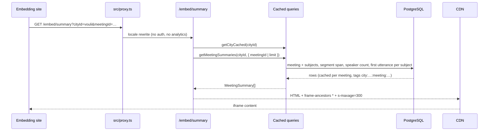

# Embed Widgets

**Concept**

Iframe widgets that show OpenCouncil content on an external website: the meetings of a municipality, its hottest subjects, or a summary of one or more meetings.

**Architectural Overview**

A site owner opens the configurator at `/{cityId}/widget`, chooses a widget type and its appearance, and copies an `<iframe>` snippet. The iframe loads a page under `/embed/`. Each embed page:

1. Reads its configuration from the query string. `parseEmbedConfig` handles the params that every widget shares (accent color, dark mode, corner radius, card limit, administrative-body filter). Widget-specific params stay in the route.
2. Loads data through the public cached queries in `src/lib/cache/queries.ts`. These queries return released meetings only and never call `headers()`, so a page can be served from the CDN.
3. Renders plain HTML with a small stylesheet (`embed.css`) driven by `--embed-*` CSS variables from `generateThemeVars`. The pages are Server Components. The subjects widget is the exception: it renders the app's shared `SubjectCardContent`, so it also applies `generateAppThemeShim`.
4. Links back to OpenCouncil with `embedBaseUrl(city.realm)`. In production the links use the realm's own domain (a Cypriot city links to opencouncil.cy). On a preview or local host the links keep `NEXTAUTH_URL`.

The `(embed)` route group has a minimal layout with `robots: noindex`. `next.config.mjs` adds `Content-Security-Policy: frame-ancestors *` and a CDN `Cache-Control` header to every `/:locale/embed/:path*` response. `EMBED_PATH` in `src/lib/utils/embed.ts` keeps analytics, SEO redirects and the dev login bar out of the iframe.

| Widget | Route | Own params | Shows |
|---|---|---|---|
| Meetings | `/embed/meetings` | `cityId`, `showSubjects` | Upcoming and recent meetings with their top subjects |
| Hot subjects | `/embed/subjects` | `cityId` or `geohash` | The most discussed subjects of recent meetings, optionally near a location |
| Meeting summary | `/embed/summary` | `cityId`, `meetingId`, `subjects` | One block per meeting: the body, the meeting, its most discussed subjects, and its stats |

Shared params: `accent` (hex without `#`), `mode` (`light`/`dark`), `radius` (`sharp`/`rounded`/`pill`), `limit`, `bodies` (comma-separated body types), `bodyIds` (comma-separated body ids).

`/api/embed/subjects` returns the subjects widget's data as JSON with open CORS, so an embedding site can hide the iframe when there is nothing to show.

**Sequence Diagram**

**Key Component Pointers**

Routes and layout:
- `EmbedLayout`: [`src/app/[locale]/(embed)/layout.tsx`](../../src/app/[locale]/(embed)/layout.tsx) (no navigation, no footer, noindex)
- Meetings widget: [`src/app/[locale]/(embed)/embed/meetings/page.tsx`](../../src/app/[locale]/(embed)/embed/meetings/page.tsx)
- Hot subjects widget: [`src/app/[locale]/(embed)/embed/subjects/page.tsx`](../../src/app/[locale]/(embed)/embed/subjects/page.tsx)
- Meeting summary widget: [`src/app/[locale]/(embed)/embed/summary/page.tsx`](../../src/app/[locale]/(embed)/embed/summary/page.tsx)
- Stylesheet: [`src/app/[locale]/(embed)/embed/meetings/embed.css`](../../src/app/[locale]/(embed)/embed/meetings/embed.css) (shared by all widgets)
- Pre-flight JSON: [`src/app/api/embed/subjects/route.ts`](../../src/app/api/embed/subjects/route.ts)

Configuration and theming:
- `parseEmbedConfig`, `parseBoundedInt`, `EMBED_SUMMARY_LIMITS`, `embedLocalePrefix`: [`src/lib/utils/embedParams.ts`](../../src/lib/utils/embedParams.ts)
- `embedBaseUrl`: [`src/lib/utils/embedBaseUrl.ts`](../../src/lib/utils/embedBaseUrl.ts) (realm-aware link base)
- `generateThemeVars`, `generateAppThemeShim`: [`src/lib/utils/embedTheme.ts`](../../src/lib/utils/embedTheme.ts)
- `EMBED_PATH`: [`src/lib/utils/embed.ts`](../../src/lib/utils/embed.ts)
- Frame and cache headers: [`next.config.mjs`](../../next.config.mjs)

Data:
- `getCouncilMeetingsForCityPublicCached`, `getMeetingSummaryCached`: [`src/lib/cache/queries.ts`](../../src/lib/cache/queries.ts)
- `getMeetingSummary`: [`src/lib/db/meetingSummary.ts`](../../src/lib/db/meetingSummary.ts) (four queries per meeting)
- `MeetingSummary` types and select: [`src/lib/db/types/meetingSummary.ts`](../../src/lib/db/types/meetingSummary.ts)
- `getMeetingSummaries`: [`src/lib/meetingSummaries.ts`](../../src/lib/meetingSummaries.ts) (one meeting, or the latest past ones)
- `pickSummarySubjects`: [`src/lib/utils/subjects.ts`](../../src/lib/utils/subjects.ts)
- `getHotSubjectCards`: [`src/lib/hotSubjectCards.ts`](../../src/lib/hotSubjectCards.ts)

Components:
- `EmbedMeetingCard`: [`src/components/embed/EmbedMeetingCard.tsx`](../../src/components/embed/EmbedMeetingCard.tsx)
- `EmbedSubjectCard`: [`src/components/embed/EmbedSubjectCard.tsx`](../../src/components/embed/EmbedSubjectCard.tsx)
- `EmbedMeetingSummary`, `EmbedSummarySubjectCard`: [`src/components/embed/EmbedMeetingSummary.tsx`](../../src/components/embed/EmbedMeetingSummary.tsx), [`src/components/embed/EmbedSummarySubjectCard.tsx`](../../src/components/embed/EmbedSummarySubjectCard.tsx)
- `EmbedFooter`: [`src/components/embed/EmbedFooter.tsx`](../../src/components/embed/EmbedFooter.tsx) (OpenCouncil attribution)
- `EmbedConfigurator`: [`src/components/embed/EmbedConfigurator.tsx`](../../src/components/embed/EmbedConfigurator.tsx), served by [`src/app/[locale]/(city)/[cityId]/(other)/(tabs)/widget/page.tsx`](../../src/app/[locale]/(city)/[cityId]/(other)/(tabs)/widget/page.tsx)

**Business Rules & Assumptions**

- Widgets show released meetings only. They need no session and read no request headers.
- An unknown `cityId` returns 404. An unknown or unreleased `meetingId`, or a city without past meetings, renders the widget's empty state with HTTP 200, because a 404 inside an iframe looks broken.
- The meeting summary widget shows the latest released past meetings (`limit` 1 to 5, default 1) or one meeting (`meetingId`). It ignores the body filter when a meeting is pinned.
- Each summary block shows the most discussed subjects first (`subjects` 1 to 20, default 6). The footer counts every subject of the meeting.
- The summary widget shows no votes, outcomes or attendance. The subject text is the AI summary (`Subject.description`), stripped of markdown and clamped to two lines.
- A meeting's duration is the span from its first to its last speaker segment. The speaker count is the number of distinct people with a speaker segment. Both stats are hidden before transcription.
- The subject timestamp is the first utterance tagged `SUBJECT_DISCUSSION` for that subject. Subjects without tagged utterances show no timestamp.
- Every widget page revalidates every 5 minutes. `revalidateMeeting` busts the per-meeting cache as soon as summarization writes new subjects.
- The configurator is visible to city editors only. Its meeting picker offers released past meetings only, because the widget is public.

See also: [meeting-lifecycle.md](./meeting-lifecycle.md) for how subjects and summaries are produced, and [../infrastructure.md](../infrastructure.md) for the CDN in front of the app.
