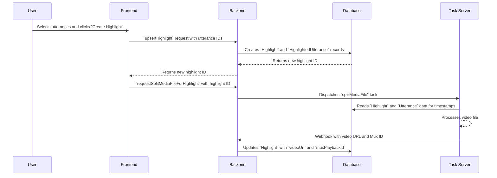

# Meeting Highlights

**Concept**

Automatically generate short, shareable video clips of key moments from council meetings.

**Architectural Overview**

The Meeting Highlights feature allows authorized users to select segments of a meeting's transcript and combine them into a single video file. The process begins on the frontend, where a user selects utterances and initiates the creation process. The request is sent to the backend, which first creates a `Highlight` record in the database, associating it with the selected `Utterance` records. It then dispatches a task to an external media processing server. This server retrieves the source video and the timestamp information from the database, creates the highlight video, and upon completion, updates the `Highlight` record with the URL to the new video.

**Sequence Diagram**

**User Interaction Flow**

The current utterance addition mechanism follows a multi-step process that requires understanding the transcript interaction pattern:

1. **Highlight Selection**: User clicks on a highlight card in the Highlights section to select it (visual feedback: border becomes primary color)
2. **Transcript Navigation**: User navigates to the Transcript section/tab to view all meeting utterances
3. **Utterance Interaction**: When a highlight is selected, clicking on any utterance in the transcript will:
   - **Add** the utterance to the highlight if it's not already included
   - **Remove** the utterance from the highlight if it's already included
4. **Visual Feedback**: Utterances that are part of the selected highlight are displayed with **bold and underlined** text
5. **State Management**: Changes are stored in the `TranscriptOptions` context as a `selectedHighlight` object
6. **Persistence**: User clicks "Save Changes" button to persist modifications via `upsertHighlight`

**Key Component Pointers**

*   **Data Models**:
    *   `Highlight`: `prisma/schema.prisma`
    *   `HighlightedUtterance`: `prisma/schema.prisma`
*   **Frontend Components**:
    *   `CouncilMeeting`: `src/components/meetings/CouncilMeeting.tsx`
    *   `Highlights`: `src/components/Highlights.tsx`
    *   `Utterance`: `src/components/meetings/transcript/Utterance.tsx`
*   **State Management**:
    *   `TranscriptOptions`: `src/components/meetings/options/OptionsContext.tsx`
*   **Backend Logic**:
    *   `upsertHighlight`: `src/lib/db/highlights.ts`
    *   `deleteHighlight`: `src/lib/db/highlights.ts`
    *   `requestSplitMediaFileForHighlight`: `src/lib/tasks/splitMediaFile.ts`
    *   `handleSplitMediaFileResult`: `src/lib/tasks/splitMediaFile.ts`

**Business Rules & Assumptions**

*   Only authorized users can create, edit, or delete highlights.
*   Highlights can only be created for meetings that have a video file.
*   A highlight must be associated with at least one utterance.
*   The external task server must have access to the database to retrieve the necessary information.
*   The application must expose a webhook endpoint for the task server to report the results of the video processing.
*   Utterance selection requires a highlight to be in "selected" state via the `TranscriptOptions` context.
*   Changes to highlight composition are not persisted until the user explicitly saves via the "Save Changes" button. 