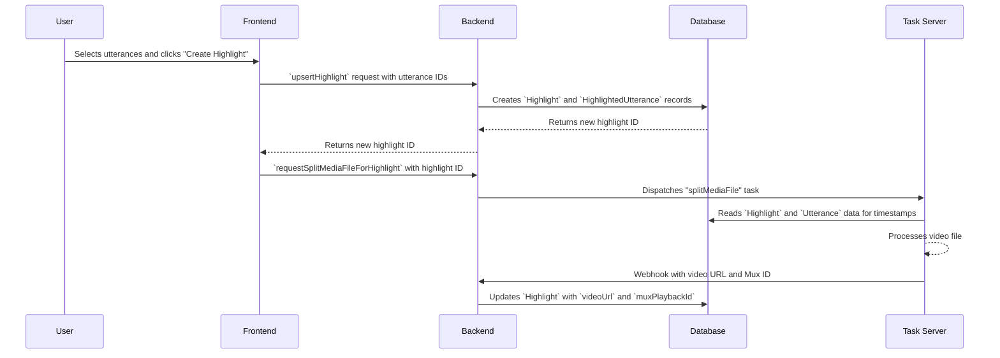

# Meeting Highlights

**Concept**

Create and share custom video clips from council meeting moments, with automatic generation and editing capabilities.

**Architectural Overview**

The Meeting Highlights feature allows authorized users to select segments of a meeting's transcript and combine them into a single video file. The process begins on the frontend, where a user selects utterances and initiates the creation process. The request is sent to the backend, which first creates a `Highlight` record in the database, associating it with the selected `Utterance` records. It then dispatches a task to an external media processing server. This server retrieves the source video and the timestamp information from the database, creates the highlight video, and upon completion, updates the `Highlight` record with the URL to the new video.

**Sequence Diagram**

**User Interaction Flow**

The current highlight editing system provides an intuitive interface for creating and modifying highlights:

1. **Highlight Creation**: User clicks "Add Highlight" button to create a new highlight with a custom name
2. **Edit Mode Activation**: User clicks the edit button on any highlight card to enter editing mode
3. **Highlight Mode Bar**: A dedicated editing interface appears with:
   - Real-time statistics (duration, speaker count, utterance count)
   - Preview mode toggle for testing highlight composition
   - Navigation controls for browsing through selected utterances
   - Save/Cancel buttons for persisting changes
4. **Utterance Selection**: In edit mode, clicking on any utterance in the transcript will:
   - **Add** the utterance to the highlight if it's not already included
   - **Remove** the utterance from the highlight if it's already included
5. **Visual Feedback**: 
   - Utterances that are part of the editing highlight are displayed with **bold and underlined** text
   - The editing highlight card shows a special "Editing" badge
   - The timeline shows highlighted segments with amber coloring
6. **Preview Mode**: Users can toggle preview mode to:
   - See a text preview of all selected utterances grouped by speaker
   - Auto-advance through highlights with looping
7. **State Management**: Changes are stored in the `HighlightContext` as an `editingHighlight` object
8. **Persistence**: User clicks "Save Changes" button to persist modifications via `upsertHighlight`

**Key Component Pointers**

*   **Data Models**:
    *   `Highlight`: `prisma/schema.prisma`
    *   `HighlightedUtterance`: `prisma/schema.prisma`
*   **Frontend Components**:
    *   `CouncilMeeting`: `src/components/meetings/CouncilMeeting.tsx`
    *   `Highlights`: `src/components/Highlights.tsx`
    *   `Utterance`: `src/components/meetings/transcript/Utterance.tsx`
    *   `HighlightModeBar`: `src/components/meetings/HighlightModeBar.tsx`
    *   `HighlightPreview`: `src/components/meetings/HighlightPreview.tsx`
*   **State Management**:
    *   `HighlightContext`: `src/components/meetings/HighlightContext.tsx`
*   **Backend Logic**:
    *   `upsertHighlight`: `src/lib/db/highlights.ts`
    *   `deleteHighlight`: `src/lib/db/highlights.ts`
    *   `requestSplitMediaFileForHighlight`: `src/lib/tasks/splitMediaFile.ts`
    *   `handleSplitMediaFileResult`: `src/lib/tasks/splitMediaFile.ts`

**Business Rules & Assumptions**

*   Only authorized users can create, edit, or delete highlights.
*   Highlights can only be created for meetings that have a video file.
*   A highlight must be associated with at least one utterance.
*   The external task server must have access to the database to retrieve the necessary information.
*   The application must expose a webhook endpoint for the task server to report the results of the video processing.
*   Only one highlight can be in editing mode at a time via the `HighlightContext`.
*   Changes to highlight composition are not persisted until the user explicitly saves via the "Save Changes" button.
*   Preview mode automatically advances through highlights and loops back to the beginning.
*   The editing interface provides real-time statistics and visual feedback for better user experience. 