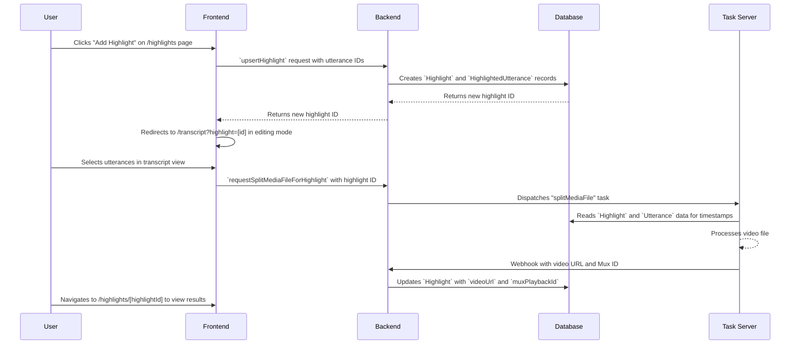

# Meeting Highlights

**Concept**

Create and share custom video clips from council meeting moments, with automatic generation and editing capabilities. The feature provides an intuitive multi-page interface for browsing, previewing, and managing highlights with advanced content editing and subject association capabilities.

**Architectural Overview**

The Meeting Highlights feature allows authorized users to select segments of a meeting's transcript and combine them into a single video file. 

The architecture follows a page-based approach:
- `/highlights` - Lists all highlights with categorization
- `/highlights/[highlightId]` - Individual highlight detail view
- `/transcript?highlight=[id]` - Transcript page with editing mode activated

The process begins on the frontend, where a user selects utterances and initiates the creation process. The request is sent to the backend, which first creates a `Highlight` record in the database, associating it with the selected `Utterance` records. It then dispatches a task to an external media processing server. This server retrieves the source video and the timestamp information from the database, creates the highlight video, and upon completion, updates the `Highlight` record with the URL to the new video.

**Sequence Diagram**



**User Interaction Flow**

The enhanced highlight system provides an intuitive multi-page interface for creating and managing highlights with advanced editing capabilities:

### **Main Interface Layout**
```
┌─────────────────────────────────────────────────────────────┐
│                    Meeting Highlights                      │
│  Create and manage video highlights from this meeting...  │
├─────────────────────────────────────────────────────────────┤
│                                                             │
│  [Showcased Highlights]                                    │
│  ┌─────────────┐ ┌─────────────┐                          │
│  │ Highlight 1 │ │ Highlight 2 │                          │
│  └─────────────┘ └─────────────┘                          │
│                                                             │
│  [Video Highlights]                                         │
│  ┌─────────────┐ ┌─────────────┐                          │
│  │ Highlight 3 │ │ Highlight 4 │                          │
│  └─────────────┘ └─────────────┘                          │
│                                                             │
│  [Draft Highlights]                                         │
│  ┌─────────────┐ ┌─────────────┐                          │
│  │ Highlight 5 │ │ Highlight 6 │                          │
│  └─────────────┘ └─────────────┘                          │
│                                                             │
│                    [+ Add Highlight]                       │
└─────────────────────────────────────────────────────────────┘
```

### **Individual Highlight View**
```
┌─────────────────────────────────────────────────────────────┐
│                    Highlight Details                        │
│  [← Back to Highlights] [Edit Content] [★] [Download] [🗑️] │
├─────────────────────────────────────────────────────────────┐
│                                                             │
│  [Content & Video]                                          │
│  ┌─────────────────┬─────────────────┐                     │
│  │ 📝 Content      │ 🎬 Video        │                     │
│  │ Preview         │ Player          │                     │
│  │                 │                 │                     │
│  └─────────────────┴─────────────────┘                     │
│                                                             │
└─────────────────────────────────────────────────────────────┘
```

### **Workflow Steps**

1. **Highlight Creation**: 
   - User clicks prominent "Add Highlight" button on `/highlights` page
   - Opens dialog with name input and subject selection
   - Uses `Combobox` component for intuitive subject search
   - Creates empty highlight and **immediately redirects to transcript page in editing mode**
   - No need to manually navigate to individual highlight page and click edit

2. **Content Editing**: 
   - User is automatically in editing mode on transcript page
   - `HighlightModeBar` appears with real-time statistics and controls
   - Click utterances in transcript to add/remove from highlight
   - Visual feedback shows selected utterances in bold/underlined
   - Real-time statistics update (duration, speaker count, utterance count)
   - Navigation controls for moving between highlight segments

3. **Preview Mode**:
   - Toggle between edit and preview modes
   - Preview mode shows integrated content preview below the mode bar
   - Auto-advancing playback through highlight segments
   - Loop functionality for continuous preview
   - Navigation controls for manual segment navigation

4. **Details Management**:
   - User navigates to `/highlights/[highlightId]` to view full details
   - Edit icons next to highlight name/subject for quick modifications
   - Same dialog used for both create and edit modes
   - Subject connection with searchable dropdown
   - Clear visual feedback for connected subjects

5. **Preview & Actions**:
   - Integrated content and video display (side-by-side on desktop, stacked on mobile)
   - All action buttons consolidated in main action bar
   - Video generation and download options prominently displayed
   - Showcase toggle (only when video exists)
   - Subject badge display in preview header

### **Visual Representation & Timeline**

The system provides multiple visual representations of highlight composition:

#### **Transcript Controls Timeline (`TranscriptControls.tsx`)**
- **Base Layer**: Speaker segments shown as colored bars with party colors
- **Highlight Layer**: Selected utterances overlaid as amber bars when editing
- **Interactive Elements**: 
  - Hover tooltips showing timestamp and speaker information
  - Click-to-seek functionality on timeline
  - Visual feedback for current scroll interval (yellow overlay)
  - Speaker selection highlighting with bounce animation
- **Responsive Design**: Adapts between horizontal (desktop) and vertical (mobile) layouts

#### **Content Preview (`HighlightPreview.tsx`)**
- **Speaker Grouping**: Groups consecutive utterances by the same speaker
- **Gap Detection**: Shows visual indicators for breaks between utterances
- **Content Display**: Formatted text with speaker badges and utterance counts
- **Empty State**: Helpful messaging when no utterances are selected

#### **Mode Bar Integration (`HighlightModeBar.tsx`)**
- **Statistics Display**: Real-time duration, speaker count, and utterance count
- **Preview Integration**: Embedded content preview when in preview mode
- **Navigation Controls**: Previous/next highlight navigation
- **Mode Toggle**: Switch between edit and preview modes
- **Done Editing**: Button to return to highlight detail page

### **Categorization System**

Highlights are automatically categorized into three distinct sections:

1. **Showcased Highlights** (⭐): Featured highlights marked for special attention
2. **Video Highlights** (▶️): Non-showcased highlights that have generated videos
3. **Draft Highlights** (⏰): Highlights without videos, ready for content editing

This categorization provides better organization and helps users understand the status of each highlight.

**Key Component Pointers**

*   **Data Models**:
    *   `Highlight`: `prisma/schema.prisma`
    *   `HighlightedUtterance`: `prisma/schema.prisma`
*   **Frontend Components**:
    *   `CouncilMeeting`: `src/components/meetings/CouncilMeeting.tsx`
    *   `HighlightsList`: `src/components/meetings/HighlightsList.tsx` (main list interface)
    *   `HighlightView`: `src/components/meetings/HighlightView.tsx` (individual highlight view)
    *   `HighlightDialog`: `src/components/meetings/HighlightDialog.tsx` (create/edit dialog)
    *   `HighlightPreview`: `src/components/meetings/HighlightPreview.tsx` (content preview)
    *   `HighlightModeBar`: `src/components/meetings/HighlightModeBar.tsx` (editing interface with statistics and controls)
    *   `Utterance`: `src/components/meetings/transcript/Utterance.tsx` (enhanced with highlight selection)
    *   `TranscriptControls`: `src/components/meetings/TranscriptControls.tsx` (timeline visualization)
*   **State Management**:
    *   `HighlightContext`: `src/components/meetings/HighlightContext.tsx` (centralized highlight state and calculations)
    *   `CouncilMeetingDataContext`: `src/components/meetings/CouncilMeetingDataContext.tsx` (meeting data and highlights)
*   **Utilities**:
    *   `calculateHighlightData`: Integrated in `HighlightContext.tsx` (reusable calculations)
*   **Backend Logic**:
    *   `upsertHighlight`: `src/lib/db/highlights.ts`
    *   `deleteHighlight`: `src/lib/db/highlights.ts`
    *   `requestSplitMediaFileForHighlight`: `src/lib/tasks/splitMediaFile.ts`
    *   `handleSplitMediaFileResult`: `src/lib/tasks/splitMediaFile.ts`

**Business Rules & Assumptions**

*   Only authorized users can create, edit, or delete highlights.
*   Highlights can only be created for meetings that have a video file.
*   A highlight must be associated with at least one utterance.
*   The external task server must have access to the database to retrieve the necessary information.
*   The application must expose a webhook endpoint for the task server to report the results of the video processing.
*   Only one highlight can be in editing mode at a time via the `HighlightContext`.
*   Changes to highlight composition are not persisted until the user explicitly saves via the "Save Changes" button.
*   Preview mode automatically advances through highlights and loops back to the beginning.
*   Subject connections are optional but provide better organization and discoverability.
*   Showcase toggle is only available when a video has been generated (`muxPlaybackId` exists).
*   Content calculations are performed lazily only when previewing highlights for performance.
*   Highlight editing mode provides real-time statistics and visual feedback for better user experience.
*   Navigation between highlight segments is available in both edit and preview modes.
*   The timeline visualization shows both speaker segments and highlight composition simultaneously.
*   Visual feedback includes color coding for speakers, highlight selection states, and interactive tooltips.
*   After creating a highlight, users are automatically redirected to editing mode on the transcript page.
*   Highlights are categorized into Showcased, Video, and Draft sections for better organization.
*   The interface uses Next.js App Router with dynamic routes for improved navigation and SEO.
*   Content preview and video player are integrated in a responsive grid layout for better mobile experience.
*   All action buttons are consolidated in the main action bar for consistency and ease of use. 