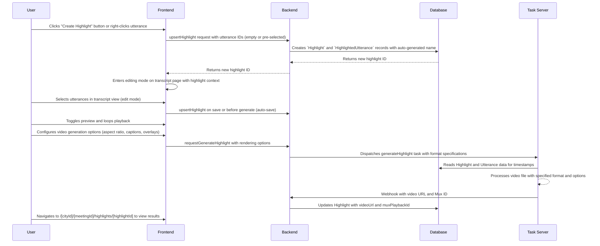

# Meeting Highlights

**Concept**

Create and share custom video clips from council meeting moments, with automatic generation and editing capabilities. The feature provides an intuitive multi-page interface for browsing, previewing, and managing highlights with advanced content editing, subject association capabilities, and flexible video generation options including social media formats.

**Architectural Overview**

The Meeting Highlights feature allows authorized users to select segments of a meeting's transcript and combine them into a single video file with customizable rendering options.

The architecture follows a page-based approach:
- `/highlights` - Lists all highlights with categorization
- `/highlights/[highlightId]` - Individual highlight detail view with responsive video player
- `/transcript?highlight=[id]` - Transcript page with editing mode activated

The process begins on the frontend, where a user selects utterances and configures video generation options. The request is sent to the backend, which first creates a `Highlight` record in the database, associating it with the selected `Utterance` records. It then dispatches a task to an external media processing server with link to the source video, utterances and timestamp information and rendering specifications. This server creates the highlight video with the specified format and options.

**Video Generation Features**

The system supports multiple video formats and rendering options:

### **Aspect Ratios**
- **Default (16:9)**: Traditional landscape format suitable for desktop viewing and standard video platforms
- **Social Media (9:16)**: Portrait format optimized for mobile-first social platforms like TikTok, Instagram Stories, and YouTube Shorts

### **Rendering Options**
- **Captions**: Overlaid text transcription of spoken content
- **Speaker Overlays**: Visual identification of speakers during their segments
- **Social Media Enhancements**: When using 9:16 format, additional options include:
  - Margin types: Blur or solid color backgrounds
  - Background color customization
  - Zoom factor adjustment for optimal video framing

### **Responsive Video Player**
The video player automatically adapts to different aspect ratios:
- **Dynamic Sizing**: Container adjusts based on video dimensions
- **Portrait Video Handling**: 9:16 videos are properly sized and centered
- **Responsive Layout**: Side-by-side content and video on desktop, stacked on mobile
- **Automatic Detection**: Video dimensions are detected on load for optimal display

**Sequence Diagram**



**User Interaction Flow**

The enhanced highlight system provides an intuitive multi-page interface for creating and managing highlights with advanced editing capabilities:

### **Main Interface Layout**
```
┌─────────────────────────────────────────────────────────────┐
│                    Meeting Highlights                      │
│  Create and manage video highlights from this meeting...  │
├─────────────────────────────────────────────────────────────┤
│  [⭐ Create Highlight] [Share]                              │
├─────────────────────────────────────────────────────────────┤
│                                                             │
│  [Showcased Highlights]                                    │
│  ┌─────────────┐ ┌─────────────┐                          │
│  │ Highlight 1 │ │ Highlight 2 │                          │
│  └─────────────┘ └─────────────┘                          │
│                                                             │
│  [Video Highlights]                                         │
│  ┌─────────────┐ ┌─────────────┐                          │
│  │ Highlight 3 │ │ Highlight 4 │                          │
│  └─────────────┘ └─────────────┘                          │
│                                                             │
│  [Draft Highlights]                                         │
│  ┌─────────────┐ ┌─────────────┐                          │
│  │ Highlight 5 │ │ Highlight 6 │                          │
│  └─────────────┘ └─────────────┘                          │
│                                                             │
│                    [+ Add Highlight]                       │
└─────────────────────────────────────────────────────────────┘
```

### **Individual Highlight View with Responsive Video**
```
┌─────────────────────────────────────────────────────────────┐
│                    Highlight Details                        │
│  [← Back to Highlights] [Edit Content] [★] [Download] [🗑️] │
├─────────────────────────────────────────────────────────────┤
│                                                             │
│  [Content & Video] - Responsive Layout                     │
│  ┌─────────────────┬─────────────────┐ (Desktop)           │
│  │ 📝 Content      │ 🎬 Video        │                     │
│  │ Preview         │ Player          │                     │
│  │                 │ (Auto-sizing)   │                     │
│  └─────────────────┴─────────────────┘                     │
│                                                             │
└─────────────────────────────────────────────────────────────┘
```

### **Workflow Steps**

1. **Highlight Creation**: 
   - **Primary Method**: User clicks the "Create Highlight" button (⭐) in the header bar
   - **Context Menu Method**: User right-clicks on any utterance and selects "Ξεκινήστε Highlight από εδώ" (Start Highlight from here)
   - **List Method**: User clicks the "+ Add Highlight" button in the highlights list
   - Creates highlight with auto-generated name ("Unnamed Highlight") and immediately enters editing mode
   - If started from utterance, that utterance is pre-selected in the highlight
   - No dialog required - streamlined creation process
   - Routing example: `/[cityId]/[meetingId]/transcript?highlight=[id]`

2. **Content Editing**: 
   - User is in editing mode on the transcript page; `HighlightModeBar` appears
   - Click utterances in transcript to add/remove from highlight
   - Visual feedback: selected utterances are bold/underlined; amber overlays on the timeline
   - Real-time statistics update (duration, speaker count, utterance count)
   - Navigation controls: Previous/Next clip within the timeline controls (shows "Clip X/Y")
   - Unsaved changes are tracked; an "Unsaved Changes" badge appears
   - Save/Reset available via the overflow menu in `HighlightModeBar`
   - Exit Editing prompts if there are unsaved changes and returns to `/[cityId]/[meetingId]/highlights`

3. **Preview Mode**:
   - Toggle between edit and preview modes from `HighlightModeBar`
   - Entering preview seeks to the first highlighted utterance and auto-plays
   - Auto-advancing playback through highlight segments; loops back to start
   - Exiting preview pauses playback
   - Embedded content preview is shown inside the mode bar

4. **Video Generation Configuration**:
   - Access generation options via the settings menu in `HighlightModeBar`
   - **Format Selection**: Choose between default (16:9) and social media (9:16) aspect ratios
   - **Content Options**: Toggle captions and speaker overlay features
   - **Social Media Enhancements**: When 9:16 format is selected:
     - Margin type selection (blur effect or solid color)
     - Background color customization for solid margins
     - Zoom factor adjustment for optimal framing
   - Settings persist during the editing session for consistent generation

5. **Details Management**:
   - Navigate to `/[cityId]/[meetingId]/highlights/[highlightId]` to view full details
   - Edit icons next to highlight name/subject open the same dialog used for create/edit
   - Subject connection with searchable dropdown; clear visual feedback for connected subjects
   - **Responsive Video Display**: Video player automatically adapts to aspect ratio
     - Portrait videos (9:16) are properly sized and centered
     - Landscape videos (16:9) use full container width
     - Responsive grid layout adapts to screen size

6. **Preview & Actions**:
   - Integrated content and video display with responsive layout
   - Action buttons consolidated in the main action bar
   - Generate Video available with configured options; if a video already exists, the action is Re-generate
   - Generate/Re-generate auto-saves if there are unsaved changes before dispatching the task
   - Showcase toggle is available only when a video exists (`muxPlaybackId` set)
   - Video downloads respect the generated format and aspect ratio

### **Visual Representation & Timeline**

The system provides multiple visual representations of highlight composition:

#### **Transcript Controls Timeline (`TranscriptControls.tsx`)**
- **Base Layer**: Speaker segments shown as colored bars with party colors
- **Highlight Layer**: Selected utterances overlaid as amber bars when editing
- **Interactive Elements**: 
  - Hover tooltips showing timestamp and speaker information
  - Click-to-seek functionality on timeline
  - Visual feedback for current scroll interval (yellow overlay)
  - Speaker selection highlighting with bounce animation
  - Inline clip navigation with "Previous/Next" and "Clip X/Y" indicator
- **Responsive Design**: Adapts between horizontal (desktop) and vertical (mobile) layouts

#### **Content Preview (`HighlightPreview.tsx`)**
- **Speaker Grouping**: Groups consecutive utterances by the same speaker
- **Gap Detection**: Shows visual indicators for breaks between utterances
- **Content Display**: Formatted text with speaker badges and utterance counts
- **Empty State**: Helpful messaging when no utterances are selected

#### **Mode Bar Integration (`HighlightModeBar.tsx`)**
- **Statistics Display**: Real-time duration, speaker count, and utterance count
- **Preview Integration**: Embedded content preview when in preview mode
- **Generation Options**: Accessible video generation settings with format selection
- **Navigation Controls**: Previous/next highlight navigation
- **Mode Toggle**: Switch between edit and preview modes
- **Save/Reset/Exit**: Save now, reset to original, and exit editing (with unsaved-changes prompt)
- **Generate**: Generate/Re-generate video with configured options; auto-saves when needed

### **Categorization System**

Highlights are automatically categorized into three distinct sections:

1. **Showcased Highlights** (⭐): Featured highlights marked for special attention
2. **Video Highlights** (▶️): Non-showcased highlights that have generated videos (supports both 16:9 and 9:16 formats)
3. **Draft Highlights** (⏰): Highlights without videos, ready for content editing and generation

This categorization provides better organization and helps users understand the status of each highlight.

**Key Component Pointers**

*   **Data Models**:
    *   `Highlight`: `prisma/schema.prisma`
    *   `HighlightedUtterance`: `prisma/schema.prisma`
*   **Frontend Components**:
    *   `CouncilMeeting`: `src/components/meetings/CouncilMeeting.tsx`
    *   `HighlightsList`: `src/components/meetings/HighlightsList.tsx` (main list interface)
    *   `HighlightView`: `src/components/meetings/HighlightView.tsx` (individual highlight view with responsive video)
    *   `HighlightVideo`: `src/components/meetings/HighlightVideo.tsx` (adaptive video player with aspect ratio detection)
    *   `CreateHighlightButton`: `src/components/meetings/CreateHighlightButton.tsx` (streamlined highlight creation)
    *   `HighlightDialog`: `src/components/meetings/HighlightDialog.tsx` (create/edit dialog)
    *   `HighlightPreview`: `src/components/meetings/HighlightPreview.tsx` (content preview)
    *   `HighlightModeBar`: `src/components/meetings/HighlightModeBar.tsx` (editing interface with statistics, generation options, save/reset/exit, preview, and generate)
    *   `Utterance`: `src/components/meetings/transcript/Utterance.tsx` (enhanced with highlight selection and context menu creation)
    *   `TranscriptControls`: `src/components/meetings/TranscriptControls.tsx` (timeline visualization with clip navigation)
*   **State Management**:
    *   `HighlightContext`: `src/components/meetings/HighlightContext.tsx` (centralized highlight state, calculations, edit/preview lifecycle, save/reset/exit)
    *   `CouncilMeetingDataContext`: `src/components/meetings/CouncilMeetingDataContext.tsx` (meeting data and highlights)
*   **Utilities**:
    *   `calculateHighlightData`: Integrated in `HighlightContext.tsx` (reusable calculations)
*   **Backend Logic**:
    *   `upsertHighlight`: `src/lib/db/highlights.ts`
    *   `deleteHighlight`: `src/lib/db/highlights.ts`
    *   `requestGenerateHighlight`: `src/lib/tasks/generateHighlight.ts` (enhanced with rendering options)
    *   `handleGenerateHighlightResult`: `src/lib/tasks/generateHighlight.ts`
*   **API Types**:
    *   `GenerateHighlightRequest`: `src/lib/apiTypes.ts` (includes aspect ratio and social media options)

**HighlightContext API (summary)**

- `enterEditMode(highlight)` — start editing lifecycle for a specific highlight
- `updateHighlightUtterances(utteranceId, 'add' | 'remove')` — modify composition in-memory and mark dirty
- `togglePreviewMode()` — preview selection; entering seeks and auto-plays first clip; exiting pauses
- `goToPreviousHighlight()` / `goToNextHighlight()` / `goToHighlightIndex(i)` — navigation; loops in preview, clamps in edit
- `saveHighlight()` — persists current composition; used explicitly or implicitly before generate
- `resetToOriginal()` — discard unsaved changes
- `exitEditMode()` — return to highlights list; prompts if unsaved changes
- `createHighlight(options)` — create new highlight with optional pre-selected utterance and callbacks
- `hasUnsavedChanges`, `isSaving`, `isCreating`, `isEditingDisabled`, `statistics`, `highlightUtterances`

**Business Rules & Assumptions**

*   Only authorized users can create, edit, or delete highlights.
*   Highlights can only be created for meetings that have a video file.
*   A highlight can be created with zero utterances initially, but must have at least one utterance before video generation.
*   The external task server must have access to the database to retrieve the necessary information.
*   The application must expose a webhook endpoint for the task server to report the results of the video processing.
*   Only one highlight can be in editing mode at a time via the `HighlightContext`.
*   Changes to highlight composition are not persisted until saved (explicitly via Save or implicitly before Generate).
*   Exiting edit mode prompts the user if there are unsaved changes.
*   Preview mode automatically advances through highlights and loops back to the beginning.
*   Subject connections are optional but provide better organization and discoverability.
*   Showcase toggle is only available when a video has been generated (`muxPlaybackId` exists).
*   Content calculations are performed lazily only when previewing highlights for performance.
*   Highlight editing mode provides real-time statistics and visual feedback for better user experience.
*   Navigation between highlight segments is available in both edit and preview modes.
*   The timeline visualization shows both speaker segments and highlight composition simultaneously.
*   After creating a highlight, users are automatically redirected to editing mode on the transcript page.
*   Highlights are categorized into Showcased, Video, and Draft sections for better organization.
*   The interface uses Next.js App Router with dynamic routes for improved navigation and SEO.
*   **Video generation supports multiple aspect ratios and rendering options for different use cases.**
*   All action buttons are consolidated in the main action bar for consistency and ease of use.
*   **Highlight creation is streamlined with multiple entry points**: header button, context menu, and list button.
*   **Auto-generated names** ("Unnamed Highlight") simplify the creation process and can be edited later.
*   **Context menu integration** allows users to start highlights directly from any utterance in the transcript. 