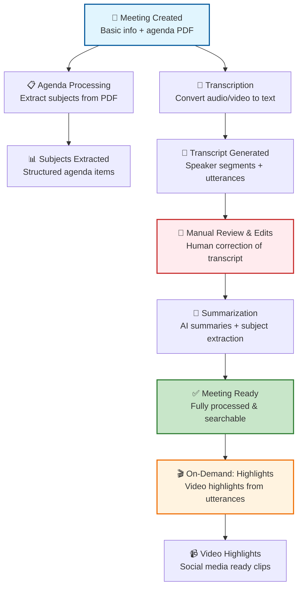
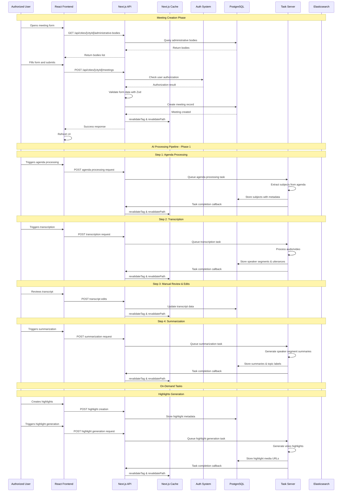

# Meeting Lifecycle & Processing Framework

## Concept

A system for managing the complete lifecycle of council meetings, from the very beginning with the publishing of the agenda to the full digitization of the meeting through our AI processing pipeline, which includes transcription, summarization, agenda processing, highlight generation, and search indexing.

## Architectural Overview

The meeting lifecycle system operates across multiple layers:

1. **Frontend Layer**: React components with form validation using React Hook Form and Zod
2. **API Layer**: Next.js API routes with authentication and authorization checks
3. **Database Layer**: Prisma ORM with PostgreSQL, using composite keys for meetings
4. **Task Processing Layer**: Asynchronous background tasks for AI processing workflows
5. **Status Tracking Layer**: Real-time meeting processing status with stage derivation and UI indicators
6. **Authentication Layer**: Role-based access control with city-level permissions
7. **Search Layer**: Elasticsearch integration for content discovery and search. pgsync replicates the database into the index continuously. There is no search-sync task.
8. **Media Processing Layer**: Video processing for highlights

## Meeting Processing Pipeline Overview

```mermaid
flowchart TD
    A[📝 Meeting Created<br/>Basic info + agenda PDF] --> B[📋 Agenda Processing<br/>Extract subjects from PDF]
    A --> C[🎤 Transcription<br/>Convert audio/video to text]
    
    B --> D[📊 Subjects Extracted<br/>Structured agenda items]
    C --> E[📝 Transcript Generated<br/>Speaker segments + utterances]
    
    E --> F[👤 Manual Review & Edits<br/>Human correction of transcript]
    F --> G[🤖 Summarization<br/>AI summaries + subject extraction]
    
    G --> I[✅ Meeting Ready<br/>Fully processed & searchable]
    
    I --> J[🎬 On-Demand: Highlights<br/>Video highlights from utterances]
    
    J --> L[📹 Video Highlights<br/>Social media ready clips]
    
    style A fill:#e1f5fe,stroke:#01579b,stroke-width:2px
    style I fill:#c8e6c9,stroke:#2e7d32,stroke-width:2px
    style J fill:#fff3e0,stroke:#ef6c00,stroke-width:2px
    style F fill:#ffebee,stroke:#c62828,stroke-width:2px
```

## Meeting Status Tracking System

The system includes comprehensive status tracking that provides real-time visibility into meeting processing progress through multiple stages and task completion states.

### Meeting Stages

Meetings progress through defined stages based on completed tasks. The stages are dynamically derived from the centralized task configuration:

1. **Scheduled** - Initial state when meeting is created
2. **Transcribe** - Audio/video has been transcribed to text
3. **Fix Transcript** - Automatic transcript correction has been applied
4. **Human Review** - Manual review and correction completed by human
5. **Transcript Sent** - The corrected transcript has been sent
6. **Summarize** - AI summarization and topic extraction completed
7. **Ready** - All required pipeline tasks completed, meeting fully processed

`MEETING_STAGES` in `src/lib/meetingStatus.ts` derives the middle stages from
`CORE_PROCESSING_TASKS`, which holds every `TASK_CONFIG` key with
`requiredForPipeline: true`. Process Agenda is not a stage: it is optional, so
it carries `requiredForPipeline: false`.

The stage derivation logic automatically determines the current stage by checking completed tasks in reverse order, ensuring accurate status representation.

## Schedule Status, Kind and Derived Name

The stages above describe the processing pipeline. The meeting record also holds the facts that the municipality announces. These facts are separate from the stages.

* **Schedule status** (`scheduleStatus`): `scheduled`, `postponed` or `cancelled`, with an optional reason. An admin sets it. The platform does not store "held": a meeting is held when material exists.
* **Kind** (`kind`): `regular`, `urgent`, `accountability`, `annualReport`, `budget` or `presidencyElection`. Null means "unknown" and occurs on archive meetings only. A new meeting is `regular` by default. λογοδοσία, απολογισμός and a meeting by circulation belong to a council.
* **Session number** (`sessionNumber`): the number that the municipality prints. It is not unique. A cancelled meeting keeps its number, and the new meeting after a postponement takes the same number. The platform never computes it.
* **Format and place** (`format`, `closedToPublic`, `place`): `format` defaults to `inPerson`. A meeting without its own `place` shows the `place` of its administrative body.
* **Links**: the new meeting after a postponement points to the postponed meeting (`postponedFromId`). A later part of a meeting points to its first part (`continuationOfId`). The continuation has its column and its checks only; the form and the page for it are a follow-up.

### The name

`name` and `name_en` hold an override only. Null means that the name is derived. `meetingDisplayName` in `src/lib/meetingName.ts` builds it from the administrative body, the kind and the date. The date is in the timezone of the city. An example is «Δημοτικό Συμβούλιο — Ειδική Συνεδρίαση Λογοδοσίας 25/06/2026». Every reader of the name calls this function. The SQL function `council_meeting_display_name` builds the same Greek name for the Notis view `notis_meeting_events`. The Elasticsearch field `meeting_name` still reads the column, and no query reads that field.

### The write path and the visibility rules

The meeting API routes are the one write path. They call `src/lib/db/meetingLifecycle.ts`, which runs the rules of `src/lib/meetingLifecycleRules.ts` and the write in one transaction. The release toggle and the delete function call the same module.

* A link goes to a postponed meeting of the same body, with no cycle. The status of a postponed meeting cannot change while its new meeting exists.
* The link alone changes no visibility. When the admin releases the new meeting, every meeting before it in the chain becomes unreleased. When the admin unreleases or deletes the new meeting, and it was released, the postponed meeting before it is released again.
* A change of status never changes the visibility. A postponed meeting stays public until its new meeting is released. A cancelled meeting stays public.
* No public payload carries `postponedFromId`. The new meeting shows the date for which it was first scheduled (`postponedFromDate`).
* The write takes no lock. Two admins who edit the same postponement chain at the same moment can, in theory, break the rules above.

### What the other parts of the platform do

* **Public presentation**: `publicMeetingPresentation` in `src/lib/meetingPresentation.ts` shows a postponed or cancelled meeting as such at every age, in place of its stage. A meeting that is closed to the public or held by circulation reads as held without a recording.
* **Pipelines**: the livestream cron, the decision poller, the upload lists and the landing page skip a meeting that is not scheduled. `requestTranscribeInternal` refuses it, and also a meeting with no public recording. A pending notice before a postponed or cancelled meeting is not sent.
* **Calendar**: `syncMeetingToCalendar` patches the event of a postponed or cancelled meeting to `status: 'cancelled'`. A past meeting emails nobody.
* **Decision polling** skips λογοδοσία by `kind`, not by the name. The migration set the kind of the existing λογοδοσία meetings.

### Backfill of the archive

1. Run `npx tsx scripts/meeting-lifecycle-report.ts --out reports/meeting-lifecycle.csv` (add `--agendas` to read the agenda PDFs). The script writes nothing to the database.
2. Review the CSV. Write `yes` in the `apply` column of each row to apply.
3. Run `npx tsx --require ./scripts/lib/allow-server-only.cjs scripts/meeting-lifecycle-apply.ts --csv reports/meeting-lifecycle.csv` for a dry run.
4. Run the same command with `--apply`. The script skips a row that changed since the report, and it writes an audit file.

## Sequence Diagram

```mermaid
sequenceDiagram
    participant User as Authorized User
    participant Frontend as React Frontend
    participant API as Next.js API
    participant Cache as Next.js Cache
    participant Auth as Auth System
    participant DB as PostgreSQL
    participant TaskServer as Task Server
    participant Search as Elasticsearch

    Note over User, Search: Meeting Creation Phase
    User->>Frontend: Opens meeting form
    Frontend->>API: GET /api/cities/[cityId]/administrative-bodies
    API->>DB: Query administrative bodies
    DB-->>API: Return bodies
    API-->>Frontend: Return bodies list

    User->>Frontend: Fills form and submits
    Frontend->>API: POST /api/cities/[cityId]/meetings
    API->>Auth: Check user authorization
    Auth-->>API: Authorization result
    API->>API: Validate form data with Zod
    API->>DB: Create meeting record
    DB-->>API: Meeting created
    API->>Cache: revalidateTag & revalidatePath
    API-->>Frontend: Success response
    Frontend->>Frontend: Refresh UI

    Note over User, Search: AI Processing Pipeline - Phase 1
    Note over User, Search: Step 1: Agenda Processing
    User->>Frontend: Triggers agenda processing
    Frontend->>API: POST agenda processing request
    API->>TaskServer: Queue agenda processing task
    TaskServer->>TaskServer: Extract subjects from agenda
    TaskServer->>DB: Store subjects with metadata
    TaskServer->>API: Task completion callback
    API->>Cache: revalidateTag & revalidatePath

    Note over User, Search: Step 2: Transcription
    User->>Frontend: Triggers transcription
    Frontend->>API: POST transcription request
    API->>TaskServer: Queue transcription task
    TaskServer->>TaskServer: Process audio/video
    TaskServer->>DB: Store speaker segments & utterances
    TaskServer->>API: Task completion callback
    API->>Cache: revalidateTag & revalidatePath

    Note over User, Search: Step 3: Manual Review & Edits
    User->>Frontend: Reviews transcript
    Frontend->>API: POST transcript edits
    API->>DB: Update transcript data
    API->>Cache: revalidateTag & revalidatePath

    Note over User, Search: Step 4: Summarization
    User->>Frontend: Triggers summarization
    Frontend->>API: POST summarization request
    API->>TaskServer: Queue summarization task
    TaskServer->>TaskServer: Generate speaker segment summaries
    TaskServer->>DB: Store summaries & topic labels
    TaskServer->>API: Task completion callback
    API->>Cache: revalidateTag & revalidatePath


    Note over User, Search: On-Demand Tasks
    Note over User, Search: Highlights Generation
    User->>Frontend: Creates highlights
    Frontend->>API: POST highlight creation
    API->>DB: Store highlight metadata
    User->>Frontend: Triggers highlight generation
    Frontend->>API: POST highlight generation request
    API->>TaskServer: Queue highlight generation task
    TaskServer->>TaskServer: Generate video highlights
    TaskServer->>DB: Store highlight media URLs
    TaskServer->>API: Task completion callback
    API->>Cache: revalidateTag & revalidatePath
```

## Key Component Pointers

*   **Data Models**:
    *   `CouncilMeeting`: `prisma/schema.prisma` (composite key: cityId + id, relations to city, administrativeBody, subjects, highlights, taskStatuses)
    *   `City`: `prisma/schema.prisma` (meetings array, administrative bodies, timezone support)
    *   `AdministrativeBody`: `prisma/schema.prisma` (optional meeting relation, types: council/committee/community)
    *   `TaskStatus`: `prisma/schema.prisma` (task execution tracking with type, status, request/response bodies)
*   **API Endpoints**:
    *   `src/app/api/cities/[cityId]/meetings/route.ts` (POST: create, GET: list meetings)
    *   `src/app/api/cities/[cityId]/meetings/[meetingId]/route.ts` (GET: fetch, PUT: update meeting)
    *   `src/app/api/cities/[cityId]/meetings/[meetingId]/status/route.ts` (GET: meeting processing status and stage)
    *   `src/app/api/cities/[cityId]/meetings/[meetingId]/taskStatuses/[taskStatusId]/route.ts` (POST: task callbacks)
    *   `src/app/api/cities/[cityId]/administrative-bodies/route.ts` (GET: list administrative bodies)
*   **Database Functions**:
    *   `src/lib/db/meetings.ts` (getCouncilMeetingsForCity, toggleMeetingRelease)
    *   `src/lib/db/meetingLifecycle.ts` (createMeetingRecord, updateMeetingRecord, setMeetingReleased, deleteMeetingRecord, originalScheduledDate)
    *   `src/lib/db/tasks.ts` (getMeetingTaskStatus, MeetingTaskStatus type, task completion tracking)
*   **Frontend Components**:
    *   `src/components/meetings/AddMeetingForm.tsx` (dual-purpose create/edit with Zod validation)
    *   `src/components/cities/CityMeetings.tsx` (meetings list with filtering and editing integration)
    *   `src/components/meetings/admin/Admin.tsx` (task management, release controls, cache tools)
    *   `src/components/meetings/CouncilMeetingWrapper.tsx` (meeting data context provider)
    *   `src/components/meetings/MeetingStatusBadge.tsx` (visual status indicator with stage-based styling)
    *   `src/components/meetings/MeetingTimeline.tsx` (detailed processing timeline with task completion status)
    *   `src/components/admin/meetings/ExpandableMeetingRow.tsx` (enhanced meeting row with status display and timeline)
*   **Authentication**:
    *   `src/lib/auth.ts` (withUserAuthorizedToEdit, isUserAuthorizedToEdit, hierarchical permissions)
*   **Task Processing Pipeline**:
    *   **Core Pipeline**: Process Agenda (optional) → Transcribe → Fix Transcript → Human Review → Summarize
    *   **Post-Processing**: Highlight Generation, Voiceprint Generation, Decision Polling
*   **Cache Management**:
    *   `src/lib/cache/queries.ts` (cache invalidation via Next.js API routes)
    *   `src/lib/cache/index.ts` (createCache utility with performance logging)
    *   Cached queries: `getMeetingDataCached()`, `getCouncilMeetingsPreviewCached()`, `getCityCached()`, `getMeetingStatusCached()`
*   **Context Providers**:
    *   `src/components/meetings/CouncilMeetingDataContext.tsx` (central data provider with speaker management)
    *   `src/components/meetings/VideoProvider.tsx` (video playback state and seeking operations)

## Business Rules & Assumptions

### Authorization Rules
1. Only users with city administration rights can create/edit meetings
2. Superadmins can edit any meeting in any city
3. Users can edit meetings if they administer the city directly or through party/person relationships
4. Unreleased meetings are only visible to authorized users

### Data Validation Rules
1. A name override is empty or at least 2 characters. An empty name is derived from the body, the kind and the date
2. Meeting ID is auto-generated from the date when the form sends none, with `_2`, `_3` for a second meeting on one day. An admin can type an ID
3. A new meeting needs a kind (default `regular`). The lifecycle rules in `src/lib/meetingLifecycleRules.ts` apply to every write
4. YouTube and agenda URLs must be valid URLs or empty strings
5. Administrative body selection is optional but validated if provided
6. Date/time combination must be valid and not in the distant past

### Status Tracking Rules
1. Meeting stage is dynamically derived from completed tasks
2. A meeting is considered "ready" only when all required pipeline tasks are completed
3. Stage derivation checks tasks in reverse order to find the latest completed stage
4. Status updates are cached and automatically invalidated when tasks complete
5. See [`docs/task-architecture.md`](/docs/task-architecture.md) for detailed task configuration and management

### Workflow Assumptions
1. Meetings are created in "unreleased" state by default
2. Meeting ID follows pattern: `month_day_year` (e.g., `jan_15_2024`)
3. Administrative bodies must exist in the same city as the meeting
4. Form supports both creation and editing modes through props
5. Cache invalidation happens automatically after successful operations
6. Status tracking provides real-time visibility into meeting processing progress
7. Human review can be manually marked as complete via admin interface

