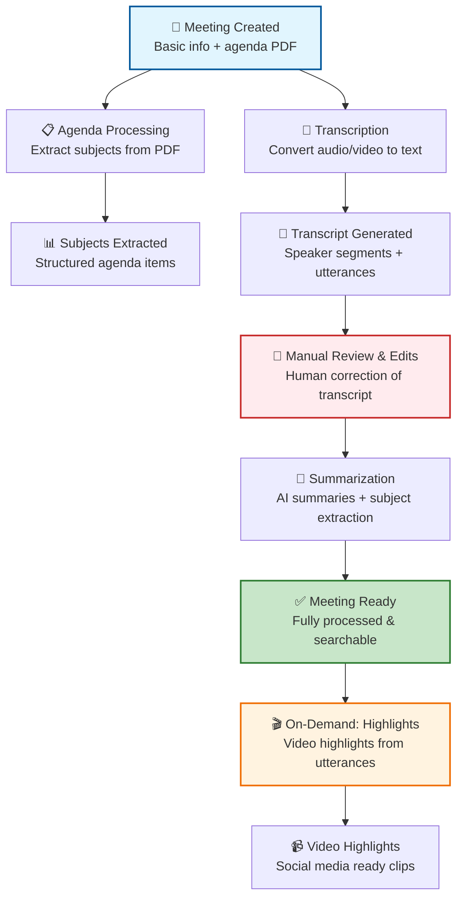
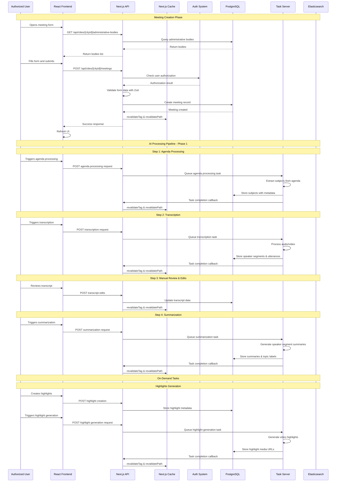

# Meeting Lifecycle & Processing Framework

## Concept

A system for managing the complete lifecycle of council meetings, from the very beginning with the publishing of the agenda to the full digitization of the meeting through our AI processing pipeline, which includes transcription, summarization, agenda processing, highlight generation, and search indexing.

## Architectural Overview

The meeting lifecycle system operates across multiple layers:

1. **Frontend Layer**: React components with form validation using React Hook Form and Zod
2. **API Layer**: Next.js API routes with authentication and authorization checks
3. **Database Layer**: Prisma ORM with PostgreSQL, using composite keys for meetings
4. **Task Processing Layer**: Asynchronous background tasks for AI processing workflows
5. **Status Tracking Layer**: Real-time meeting processing status with stage derivation and UI indicators
6. **Authentication Layer**: Role-based access control with city-level permissions
7. **Search Layer**: Elasticsearch integration for content discovery and search. pgsync replicates the database into the index continuously. There is no search-sync task.
8. **Media Processing Layer**: Video processing for highlights

## Meeting Processing Pipeline Overview

```mermaid
flowchart TD
    A[📝 Meeting Created<br/>Basic info + agenda PDF] --> B[📋 Agenda Processing<br/>Extract subjects from PDF]
    A --> C[🎤 Transcription<br/>Convert audio/video to text]
    
    B --> D[📊 Subjects Extracted<br/>Structured agenda items]
    C --> E[📝 Transcript Generated<br/>Speaker segments + utterances]
    
    E --> F[👤 Manual Review & Edits<br/>Human correction of transcript]
    F --> G[🤖 Summarization<br/>AI summaries + subject extraction]
    
    G --> I[✅ Meeting Ready<br/>Fully processed & searchable]
    
    I --> J[🎬 On-Demand: Highlights<br/>Video highlights from utterances]
    
    J --> L[📹 Video Highlights<br/>Social media ready clips]
    
    style A fill:#e1f5fe,stroke:#01579b,stroke-width:2px
    style I fill:#c8e6c9,stroke:#2e7d32,stroke-width:2px
    style J fill:#fff3e0,stroke:#ef6c00,stroke-width:2px
    style F fill:#ffebee,stroke:#c62828,stroke-width:2px
```

## Meeting Status Tracking System

The system includes comprehensive status tracking that provides real-time visibility into meeting processing progress through multiple stages and task completion states.

### Meeting Stages

Meetings progress through defined stages based on completed tasks. The stages are dynamically derived from the centralized task configuration:

1. **Scheduled** - Initial state when meeting is created
2. **Transcribe** - Audio/video has been transcribed to text
3. **Fix Transcript** - Automatic transcript correction has been applied
4. **Human Review** - Manual review and correction completed by human
5. **Transcript Sent** - The corrected transcript has been sent
6. **Summarize** - AI summarization and topic extraction completed
7. **Ready** - All required pipeline tasks completed, meeting fully processed

`MEETING_STAGES` in `src/lib/meetingStatus.ts` derives the middle stages from
`CORE_PROCESSING_TASKS`, which holds every `TASK_CONFIG` key with
`requiredForPipeline: true`. Process Agenda is not a stage: it is optional, so
it carries `requiredForPipeline: false`.

The stage derivation logic automatically determines the current stage by checking completed tasks in reverse order, ensuring accurate status representation.

## Schedule Status, Kind and Derived Name

The stages above describe the processing pipeline. The meeting record also holds the facts that the municipality announces. These facts are separate from the stages.

* **Schedule status** (`scheduleStatus`): `scheduled`, `postponed` or `cancelled`, with an optional reason. An admin sets it. The platform does not store "held": a meeting is held when material exists.
* **Kind** (`kind`): `regular`, `urgent`, `accountability`, `activityReport`, `budget` or `presidencyElection`. A null kind means that the record states no single kind. There are three cases. The invitation is not read yet. The record holds several meetings, and its name override says which. The meeting is none of these kinds, such as the financial accounts. The form offers «Από την πρόσκληση» for null and has no default. The four special kinds belong to a council.
* **Session number** (`sessionNumber`): the number that the municipality prints. It is not unique. A cancelled meeting keeps its number, and the new meeting after a postponement takes the same number. The platform never computes it.
* **Format and place** (`format`, `closedToPublic`, `place`): `format` is null until somebody states it or reads it from the invitation, like the kind. A meeting of unstated format is expected as usual: it can have a stream and a transcript. A meeting without its own `place` shows the `place` of its administrative body. A format that has no place, such as a remote meeting, shows no place. `closedToPublic` is a fact that the meeting page shows to readers. A closed meeting is still recorded and transcribed, and readers get it like any other meeting. To keep the material of a meeting private, an admin unreleases the meeting.
* **Links**: the new meeting after a postponement points to the postponed meeting (`postponedFromId`). A later part of a meeting points to its first part (`continuationOfId`). The continuation has its column and its checks only; the form and the page for it are a follow-up.

### The name

`name` and `name_en` hold an override only. Null means that the name is derived. `src/lib/meetingName.ts` derives two forms:

* **The title** (`meetingDisplayName`): the session number and the kind, for example «3η Τακτική» or «4η Ειδική Λογοδοσίας». A meeting without a number reads «Τακτική Συνεδρίαση». A meeting of unknown kind reads «Συνεδρίαση 12/03/2026». The title has no body. The meeting page, the cards and the lists use it, because they show the body and the date next to it.
* **The label** (`meetingLabel`): the body, the title and the date, for example «Δημοτικό Συμβούλιο · 3η Τακτική · 12/03/2026». A reader that prints the name on its own uses it. Examples are alerts, emails, the RSS feed, the OG images and the calendar event. Share texts, the MCP tools and the `name` of the public API use it too. The public API also returns the title as `title`.

An override wins in both forms, as the admin wrote it. The kind words exist in Greek and English. The other locales name a meeting by their word for "meeting" and the date. The date is in the timezone of the city.

The kind words, the ordinals and the title rule live in the shared module `packages/ui/src/lib/meeting-title.ts`. `meetingName.ts` adds the date in the timezone of the city and the Serbian script. The shared module declares the kinds without Prisma, and `meetingName.ts` asserts that the list equals `MeetingKind`, so a new kind does not compile until it has words.

Notis does not receive a title. The view `notis_meeting_events` gives the facts: `meetingName` holds the override (null when the title is derived), and `meetingKind` and `sessionNumber` follow. Notis derives the title from these facts with the shared module. Its agent prompt states the title and the raw facts, and the admin pages show «body · title · date». An event or a ledger row from before this change has only the stored name, and Notis shows that name. The Elasticsearch field `meeting_name` still reads the column, and no query reads that field.

### The write path and the visibility rules

`src/lib/meetingWrites.ts` is the one write path for the details of a meeting. The meeting API routes and the MCP admin tools (`create_meeting`, `update_meeting`) call it after they authorize the request. It calls `src/lib/db/meetingLifecycle.ts`, which runs the rules of `src/lib/meetingLifecycleRules.ts` and the write in one transaction. The release toggle and the delete function call the lifecycle module directly.

* A link goes to a postponed meeting of the same body, with no cycle. The status of a postponed meeting cannot change while its new meeting exists.
* The link alone changes no visibility. When the admin releases the new meeting, every public meeting before it in the chain becomes unreleased. Each of those meetings remembers it (`hiddenByPostponement`). Then the admin can unrelease or delete the released new meeting. The postponed meeting before it is released again only when that release had hidden it. A postponed draft stays a draft.
* A postponed meeting has one new meeting at most.
* A change of status never changes the visibility. A postponed meeting stays public until its new meeting is released. A cancelled meeting stays public.
* No public payload carries `postponedFromId` or `continuationOfId`. The new meeting shows the date for which it was first scheduled (`postponedFromDate`).
* The write takes no lock. Two admins who edit the same postponement chain at the same moment can, in theory, break the rules above.

### What the other parts of the platform do

* **Public presentation**: `publicMeetingPresentation` in `src/lib/meetingPresentation.ts` shows a postponed or cancelled meeting as such at every age, in place of its stage. A meeting held by circulation offers no channel before it starts. After it starts, it reads as held without a recording.
* **One meaning for each value**: `src/lib/meetingLifecycleRules.ts` holds a table for each enum (`SCHEDULE_STATUSES`, `MEETING_FORMATS`, `MEETING_KINDS`). Code reads `takesPlace`, `TAKES_PLACE_WHERE`, `hasPublicRecording` or `PUBLIC_RECORDING_WHERE`, never a raw value. A new value fails to compile until each table gives it a meaning.
* **Pipelines and lists**: some parts skip a meeting that does not take place. These are the livestream cron, the decision poller, the bulk poll dialog and the upload lists. The landing page, the city rail, the embed widget and `/latest` skip it too. `requestTranscribeInternal` refuses it, and also a meeting held by circulation. A pending notice before a postponed or cancelled meeting is not sent.
* **Calendar**: `syncMeetingToCalendar` patches the event of a postponed or cancelled meeting to `status: 'cancelled'`. It patches the event back to `confirmed` only when the meeting returns to scheduled. Any other edit leaves the status alone. A past meeting emails nobody.
* **Decision polling** skips the meetings that take no decisions, λογοδοσία and απολογισμός, by `kind`, not by the name. A later part takes the kind of its first part. The migration set the kind of the existing λογοδοσία meetings.

### The archive

The migration sets `kind = accountability` on the existing λογοδοσία meetings of a council, because the decision poller reads the kind. The kind and the format of an archive meeting stay null, and its stored name stays as an override. A later run of processAgenda over the archive will extract the kind, the session number and the format from each invitation.

## Sequence Diagram

```mermaid
sequenceDiagram
    participant User as Authorized User
    participant Frontend as React Frontend
    participant API as Next.js API
    participant Cache as Next.js Cache
    participant Auth as Auth System
    participant DB as PostgreSQL
    participant TaskServer as Task Server
    participant Search as Elasticsearch

    Note over User, Search: Meeting Creation Phase
    User->>Frontend: Opens meeting form
    Frontend->>API: GET /api/cities/[cityId]/administrative-bodies
    API->>DB: Query administrative bodies
    DB-->>API: Return bodies
    API-->>Frontend: Return bodies list

    User->>Frontend: Fills form and submits
    Frontend->>API: POST /api/cities/[cityId]/meetings
    API->>Auth: Check user authorization
    Auth-->>API: Authorization result
    API->>API: Validate form data with Zod
    API->>DB: Create meeting record
    DB-->>API: Meeting created
    API->>Cache: revalidateTag & revalidatePath
    API-->>Frontend: Success response
    Frontend->>Frontend: Refresh UI

    Note over User, Search: AI Processing Pipeline - Phase 1
    Note over User, Search: Step 1: Agenda Processing
    User->>Frontend: Triggers agenda processing
    Frontend->>API: POST agenda processing request
    API->>TaskServer: Queue agenda processing task
    TaskServer->>TaskServer: Extract subjects from agenda
    TaskServer->>DB: Store subjects with metadata
    TaskServer->>API: Task completion callback
    API->>Cache: revalidateTag & revalidatePath

    Note over User, Search: Step 2: Transcription
    User->>Frontend: Triggers transcription
    Frontend->>API: POST transcription request
    API->>TaskServer: Queue transcription task
    TaskServer->>TaskServer: Process audio/video
    TaskServer->>DB: Store speaker segments & utterances
    TaskServer->>API: Task completion callback
    API->>Cache: revalidateTag & revalidatePath

    Note over User, Search: Step 3: Manual Review & Edits
    User->>Frontend: Reviews transcript
    Frontend->>API: POST transcript edits
    API->>DB: Update transcript data
    API->>Cache: revalidateTag & revalidatePath

    Note over User, Search: Step 4: Summarization
    User->>Frontend: Triggers summarization
    Frontend->>API: POST summarization request
    API->>TaskServer: Queue summarization task
    TaskServer->>TaskServer: Generate speaker segment summaries
    TaskServer->>DB: Store summaries & topic labels
    TaskServer->>API: Task completion callback
    API->>Cache: revalidateTag & revalidatePath


    Note over User, Search: On-Demand Tasks
    Note over User, Search: Highlights Generation
    User->>Frontend: Creates highlights
    Frontend->>API: POST highlight creation
    API->>DB: Store highlight metadata
    User->>Frontend: Triggers highlight generation
    Frontend->>API: POST highlight generation request
    API->>TaskServer: Queue highlight generation task
    TaskServer->>TaskServer: Generate video highlights
    TaskServer->>DB: Store highlight media URLs
    TaskServer->>API: Task completion callback
    API->>Cache: revalidateTag & revalidatePath
```

## Key Component Pointers

*   **Data Models**:
    *   `CouncilMeeting`: `prisma/schema.prisma` (composite key: cityId + id, relations to city, administrativeBody, subjects, highlights, taskStatuses)
    *   `City`: `prisma/schema.prisma` (meetings array, administrative bodies, timezone support)
    *   `AdministrativeBody`: `prisma/schema.prisma` (optional meeting relation, types: council/committee/community)
    *   `TaskStatus`: `prisma/schema.prisma` (task execution tracking with type, status, request/response bodies)
*   **API Endpoints**:
    *   `src/app/api/cities/[cityId]/meetings/route.ts` (POST: create, GET: list meetings)
    *   `src/app/api/cities/[cityId]/meetings/[meetingId]/route.ts` (GET: fetch, PUT: update meeting)
    *   `src/app/api/cities/[cityId]/meetings/[meetingId]/status/route.ts` (GET: meeting processing status and stage)
    *   `src/app/api/cities/[cityId]/meetings/[meetingId]/taskStatuses/[taskStatusId]/route.ts` (POST: task callbacks)
    *   `src/app/api/cities/[cityId]/administrative-bodies/route.ts` (GET: list administrative bodies)
*   **Database Functions**:
    *   `src/lib/db/meetings.ts` (getCouncilMeetingsForCity, toggleMeetingRelease)
    *   `src/lib/meetingWrites.ts` (createMeetingWithEffects, updateMeetingWithEffects: the writes of the API routes and the MCP admin tools)
    *   `src/lib/db/meetingLifecycle.ts` (createMeetingRecord, updateMeetingRecord, setMeetingReleased, deleteMeetingRecord, originalScheduledDate)
    *   `src/lib/db/tasks.ts` (getMeetingTaskStatus, MeetingTaskStatus type, task completion tracking)
*   **Frontend Components**:
    *   `src/components/meetings/AddMeetingForm.tsx` (dual-purpose create/edit with Zod validation)
    *   `src/components/cities/CityMeetings.tsx` (meetings list with filtering and editing integration)
    *   `src/components/meetings/admin/Admin.tsx` (task management, release controls, cache tools)
    *   `src/components/meetings/CouncilMeetingWrapper.tsx` (meeting data context provider)
    *   `src/components/meetings/MeetingStatusBadge.tsx` (visual status indicator with stage-based styling)
    *   `src/components/meetings/MeetingTimeline.tsx` (detailed processing timeline with task completion status)
    *   `src/components/admin/meetings/ExpandableMeetingRow.tsx` (enhanced meeting row with status display and timeline)
*   **Authentication**:
    *   `src/lib/auth.ts` (withUserAuthorizedToEdit, isUserAuthorizedToEdit, hierarchical permissions)
*   **Task Processing Pipeline**:
    *   **Core Pipeline**: Process Agenda (optional) → Transcribe → Fix Transcript → Human Review → Summarize
    *   **Post-Processing**: Highlight Generation, Voiceprint Generation, Decision Polling
*   **Cache Management**:
    *   `src/lib/cache/queries.ts` (cache invalidation via Next.js API routes)
    *   `src/lib/cache/index.ts` (createCache utility with performance logging)
    *   Cached queries: `getMeetingDataCached()`, `getCouncilMeetingsPreviewCached()`, `getCityCached()`, `getMeetingStatusCached()`
*   **Context Providers**:
    *   `src/components/meetings/CouncilMeetingDataContext.tsx` (central data provider with speaker management)
    *   `src/components/meetings/VideoProvider.tsx` (video playback state and seeking operations)

## Business Rules & Assumptions

### Authorization Rules
1. Only users with city administration rights can create/edit meetings
2. Superadmins can edit any meeting in any city
3. Users can edit meetings if they administer the city directly or through party/person relationships
4. Unreleased meetings are only visible to authorized users

### Data Validation Rules
1. A name override is empty or at least 2 characters. An empty name is derived from the body, the kind and the date
2. Meeting ID is auto-generated from the date when the form sends none, with `_2`, `_3` for a second meeting on one day. An admin can type an ID
3. The kind and the format may stay unstated («Από την πρόσκληση»). The lifecycle rules in `src/lib/meetingLifecycleRules.ts` apply to every write
4. YouTube and agenda URLs must be valid URLs or empty strings
5. Administrative body selection is optional but validated if provided
6. Date/time combination must be valid and not in the distant past

### Status Tracking Rules
1. Meeting stage is dynamically derived from completed tasks
2. A meeting is considered "ready" only when all required pipeline tasks are completed
3. Stage derivation checks tasks in reverse order to find the latest completed stage
4. Status updates are cached and automatically invalidated when tasks complete
5. See [`docs/task-architecture.md`](/docs/task-architecture.md) for detailed task configuration and management

### Workflow Assumptions
1. Meetings are created in "unreleased" state by default
2. Meeting ID follows pattern: `month_day_year` (e.g., `jan_15_2024`)
3. Administrative bodies must exist in the same city as the meeting
4. Form supports both creation and editing modes through props
5. Cache invalidation happens automatically after successful operations
6. Status tracking provides real-time visibility into meeting processing progress
7. Human review can be manually marked as complete via admin interface

