# Meeting Lifecycle & Processing Framework

## Concept

A system for managing the complete lifecycle of council meetings, from the very beginning with the publishing of the agenda to the full digitization of the meeting through our AI processing pipeline, which includes transcription, summarization, agenda processing, highlight generation, podcast creation, and search indexing.

## Architectural Overview

The meeting lifecycle system operates across multiple layers:

1. **Frontend Layer**: React components with form validation using React Hook Form and Zod
2. **API Layer**: Next.js API routes with authentication and authorization checks
3. **Database Layer**: Prisma ORM with PostgreSQL, using composite keys for meetings
4. **Task Processing Layer**: Asynchronous background tasks for AI processing workflows
5. **Authentication Layer**: Role-based access control with city-level permissions
6. **Search Layer**: Elasticsearch integration for content discovery and search
7. **Media Processing Layer**: Video/audio processing for highlights and podcasts

## Meeting Processing Pipeline Overview

```mermaid
flowchart TD
    A[📝 Meeting Created<br/>Basic info + agenda PDF] --> B[📋 Agenda Processing<br/>Extract subjects from PDF]
    A --> C[🎤 Transcription<br/>Convert audio/video to text]
    
    B --> D[📊 Subjects Extracted<br/>Structured agenda items]
    C --> E[📝 Transcript Generated<br/>Speaker segments + utterances]
    
    E --> F[👤 Manual Review & Edits<br/>Human correction of transcript]
    F --> G[🤖 Summarization<br/>AI summaries + subject extraction]
    
    G --> H[🔍 Search Sync<br/>Index content for search]
    H --> I[✅ Meeting Ready<br/>Fully processed & searchable]
    
    I --> J[🎬 On-Demand: Highlights<br/>Video highlights from utterances]
    I --> K[🎧 On-Demand: Podcasts<br/>Audio segments + host content]
    
    J --> L[📹 Video Highlights<br/>Social media ready clips]
    K --> M[🎵 Podcast Specs<br/>Structured audio content]
    
    style A fill:#e1f5fe,stroke:#01579b,stroke-width:2px
    style I fill:#c8e6c9,stroke:#2e7d32,stroke-width:2px
    style J fill:#fff3e0,stroke:#ef6c00,stroke-width:2px
    style K fill:#fff3e0,stroke:#ef6c00,stroke-width:2px
    style F fill:#ffebee,stroke:#c62828,stroke-width:2px
```

## Sequence Diagram

## Key Component Pointers

*   **Data Models**:
    *   `CouncilMeeting`: `prisma/schema.prisma` (composite key: cityId + id, relations to city, administrativeBody, subjects, highlights, taskStatuses)
    *   `City`: `prisma/schema.prisma` (meetings array, administrative bodies, timezone support)
    *   `AdministrativeBody`: `prisma/schema.prisma` (optional meeting relation, types: council/committee/community)
    *   `TaskStatus`: `prisma/schema.prisma` (task execution tracking with type, status, request/response bodies)
*   **API Endpoints**:
    *   `src/app/api/cities/[cityId]/meetings/route.ts` (POST: create, GET: list meetings)
    *   `src/app/api/cities/[cityId]/meetings/[meetingId]/route.ts` (GET: fetch, PUT: update meeting)
    *   `src/app/api/cities/[cityId]/meetings/[meetingId]/taskStatuses/[taskStatusId]/route.ts` (POST: task callbacks)
    *   `src/app/api/cities/[cityId]/administrative-bodies/route.ts` (GET: list administrative bodies)
*   **Database Functions**:
    *   `src/lib/db/meetings.ts` (createCouncilMeeting, editCouncilMeeting, getCouncilMeetingsForCity, toggleMeetingRelease)
*   **Frontend Components**:
    *   `src/components/meetings/AddMeetingForm.tsx` (dual-purpose create/edit with Zod validation)
    *   `src/components/cities/CityMeetings.tsx` (meetings list with filtering and editing integration)
    *   `src/components/meetings/admin/Admin.tsx` (task management, release controls, cache tools)
    *   `src/components/meetings/CouncilMeetingWrapper.tsx` (meeting data context provider)
*   **Authentication**:
    *   `src/lib/auth.ts` (withUserAuthorizedToEdit, isUserAuthorizedToEdit, hierarchical permissions)
*   **Task Processing Pipeline**:
    *   **Core Pipeline**: Agenda Processing → Transcription → Transcript Correction → Manual Review → Summarization → Search Sync → Manual Send Final Transcript
    *   **On-Demand**: Highlight Generation, Podcast Generation, Voiceprint Generation, Media File Splitting
    *   See [`docs/task-architecture.md`](/docs/task-architecture.md) for detailed task architecture
*   **Cache Management**:
    *   `src/lib/cache/queries.ts` (cache invalidation via Next.js API routes)
    *   `src/lib/cache/index.ts` (createCache utility with performance logging)
    *   Cached queries: `getMeetingDataCached()`, `getCouncilMeetingsForCityCached()`, `getCityCached()`
*   **Context Providers**:
    *   `src/components/meetings/CouncilMeetingDataContext.tsx` (central data provider with speaker management)
    *   `src/components/meetings/VideoProvider.tsx` (video playback state and seeking operations)

## Business Rules & Assumptions

### Authorization Rules
1. Only users with city administration rights can create/edit meetings
2. Superadmins can edit any meeting in any city
3. Users can edit meetings if they administer the city directly or through party/person relationships
4. Unreleased meetings are only visible to authorized users

### Data Validation Rules
1. Meeting names must be at least 2 characters in both Greek and English
2. Meeting ID is auto-generated from date but can be manually overridden
3. YouTube and agenda URLs must be valid URLs or empty strings
4. Administrative body selection is optional but validated if provided
5. Date/time combination must be valid and not in the distant past

### Workflow Assumptions
1. Meetings are created in "unreleased" state by default
2. Meeting ID follows pattern: `month_day_year` (e.g., `jan_15_2024`)
3. Administrative bodies must exist in the same city as the meeting
4. Form supports both creation and editing modes through props
5. Cache invalidation happens automatically after successful operations

