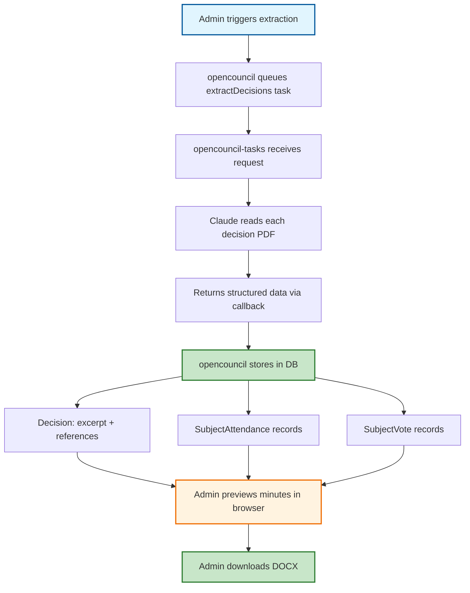

# Meeting Minutes Generation

## Concept

A system for generating official meeting minutes (πρακτικά συνεδρίασης) from council meetings. Minutes combine transcript data, agenda subjects, and decision data extracted from Diavgeia PDFs into a structured DOCX document that municipalities can use as their official record.

The system follows a two-phase architecture: an **extraction phase** where AI reads decision PDFs and stores structured data in the database, and a **rendering phase** where minutes are assembled from database content — no AI or task server needed.

## Architectural Overview

The minutes system operates across two repos with a clear responsibility split:

1. **opencouncil-tasks** — Expensive LLM work only: reads decision PDFs via Claude and returns structured extraction results
2. **opencouncil** — Owns all data and rendering: stores extracted data in the database, renders DOCX on-demand, provides admin preview

This split means that once decisions are extracted, minutes can be regenerated instantly without the task server. The extracted data is also useful beyond minutes (subject views, voting records, legal references).

## Data Model

Minutes generation relies on three layers of data, all on the `Subject` level:

### Decision content (extracted from PDF)

The `Decision` model is enriched with fields extracted from the actual Diavgeia PDF:

| Field | Type | Source |
|-------|------|--------|
| `excerpt` | String? (markdown) | The decision body — "ΑΠΟΦΑΣΙΖΕΙ…" with any bullet points or structured content |
| `references` | String? (markdown) | Legal bases from the "αφού έλαβε υπόψη" section — laws, FEK citations, prior decisions |

Both fields are markdown because PDF content can contain numbered lists, bullet points, and other structured formatting. Richness varies by municipality — Vrilissia has 14+ numbered reference items per decision, while Zografou often uses a single generic phrase.

### Subject attendance

`SubjectAttendance` tracks who was present or absent for each subject:

| Field | Type | Description |
|-------|------|-------------|
| `subjectId` | String | The subject this attendance record belongs to |
| `personId` | String | The council member |
| `status` | AttendanceStatus | `PRESENT` or `ABSENT` |

Attendance is per-subject (not per-meeting) because members can arrive late or leave early — PDFs include phrasing like "ο X αποχώρησε κατά τη συζήτηση του θέματος Y". In practice, most subjects within a meeting share the same attendance, but the per-subject model handles edge cases correctly.

### Subject votes

`SubjectVote` records how each member voted on each subject:

| Field | Type | Description |
|-------|------|-------------|
| `subjectId` | String | The subject voted on |
| `personId` | String | The council member |
| `voteType` | VoteType | `FOR`, `AGAINST`, or `ABSTAIN` |

Per-person votes replace text-based results like "Ομόφωνα" or "Κατά πλειοψηφία" — the result can be derived from the individual votes. Not all PDFs include per-person details; some just say "Ομόφωνα" (unanimous), in which case a `FOR` vote is created for every present member.

### Creation pattern

All three (`Decision`, `SubjectAttendance`, `SubjectVote`) follow the same dual-creation pattern:
- **Automated**: The extraction task reads PDFs and creates records via callback
- **Manual**: Admins can add/edit/remove records directly through the UI

Each record tracks its origin via `taskId` (automated) or `createdById` (manual).

## Pipeline Overview

### Phase 1: Extraction (requires task server)

1. Admin clicks "Extract Decisions" in the meeting admin panel
2. opencouncil builds a request with all subjects that have linked decisions (with PDF URLs)
3. opencouncil-tasks receives the request, downloads each PDF, and sends it to Claude for extraction
4. Claude extracts: decision excerpt, references, present/absent members, vote details
5. Results are returned via the standard task callback to opencouncil
6. Callback handler stores extracted data: `excerpt`/`references` on Decision, creates `SubjectAttendance` and `SubjectVote` records

### Phase 2: Rendering (local, instant)

1. Admin previews the minutes in an in-browser view — inspects attendance, transcript sections, decisions per subject
2. Admin can manually adjust data if needed (add missing attendance, fix vote records)
3. Admin downloads the final DOCX — assembled from DB content, no network calls

## Minutes Document Structure

The generated DOCX follows the standard Greek municipal minutes format:

1. **Cover page**: Meeting metadata (city, date, administrative body), present/absent member lists
2. **Table of contents**: Subject titles with decision numbers (protocol numbers from Diavgeia)
3. **Per-subject sections**: Each subject includes:
   - Subject title and agenda item number
   - Speaker-labelled transcript text (from `Utterance.discussionSubjectId` linking)
   - Decision excerpt (from `Decision.excerpt`)

### Transcript-subject linking

Minutes include only utterances linked to each subject via `Utterance.discussionSubjectId` (populated by the summarize task). Only utterances with `discussionStatus: 'SUBJECT_DISCUSSION'` are included.

This linking is currently AI-driven with no manual editing UI. Misclassified or unlinked utterances silently disappear from the minutes output. A future iteration should add a transcript view with visual subject boundaries and the ability to reassign utterances.

## Key Component Pointers

### opencouncil

* **Data Models**:
  * `Decision`: `prisma/schema.prisma` — enriched with `excerpt`, `references`
  * `SubjectAttendance`: `prisma/schema.prisma` — Subject→Person with AttendanceStatus
  * `SubjectVote`: `prisma/schema.prisma` — Subject→Person with VoteType
* **Task Integration**:
  * `src/lib/tasks/generateMinutes.ts` — request builder, callback handler, request body export
  * `src/lib/apiTypes.ts` — shared request/result types for the extraction task
* **Admin UI**:
  * `src/components/meetings/admin/Admin.tsx` — "Generate Minutes" split button, DOCX download link, request export

### opencouncil-tasks

* **PDF Extraction**:
  * `src/tasks/generateMinutes.ts` — `extractDecisionData` (single PDF), `extractAllDecisions` (batch), `buildMinutesData`, `renderMinutesDocx`
* **CLI**:
  * `src/cli.ts` — composable commands: `extract-decision`, `build-minutes-data`, `render-minutes`, `generate-minutes`
* **Types**:
  * `src/types.ts` — `GenerateMinutesRequest`, `GenerateMinutesResult`, `MinutesData`, `ExtractedDecisions`

## Business Rules & Assumptions

### Data Rules
1. Attendance and votes are per-subject, not per-meeting — different subjects can have different attendance
2. `Decision.protocolNumber` serves as the decision number — no separate field needed
3. `excerpt` and `references` are markdown to preserve PDF structure (bullet points, numbered lists)
4. A subject can have attendance/vote records without a linked Decision (manual entry)
5. A subject can have a Decision without attendance/vote records (extraction pending or not available in PDF)

### Extraction Rules
1. PDF extraction results are cached per URL to avoid re-extracting unchanged documents
2. Missing decisions produce warnings but don't block minutes generation
3. Vote breakdown is best-effort — some PDFs only state "Ομόφωνα" without naming voters
4. Reference richness varies by municipality — from detailed law citations to generic phrases

### Workflow Assumptions
1. Decisions must be linked to subjects (via the existing Diavgeia polling or manual entry) before extraction
2. The summarize task must have run to populate `Utterance.discussionSubjectId` for transcript content
3. Minutes generation is an admin-only feature, accessible from the meeting admin panel
4. Both automated and manual data entry are supported — admins can override AI-extracted data
