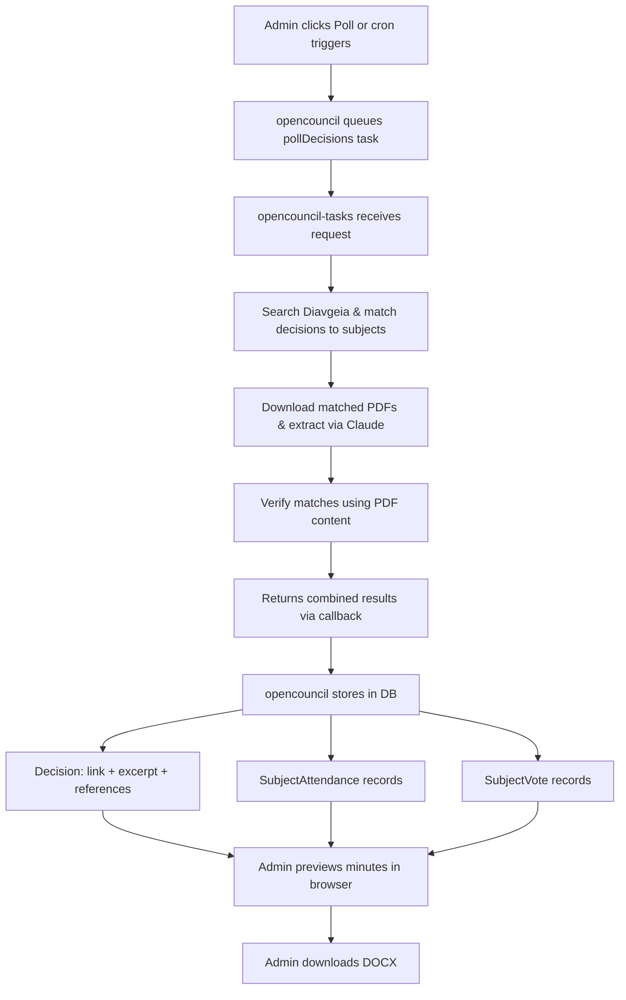

# Meeting Minutes Generation

## Concept

A system for generating official meeting minutes (πρακτικά συνεδρίασης) from council meetings. Minutes combine transcript data, agenda subjects, and decision data extracted from Diavgeia PDFs into a structured DOCX document that municipalities can use as their official record.

## Architectural Split

The system operates across two repos:

1. **opencouncil-tasks** — Expensive LLM work only: searches Diavgeia, matches decisions to subjects, reads matched decision PDFs via Claude, and returns combined matching + extraction results
2. **opencouncil** — Owns all data and rendering: stores matched decisions and extracted data in the database, renders DOCX on-demand, provides admin preview

This split means that once decisions are polled and extracted, minutes can be regenerated instantly without the task server. The extracted data is also useful beyond minutes (subject views, voting records, legal references).

## Pipeline

## Key Design Decisions

### Per-subject attendance, not per-meeting
Attendance is modeled per-subject because members can arrive late or leave early — PDFs include phrasing like "ο X αποχώρησε κατά τη συζήτηση του θέματος Y". In practice most subjects share the same attendance, but the per-subject model handles edge cases correctly.

### Council composition
Mayor and president presence are tracked separately from member attendance. The DOCX output includes a council composition section and full vote breakdowns showing FOR/AGAINST/ABSTAIN/ABSENT members by name.

### Transcript content in minutes
Minutes include utterances linked to each subject via `Utterance.discussionSubjectId` (populated by the summarize task). Both `SUBJECT_DISCUSSION` and `VOTE` utterances are included. Orphaned utterances (preamble before first subject, epilogue after last, gaps between subjects) are handled separately.

This linking is currently AI-driven with no manual editing UI. Misclassified or unlinked utterances silently disappear from the minutes output.

### Excerpt and references are markdown
`Decision.excerpt` and `Decision.references` are stored as markdown to preserve PDF structure (bullet points, numbered lists). Richness varies by municipality — Vrilissia has 14+ numbered reference items per decision, while Zografou often uses a single generic phrase.

### Dual creation pattern
`Decision`, `SubjectAttendance`, and `SubjectVote` records can be created both automatically (via extraction task, tracked by `taskId`) and manually (via admin UI, tracked by `createdById`). Admins can override AI-extracted data.

### Vote inference is backend-side
The task server infers individual votes from PDF phrases — unanimous ("Ομόφωνα") means all present get FOR, majority with only AGAINST/ABSTAIN listed means remaining get FOR. The frontend writes `voteDetails` as-is without re-interpreting.
