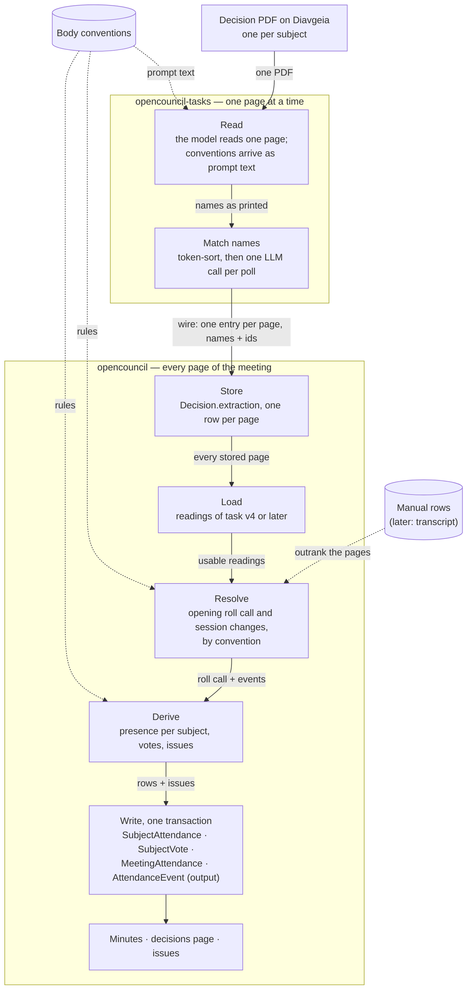
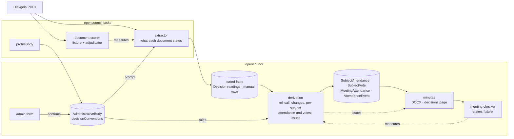

# Meeting Minutes Generation

## Concept

A system for generating official meeting minutes (πρακτικά συνεδρίασης) from council meetings. Minutes combine transcript data, agenda subjects, and the facts stated in the decision documents each administrative body publishes on Diavgeia. They are rendered as a DOCX that municipalities can use as their official record. The same facts feed the decisions page and the voting records.

The governing rule comes from [the design record](../superpowers/specs/2026-09-17-decision-facts-derivation-design.md) (§2), amended by the C1 iteration; where the two differ, this guide is in force. **Store the finest-grained thing a source states; derive the aggregates.** A page states its own roll call, its own arrivals and departures, a vote phrase and the members it names. opencouncil combines every page's statement into one roll call and one set of events (below). Who was present for each subject and who voted FOR are computed from that, never stored as facts.

## How a page becomes the minutes

```mermaid
flowchart TB
    pdf["Decision PDF on Diavgeia<br/>one per subject"]
    subgraph tasks["opencouncil-tasks — one page at a time"]
        read["Read<br/>the model reads one page;<br/>conventions arrive as prompt text"]
        match["Match names<br/>token-sort, then one LLM call per poll"]
    end
    subgraph app["opencouncil — every page of the meeting"]
        store["Store<br/>Decision.extraction, one row per page"]
        load["Load<br/>readings of task v4 or later"]
        resolve["Resolve<br/>opening roll call and session changes,<br/>by convention"]
        derive["Derive<br/>presence per subject, votes, issues"]
        write["Write, one transaction<br/>SubjectAttendance · SubjectVote ·<br/>MeetingAttendance · AttendanceEvent (output)"]
        show["Minutes · decisions page · issues"]
    end
    conv[("Body conventions")]
    manual[("Manual rows<br/>(later: transcript)")]
    pdf -->|one PDF| read --> |names as printed| match
    match -->|"wire: one entry per page, names + ids"| store
    store -->|every stored page| load -->|usable readings| resolve -->|roll call + events| derive -->|rows + issues| write --> show
    conv -.->|prompt text| read
    conv -.->|rules| resolve
    conv -.->|rules| derive
    manual -.->|outrank the pages| resolve
```

opencouncil-tasks reads one page and matches its names; it never computes a fact from two or more pages. opencouncil stores each page's reading as it arrives and combines every stored page. A later poll only adds pages. `MeetingAttendance` and `AttendanceEvent` rows of source `decision` are derivation output, never read back; rows of any other source are stated facts and outrank the pages.

## Architectural split

Two repos:

1. **opencouncil-tasks** — the LLM work. It searches Diavgeia, matches decisions to subjects, and reads each matched PDF. It returns what the page *states*, with names resolved to person ids. It also profiles a body's documents into conventions (below). It infers nothing across documents.
2. **opencouncil** — owns the data, the derivation and the rendering. It stores the stated facts and derives per-subject attendance and votes from them. It renders DOCX on demand, and shows the admin what could not be derived.

Once a meeting's documents are read, everything downstream runs without the task server: re-deriving and re-rendering are instant and cost nothing.

## The moving parts

```mermaid
flowchart LR
    PDF[Diavgeia PDFs]

    subgraph tasks [opencouncil-tasks]
        X[extractor<br/>what each document states]
        P[profileBody]
        S[document scorer<br/>fixture + adjudicator]
    end

    subgraph oc [opencouncil]
        C[(AdministrativeBody<br/>decisionConventions)]
        A[admin form]
        F[(stated facts<br/>Decision readings · manual rows)]
        D[derivation<br/>roll call, changes, per-subject<br/>attendance and votes; issues]
        R[(SubjectAttendance · SubjectVote<br/>MeetingAttendance · AttendanceEvent)]
        M[minutes<br/>DOCX · decisions page]
        K[meeting checker<br/>claims fixture]
    end

    PDF --> X --> F --> D --> R --> M
    D -. issues .-> M
    P --> C
    A -- confirms --> C
    C -- prompt --> X
    C -- rules --> D
    PDF --> S
    S -. measures .-> X
    M --> K
    K -. measures .-> D
```

Two loops share the middle row. The **production path** runs left to right: PDF, extractor, stated facts, derivation, rows, minutes. The **quality path** measures each half of it separately. A document scorer checks the extractor against a hand-labelled fixture of PDFs. A meeting checker checks the derivation against claims about finished meetings. **Per-body conventions** sit between the loops: an input to both the extractor and the derivation, produced by a profiling task and confirmed by a person.

### Extractor (opencouncil-tasks)

`pollDecisions` reads each matched PDF and returns the roll call, the arrivals and departures with the anchor the document pins them to (an agenda item, a decision number, a phase of the session), the vote phrase as printed, the voters the page names, and the document's own present list where the body prints one. Names are matched to person ids; unmatched names travel as strings. The task version on the wire says which of these a stored read carries. `docs/decision-extraction-eval.md` in opencouncil-tasks describes what it reads and how that is measured.

### Stated facts (opencouncil)

One place holds what the documents state, written by the poll callback in `src/lib/tasks/pollDecisions.ts`:

- **Per-document facts** — columns on `Decision` (the vote phrase, the mayor sentence, the declared item number, whether the read was incomplete, the unmatched names) plus `Decision.extraction`, the wire entry as received; the named votes, the printed tally, the per-decision present list and the presiding member are read from there. No vote outcome, tally or provenance is stored: all are views over the rows.

Each page's own roll call and its own stated arrivals and departures live inside that same `Decision.extraction`. They are not stored as meeting-wide facts: the derivation combines them (below) into the roll call and the events it writes as output.

### Derivation (opencouncil)

`src/lib/derivation/` turns stated facts into the resolved roll call, the resolved events and per-subject rows. It is pure and deterministic: `deriveMeetingFacts()` takes everything it needs as one input (`loadDerivationInput()` does the only database reads) and running it twice yields identical rows. Four steps:

1. **Resolve the session** (`resolveSession.ts`) — combine every stored page's own roll call, its own stated arrivals and departures, and its per-vote absences into one roll call and one set of events. The rule it combines them by depends on the body's conventions ([below](#rules-by-body-convention)).
2. **Place events** (`placeEvents.ts`) — each event's anchor becomes an index into the meeting's discussion order, the same transcript-derived order the minutes print. An anchor that matches nothing becomes an issue, not a row. One anchor has a fallback: a change during the out-of-agenda items, in a meeting with no out-of-agenda subject, takes effect before the first subject and raises `OUT_OF_AGENDA_PLACED_FIRST` (info).
3. **Replay attendance** (`replayAttendance.ts`) — start from the roll call, apply the placed events subject by subject. Where the body prints a per-decision present list, that list wins for its subject and resets the state from there on. A change it implies without a stated event is reported. A per-decision roll call that lists a member as present, where a range of decisions on another page puts that member out of the room, also wins, and raises `SOURCES_DISAGREE`.
4. **Derive votes** (`deriveVotes.ts`) — the named votes are `stated`. When the phrase permits it (unanimous, majority, or a counted phrase), every present member the page did not name gets FOR, marked `inferred`. A printed count that disagrees with the rows is reported. A named vote of a member who is absent on that subject stays, and raises `VOTE_BY_ABSENT_MEMBER` (warning): the vote or the absence is wrong. A page that says ΑΠΟΦΑΣΙΖΕΙ, read whole, with no vote phrase, no named voter and no count raises `NO_VOTE_RESULT` (error): the read lost the vote.

Where a fact is missing, unresolved or contradicted, the derivation returns an issue rather than guessing silently. The closed set of codes is `ISSUE_CODES` in `src/lib/derivation/types.ts`; the site that raises each one says why in its message. An issue that concerns one member (it carries a `personId`) names that member: the decisions page names the member from the city's people, and the scripts name the member from the roster (`issuePerson()` in `src/lib/derivation/issueText.ts`). A name that matched nobody (`UNMATCHED_NAME`) or two people (`NAME_MATCHED_TWICE`) has no person line, because the issue's own message prints the name. Issues are not stored: the decisions page recomputes them on read (`explainMeeting()`), and "Re-derive" (`rederiveMeeting()`) rewrites the rows without polling.

The write replaces every `decision`-sourced `MeetingAttendance`, `AttendanceEvent`, `SubjectAttendance` and `SubjectVote` row of the meeting at once, in one transaction. `MeetingAttendance` and `AttendanceEvent` rows of source `decision` are derivation output, never read back; rows of any other source are stated facts and outrank the pages. The derivation therefore refuses an input that would empty the rows: a document read before facts were stored, or no roll call at all. `derivationSkipIssue()` in `persist.ts` says why, and the stored rows stand.

### Conventions (both repos)

`AdministrativeBody.decisionConventions` records how one body writes its documents: the roll-call layout, whether the present list is the opening roll call or already includes late arrivals, what changes are anchored to, whether each decision prints its own present list. The shape is `DecisionConventions` in `src/lib/decisionConventions.ts`; the glossary for every value lives under `messages/<locale>/admin.json → conventions` — the `el` text for the admin form, the `en` sentences opencouncil renders into the poll request for the extractor's prompt.

The record is produced by the `profileBody` task, which reads a sample of the body's documents in opencouncil-tasks, with `provenance.source = 'profile'`. A person confirms it in the administrative body form, which sets `manual`. The derivation reads it to decide what the present list means and whether a per-decision list is expected. It raises an issue on every meeting of a body nobody has confirmed.

#### Where a body's rules live

Three places, each with one job:

| what | where | who changes it |
| --- | --- | --- |
| **Evidence** — the document survey and its review notes | opencouncil-tasks, `fixtures/body-conventions.json` (survey statistics) and the body notes in `fixtures/extraction-golden.json` | a new survey or a `profileBody` run |
| **The record a body starts from** — one settled record per body, in the stored shape | opencouncil, `fixtures/body-conventions.json` | a page read that corrects it; edit the file |
| **The record in force** | the database, `AdministrativeBody.decisionConventions` | a person confirming it in the administrative body form |

The middle one is in this repository because everything that gives it meaning is here too. That is the schema that validates it, the derivation that reads it, and the seed that needs it. A test parses every record against `decisionConventionsSchema`, so the file and the shape cannot drift apart unnoticed.

`scripts/import-body-conventions.ts` writes the file to the database in `DATABASE_URL`. It is idempotent, reports bodies the database does not hold, and **never overwrites a body a person has confirmed** — the file is a starting state, not an authority over admin. How it reaches each environment:

- **Local and preview databases**: `prisma/seed.ts` runs the same import after it creates the bodies, so a fresh database has conventions with no extra step. The seed imports the JSON rather than reading it from disk, because the preview runs an esbuild bundle of the seed with no `fixtures/` beside it.
- **Staging and production**: run `npx tsx scripts/import-body-conventions.ts` once after the migration that adds the column, and again whenever the file changes. A seed dump taken afterwards carries the conventions too.

A database with no conventions is not an error, it is silence: every subject derives as «presence unknown» and nothing is printed. A meeting also shows nothing until it has been polled under task v4, since attendance and votes derive from stored readings.

The meeting checker reads whatever rows a meeting last derived to. After changing a record or a derivation rule, run it as `npm run decisions -- check --derive`, or its numbers describe the rule you just replaced.

### Rules by body convention

Two questions about a body's documents, each answered by its own field of `DecisionConventions`:

| question | field | values |
| --- | --- | --- |
| Which moment does the top-of-page list describe? | `presentListMeaning` | `opening` — the start, the same on every page. `cumulative` — everyone who attended, late arrivals included, the same on every page. `per_decision` — the state at this page's own decision; it changes from page to page. `unknown` — not settled. |
| How does a page state a change? | `statesPerVoteAbsence`, `statesPerDecisionAttendance` | A sentence anchors a per-vote absence («αποχώρησε…»). A second list, ΤΑ ΜΕΛΗ, printed after the decision, states `statesPerDecisionAttendance`. |

`resolveSession.ts` combines every page's own roll call and events into one, by these rules (spec §4.1.1):

- **Opening roll call.** For an `opening`, `cumulative` or `unknown` body: the roll call that more than half of the pages with a roll call print. A majority settles a misread. For a `per_decision` body: the roll call of the first page in the derivation's subject order. Either way, each page's own roll call still sets its own subject.
- **Session changes, a body whose pages carry their own list** (`per_decision`, or `statesPerDecisionAttendance` when at least one usable page of the meeting prints its list): every stated change counts, restatements merge, and a later page's list is checked against it.
- **Session changes, every other body:** the majority of pages decide, as the pre-C1 task did. A change needs more than half of the pages. A change that half of the pages or fewer state raises `CHANGE_NOT_CORROBORATED`.
- **A change pinned to the page's own subject** («προσήλθε κατά τη συζήτηση του θέματος»): always counts, on its own page, never voted.
- **A per-vote absence** («απουσίαζε κατά την ψηφοφορία», «Εκτός αιθούσης στις με αρ. 31 – 40»): the reader returns it as its own kind, `absent_for_vote`. It names the page's own decision, or a range of decision numbers. A reading stored before that kind holds a departure before and an arrival after the page's own subject, and `pageStatementsOf()` reads that pair as the same absence. The resolver combines the absences of every page and never takes a vote on them:
  - **Runs.** The absences of one member on consecutive subjects of the derivation's order are one run. A run gives one departure before its first subject and one arrival before the next subject whose usable page does not state the absence. A run that reaches the last subject has no arrival.
  - **Gaps.** A subject with no usable page (no page, or a reading before task v4) states nothing, so it does not end a run.
  - **Ranges.** A range covers every subject whose decision number is in the range, and a subject with no decision number between two of those. A run that reaches the end of a range ends after the range's last decision. When the range's last decision is not linked yet, the run continues across the subjects with no decision number and no usable page, and ends at the next subject with a decision number or a usable page. When the range's first decision is not linked yet, the run starts in the same way: after the last subject before the range that has a decision number or a usable page. A range thus starts and ends at decision numbers, and a missing page is not evidence of a departure or a return. A boundary that a range states is anchored at its decision number when that number places the event at the same subject; every other boundary is anchored at the subject.
  - **A range outside the meeting.** A range that covers no numbered subject gives no event, and raises `UNPLACEABLE_ANCHOR` once per member and range. The reason is `rangeNotInMeeting`, or `rangeNoDecisionNumbers` when no subject of the meeting has a decision number, or `rangeNumberNoDigits` when a number of the range has no digits. The message names the whole range, because neither the departure nor the arrival is placed. This happens during a partial poll, before the range's decisions are linked. The next derivation after they are linked places the range.
  - **Restatements.** A page that states the absence of a decision in a run again joins that run. The run's events count every page that states it.

Four page checks catch what these rules cannot settle from one page alone:

- `LATE_ARRIVAL_IN_OPENING_LIST` — an `opening` body's page lists a member under ΠΑΡΟΝΤΕΣ that the same page also says arrived later.
- `NAMED_VOTERS_UNEXPECTED` — a page names voters unlike its body's convention: FOR on a body that names only dissenters, anyone on a body that names nobody, or nobody FOR on a body that names everyone under a phrase that carried. A body that names everyone only on a split vote (`all_when_split`) also expects nobody under «Ομόφωνα» and everyone under «κατά πλειοψηφία». A unanimous page that names every member present on the subject (the mayor excluded), all with one vote, is a unanimous rejection and raises nothing. A unanimous page that names only some of them, with nobody FOR, lost the FOR names and raises the issue.
- `NAMES_SHARE_ID` — two entries of one list on one page matched to the same person; one match is wrong.
- `NAME_MATCHED_TWICE` — one printed name matched to two different people on two pages of the same meeting.

The mayor: never a member of a council or a community; a member of a committee only with an active role on it.

### Tools

`npm run decisions -- <command>`, one command at a time:

- `measure` — measures every meeting with stored readings and reports the checks that need attention.
- `diff` — compares two measure files and reports what changed between them.
- `derive` — derives one meeting; add `--write` to persist the rows, otherwise it only reports what would change.
- `trace` — traces one meeting from its pages to its rows, as JSON; `--all --out-dir` traces every meeting.
- `equivalence` — historical: compares the resolver against the rows the pre-C1 poll handler stored.
- `check` — compares the derived minutes with the official Πρακτικά golden claims, and prints each meeting's issues under its claims.
- `reread-count` — counts the linked pages that the next polls will read again, because they have no usable reading. It only reads.
- `sections` — prints one meeting's discussion order line and its transcript sections, as the minutes print them: each section's windows, where a section resumes, and the notes that name other subjects. `--json` prints the data. It only reads.

### Quality path

- **Document scorer** (opencouncil-tasks): `evaluate-decision-extraction` scores the extractor per field against `fixtures/extraction-golden.json`, a hand-labelled fixture chosen for mechanism coverage across every supported body. `adjudicate-extraction` settles a disagreement by reading the page and quoting it, so a label change carries its justification. Both are described in `docs/decision-extraction-eval.md` there.
- **Meeting checker** (opencouncil): `npm run decisions -- check` compares what a meeting renders from — roll call including the mayor and the president, changes, per-subject presence and votes — against claims in `fixtures/minutes-golden.json`. Official minutes are an evaluation instrument only: the document is the truth of the pipeline, and a document/minutes disagreement is an explained miss, not a bug.
- **Claims coverage** (opencouncil): `scripts/extract-coverage.ts --claims` closes the gap between the two. The scorer never runs the derivation and the checker runs it only where a claim sits, so a document can be fully scored while nothing exercises its derivation. Per body and per mechanism it counts the documents that show it, those in a golden meeting, and those on a subject whose claim would fail if the mechanism broke; `UNCLAIMED` names what to label next.

## Key design decisions

The dated record of what was decided and why, including the deviations taken during implementation, is the spec's §3 and §11. What follows is what a reader of this guide needs without opening it.

### Per-subject attendance is derived, not stated
Members arrive late and leave early, and documents say so ("ο X αποχώρησε κατά τη συζήτηση του θέματος Y"), so attendance is modelled per subject. But no document states per-subject attendance for a whole meeting. Each states the roll call and the changes, and the derivation replays them along the discussion order. Storing the replayed result as a fact would freeze one reading of the events and hide where it came from.

### Votes: stated and inferred are different things
Pages name dissenters and declarers and almost never the majority. A FOR the page did not print is therefore not a read fact. The extractor never invents one, and the derivation adds it only from presence, marked `inferred`. Before task version 4 the task server did this inference itself and the app wrote the result as-is. Moving it behind stored facts is what lets it be re-run, explained and checked.

### The mayor
The mayor is never in the member lists or the changes block of the minutes. The ΔΗΜΑΡΧΟΣ line carries a note instead. It is built from their roll-call row, their own arrivals and departures, and whoever the documents say presided in their place. Whether the mayor gets attendance and vote rows depends on the body. On a council they attend without a vote and are left out. On a committee they sit on they vote like everyone else (`mayorIsMemberOf()` in `src/lib/utils/roles.ts`). Documents of one meeting that disagree about who presided raise an issue.

### Transcript content in minutes
Minutes include the utterances the summarize task linked to each subject via `Utterance.discussionSubjectId`, procedural vote ones included. Utterances outside every subject (preamble, epilogue, gaps) are handled by the temporal windows in `src/lib/minutes/temporalWindows.ts`.

This linking is AI-driven with no manual editing UI. Misclassified or unlinked utterances silently disappear from the minutes output.

### Discussion order and sections
The minutes, the decisions page and the derivation use one order of the subjects: `orderedMinutesSubjects()` with `discussionOrderKeys()` in `src/lib/minutes/builders.ts`. An anchor such as «after item 3» is placed by position, so a second order would put a change on a different subject. `minutesSections()` adds the temporal windows and the assignment of every utterance. `getMinutesData()` and `decisions sections` both call it.

- A subject's discussion is one or more spans (`discussionSpans()` in `src/lib/minutes/temporalWindows.ts`). A span splits where another subject has a VOTE utterance between two utterances of the subject: the council left the subject pending and decided something else.
- A procedural vote of the subject that follows a span, before an utterance of another subject, closes that span. The vote to postpone a subject ends the span that it postpones. These votes do not change where a span starts or splits.
- A subject sorts at the start of the span that holds its first VOTE utterance, else at the start of its first span. A subject left pending therefore sorts where its discussion resumes. On Sparta may6_2026, item 5 prints after item 14.
- Each span is one temporal window of the subject's section. The transcript starts a new speaker block where a later window of a section starts.
- The poll's request to the task orders the subjects by their first utterance of any status. No derived row depends on that order.

### Subject headings print the official agenda title
`Subject.agendaItemTitle` holds the item as written on the official agenda. `processAgenda` fills it for new meetings. The minutes print it in the table of contents, in each subject heading, and in cross-references. A subject without a title, for example one that summarize created, prints its summary name instead; `agendaItemTitleOrName()` in `src/lib/utils/subjects.ts` holds that rule. Web pages keep showing the summary name. The Diavgeia decision matcher receives the same title as the subject text of the poll request: the official wording matches decision titles far better than the summary name (issue #616).

### Excerpt and references are markdown
`Decision.excerpt` and `Decision.references` are stored as markdown to preserve PDF structure (bullet points, numbered lists, tables). Richness varies by municipality — Vrilissia has 14+ numbered reference items per decision, while Zografou often uses a single generic phrase.

### Dual creation pattern
`Decision`, `MeetingAttendance`, `SubjectAttendance` and `SubjectVote` rows can be created automatically (tracked by `taskId`) or manually (tracked by `createdById`), and carry a `source`. The derivation only ever replaces `decision`-sourced rows, so manual rows survive a re-derive. `SOURCE_PRECEDENCE` in `src/lib/derivation/types.ts` says which source wins when two state different values for one fact; note its comment — the readers that feed the page do not yet apply it, and nothing writes a manual row today.
