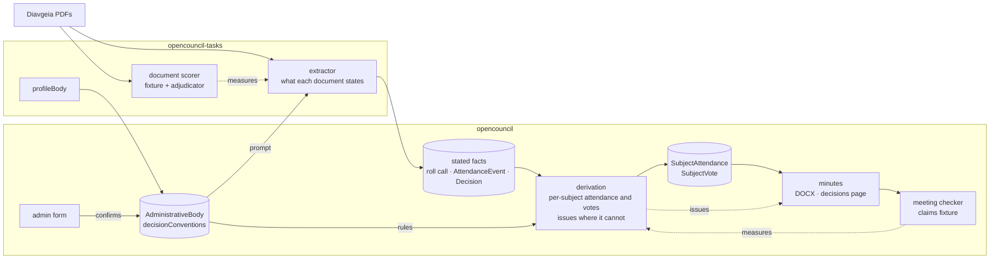

# Meeting Minutes Generation

## Concept

A system for generating official meeting minutes (πρακτικά συνεδρίασης) from council meetings. Minutes combine transcript data, agenda subjects, and the facts stated in the decision documents each administrative body publishes on Diavgeia, rendered as a DOCX that municipalities can use as their official record. The same facts feed the decisions page and the voting records.

The governing rule, from [the design in force](../superpowers/specs/2026-09-17-decision-facts-derivation-design.md) (§2): **store the finest-grained thing a source states; derive the aggregates.** A document states a roll call, arrivals and departures, a vote phrase and the members it names. Who was present for each subject and who voted FOR are computed from that, never stored as facts.

## Architectural split

Two repos:

1. **opencouncil-tasks** — the LLM work: searches Diavgeia, matches decisions to subjects, reads each matched PDF and returns what it *states*, with names resolved to person ids. It also profiles a body's documents into conventions (below). It infers nothing across documents.
2. **opencouncil** — owns the data, the derivation and the rendering: stores the stated facts, derives per-subject attendance and votes from them, renders DOCX on demand, and shows the admin what could not be derived.

Once a meeting's documents are read, everything downstream runs without the task server: re-deriving and re-rendering are instant and cost nothing.

## The moving parts

```mermaid
flowchart LR
    PDF[Diavgeia PDFs]

    subgraph tasks [opencouncil-tasks]
        X[extractor<br/>what each document states]
        P[profileBody]
        S[document scorer<br/>fixture + adjudicator]
    end

    subgraph oc [opencouncil]
        C[(AdministrativeBody<br/>decisionConventions)]
        A[admin form]
        F[(stated facts<br/>roll call · AttendanceEvent · Decision)]
        D[derivation<br/>per-subject attendance and votes<br/>issues where it cannot]
        R[(SubjectAttendance<br/>SubjectVote)]
        M[minutes<br/>DOCX · decisions page]
        K[meeting checker<br/>claims fixture]
    end

    PDF --> X --> F --> D --> R --> M
    D -. issues .-> M
    P --> C
    A -- confirms --> C
    C -- prompt --> X
    C -- rules --> D
    PDF --> S
    S -. measures .-> X
    M --> K
    K -. measures .-> D
```

Two loops share the middle row. The **production path** runs left to right: PDF, extractor, stated facts, derivation, rows, minutes. The **quality path** measures each half of it separately: a document scorer checks the extractor against a hand-labelled fixture of PDFs, and a meeting checker checks the derivation against claims about finished meetings. **Per-body conventions** sit between the loops: an input to both the extractor and the derivation, produced by a profiling task and confirmed by a person.

### Extractor (opencouncil-tasks)

`pollDecisions` reads each matched PDF and returns the roll call, the arrivals and departures with the anchor the document pins them to (an agenda item, a decision number, a phase of the session), the vote phrase as printed, the voters the page names, and the document's own present list where the body prints one. Names are matched to person ids; unmatched names travel as strings. The task version on the wire says which of these a stored read carries. `docs/decision-extraction-eval.md` in opencouncil-tasks describes what it reads and how that is measured.

### Stated facts (opencouncil)

Three places hold what the documents state, all written by the poll callback in `src/lib/tasks/pollDecisions.ts` with `source = decision`:

- **Roll call** — `MeetingAttendance`, one row per person per source.
- **Arrivals and departures** — `AttendanceEvent`, each with its anchor, the sentence it came from, and how many of the session's documents stated it.
- **Per-document facts** — columns on `Decision` (the vote phrase, the mayor sentence, the declared item number, whether the read was incomplete, the unmatched names) plus `Decision.extraction`, the wire entry as received; the named votes, the printed tally, the per-decision present list and the presiding member are read from there. No vote outcome, tally or provenance is stored: all are views over the rows.

### Derivation (opencouncil)

`src/lib/derivation/` turns stated facts into per-subject rows. It is pure and deterministic: `deriveMeetingFacts()` takes everything it needs as one input (`loadDerivationInput()` does the only database reads) and running it twice yields identical rows. Three steps:

1. **Place events** (`placeEvents.ts`) — each event's anchor becomes an index into the meeting's discussion order, the same transcript-derived order the minutes print. An anchor that matches nothing becomes an issue, not a row.
2. **Replay attendance** (`replayAttendance.ts`) — start from the roll call, apply the placed events subject by subject. Where the body prints a per-decision present list, that list wins for its subject and resets the state from there on; a change it implies without a stated event is reported.
3. **Derive votes** (`deriveVotes.ts`) — the named votes are `stated`; when the phrase permits it (unanimous, majority, or a counted phrase), every present member the page did not name gets FOR, marked `inferred`. A printed count that disagrees with the rows is reported.

Where a fact is missing, unresolved or contradicted, the derivation returns an issue rather than guessing silently. The closed set of codes is `ISSUE_CODES` in `src/lib/derivation/types.ts`; the site that raises each one says why in its message. Issues are not stored: the decisions page recomputes them on read (`explainMeeting()`), and "Re-derive" (`rederiveMeeting()`) rewrites the rows without polling.

The write replaces every `decision`-sourced `SubjectAttendance` and `SubjectVote` row of the meeting at once, so the derivation refuses an input that would empty them (a document read before facts were stored, or no roll call at all); `derivationSkipIssue()` in `persist.ts` says why, and the stored rows stand.

### Conventions (both repos)

`AdministrativeBody.decisionConventions` records how one body writes its documents: the roll-call layout, whether the present list is the opening roll call or already includes late arrivals, what changes are anchored to, whether each decision prints its own present list. The shape is `DecisionConventions` in `src/lib/decisionConventions.ts`; the glossary for every value lives under `messages/<locale>/admin.json → conventions` — the `el` text for the admin form, the `en` sentences opencouncil renders into the poll request for the extractor's prompt.

The record is produced by the `profileBody` task (opencouncil-tasks reads a sample of the body's documents) with `provenance.source = 'profile'`, and confirmed by a person in the administrative body form, which sets `manual`. The derivation reads it to decide what the present list means and whether a per-decision list is expected, and raises an issue on every meeting of a body nobody has confirmed.

### Quality path

- **Document scorer** (opencouncil-tasks): `evaluate-decision-extraction` scores the extractor per field against `fixtures/extraction-golden.json`, a hand-labelled fixture chosen for mechanism coverage across every supported body. `adjudicate-extraction` settles a disagreement by reading the page and quoting it, so a label change carries its justification. Both are described in `docs/decision-extraction-eval.md` there.
- **Meeting checker** (opencouncil): `scripts/check-minutes.ts` compares what a meeting renders from — roll call, changes, per-subject presence and votes — against claims in `fixtures/minutes-golden.json`, and prints the meeting's issues under its claims. Official minutes are an evaluation instrument only: the document is the truth of the pipeline, and a document/minutes disagreement is an explained miss, not a bug.
- **Claims coverage** (opencouncil): `scripts/extract-coverage.ts --claims` closes the gap between the two. The scorer never runs the derivation and the checker runs it only where a claim sits, so a document can be fully scored while nothing exercises its derivation. Per body and per mechanism it counts the documents that show it, those in a golden meeting, and those on a subject whose claim would fail if the mechanism broke; `UNCLAIMED` names what to label next.

## Key design decisions

The dated record of what was decided and why, including the deviations taken during implementation, is the spec's §3 and §11. What follows is what a reader of this guide needs without opening it.

### Per-subject attendance is derived, not stated
Members arrive late and leave early, and documents say so ("ο X αποχώρησε κατά τη συζήτηση του θέματος Y"), so attendance is modelled per subject. But no document states per-subject attendance for a whole meeting; each states the roll call and the changes, and the derivation replays them along the discussion order. Storing the replayed result as a fact would freeze one reading of the events and hide where it came from.

### Votes: stated and inferred are different things
Pages name dissenters and declarers and almost never the majority. A FOR the page did not print is therefore not a read fact: the extractor never invents one, and the derivation adds it only from presence, marked `inferred`. Before task version 4 the task server did this inference itself and the app wrote the result as-is; moving it behind stored facts is what lets it be re-run, explained and checked.

### The mayor
The mayor is never in the member lists or the changes block of the minutes; the ΔΗΜΑΡΧΟΣ line carries a note built from their roll-call row, their own arrivals and departures, and whoever the documents say presided in their place. Whether the mayor gets attendance and vote rows depends on the body: on a council they attend without a vote and are left out; on a committee they sit on they vote like everyone else (`mayorIsMemberOf()` in `src/lib/utils/roles.ts`). Documents of one meeting that disagree about who presided raise an issue.

### Transcript content in minutes
Minutes include the utterances the summarize task linked to each subject via `Utterance.discussionSubjectId`, procedural vote ones included. Utterances outside every subject (preamble, epilogue, gaps) are handled by the temporal windows in `src/lib/minutes/temporalWindows.ts`.

This linking is AI-driven with no manual editing UI. Misclassified or unlinked utterances silently disappear from the minutes output.

### Subject headings print the official agenda title
`Subject.agendaItemTitle` holds the item as written on the official agenda. `processAgenda` fills it for new meetings. The minutes print it in the table of contents, in each subject heading, and in cross-references. A subject without a title, for example one that summarize created, prints its summary name instead; `agendaItemTitleOrName()` in `src/lib/utils/subjects.ts` holds that rule. Web pages keep showing the summary name. The Diavgeia decision matcher receives the same title as the subject text of the poll request: the official wording matches decision titles far better than the summary name (issue #616).

### Excerpt and references are markdown
`Decision.excerpt` and `Decision.references` are stored as markdown to preserve PDF structure (bullet points, numbered lists, tables). Richness varies by municipality — Vrilissia has 14+ numbered reference items per decision, while Zografou often uses a single generic phrase.

### Dual creation pattern
`Decision`, `MeetingAttendance`, `SubjectAttendance` and `SubjectVote` rows can be created automatically (tracked by `taskId`) or manually (tracked by `createdById`), and carry a `source`. The derivation only ever replaces `decision`-sourced rows, so manual rows survive a re-derive. `SOURCE_PRECEDENCE` in `src/lib/derivation/types.ts` says which source wins when two state different values for one fact; note its comment — the readers that feed the page do not yet apply it, and nothing writes a manual row today.
