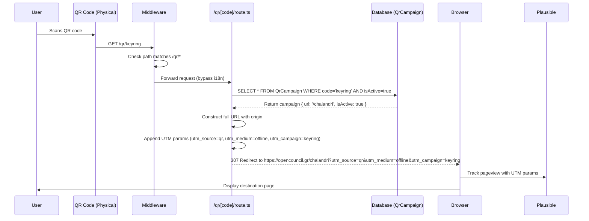

# QR Campaigns System

**Concept**

A short-link redirect system for managing QR code campaigns on physical marketing materials (t-shirts, keyrings, maps), allowing instant redirects to internal pages or external URLs with analytics tracking via UTM parameters.

**Architectural Overview**

The QR Campaign system provides a lightweight way to manage dynamic redirects for printed QR codes without requiring code deployments. When a user scans a QR code pointing to `/qr/<code>`, the system:

1. **Request Flow**: The middleware bypasses i18n routing for `/qr/*` paths, sending requests directly to the route handler
2. **Database Lookup**: The route handler queries the `QrCampaign` table for an active campaign matching the code
3. **URL Construction**: For relative URLs (e.g., `/chalandri`), it constructs an absolute URL using the request origin; external URLs are used as-is
4. **UTM Parameter Injection**: Appends analytics tracking parameters (`utm_source=qr`, `utm_medium=offline`, `utm_campaign=<code>`) to the destination URL
5. **Redirect**: Returns an HTTP 307 redirect to the final destination URL
6. **Analytics**: Users can track scans in analytics tool by filtering for UTM parameters

The admin interface allows superadmins to create, edit, toggle, and delete campaigns without touching code or redeploying.

**Sequence Diagram**

**Key Component Pointers**

### Data Models
- `prisma/schema.prisma` - `QrCampaign` model (id, code [unique], url, name, isActive, timestamps)

### Route Handlers
- `src/app/qr/[code]/route.ts` - Public redirect handler (GET request, DB lookup, UTM injection, 307 redirect)
- `src/middleware.ts` - Middleware configuration (bypasses i18n for `/qr/*` paths using regex `qr\/`)

### API Endpoints
- `src/app/api/admin/qr/route.ts` - Admin CRUD (GET: list campaigns, POST: create campaign with duplicate code detection)
- `src/app/api/admin/qr/[id]/route.ts` - Admin operations (PUT: update campaign, DELETE: delete campaign)

### Frontend Components
- `src/app/[locale]/(other)/admin/qr/page.tsx` - Admin management page (server component, displays table with name column)
- `src/components/admin/qr/qr-controls.tsx` - Client controls (CreateForm with inline error display, ToggleActive, DeleteButton, CopyButton)
- `src/components/admin/sidebar.tsx` - Admin navigation (QR Campaigns menu item with QrCode icon)

### Utilities
- `isExternalUrl()` - Helper to detect URLs starting with `http://` or `https://`
- `appendUtmParams()` - Helper to inject UTM parameters into URLs (handles both relative and absolute URLs)

**Business Rules & Assumptions**

1. **Code Uniqueness**: Campaign codes must be unique across all campaigns (enforced by database unique constraint)
2. **Active Status**: Only active campaigns (`isActive=true`) will redirect; inactive campaigns fall back to homepage
3. **Authorization**: All admin operations require superadmin access (checked via `withUserAuthorizedToEdit({})`)
4. **URL Flexibility**: Campaigns support both relative URLs (e.g., `/chalandri`) and absolute URLs (e.g., `https://example.com`)
5. **UTM Preservation**: If destination URL already has UTM parameters, they are not overwritten
6. **Case Sensitivity**: Campaign codes are case-sensitive (e.g., `keyring` ≠ `Keyring`)
7. **No Locale Handling**: QR redirects bypass locale detection; destination URLs must include locale if needed (e.g., `/el/chalandri` not `/chalandri`)
8. **Immutable Short URLs**: Once a QR code is printed, the short URL is fixed; only the destination can be changed via the admin panel
9. **Analytics Dependency**: Campaign tracking relies on Plausible's standard pageview tracking with UTM parameters (no custom events)

**UTM Parameter Explanation**

UTM (Urchin Tracking Module) parameters are query string parameters added to URLs to track marketing campaign performance in analytics tools like Plausible, Google Analytics, etc.

### UTM Parameters Used

| Parameter | Value | Purpose |
|-----------|-------|---------|
| `utm_source` | `qr` | Identifies that traffic came from a QR code |
| `utm_medium` | `offline` | Categorizes the marketing channel (physical/offline materials) |
| `utm_campaign` | `<code>` | Identifies the specific campaign (e.g., `keyring`, `t-shirt`, `map-chl`) |

### Example

For campaign code `keyring` redirecting to `/chalandri`:
- **Short URL**: `https://opencouncil.gr/qr/keyring`
- **Final URL**: `https://opencouncil.gr/chalandri?utm_source=qr&utm_medium=offline&utm_campaign=keyring`

### Analytics Benefits

In Plausible, you can:
1. **Filter by source**: See all traffic from QR codes (`utm_source=qr`)
2. **Compare campaigns**: Compare performance of different QR codes (filter by `utm_campaign`)
3. **Track offline ROI**: Measure effectiveness of physical marketing materials
4. **Segment by medium**: Distinguish offline QR scans from other traffic sources

### Real-World Use Case

If you print 100 keyrings with QR codes for Chalandri municipality and 50 t-shirts for Zografou:
- **Keyring campaign**: `/qr/keyring` → filter Plausible by `utm_campaign=keyring` to see total scans
- **T-shirt campaign**: `/qr/t-shirt` → filter Plausible by `utm_campaign=t-shirt` to see total scans
- **All QR traffic**: Filter by `utm_source=qr` to see combined performance

**See Also**

- [Authentication Guide](./authentication.md) - Understanding admin authorization checks
- [Environment Variables](../environment-variables.md) - Required configuration for `NEXT_PUBLIC_BASE_URL`
- Database schema documentation - QrCampaign model details

