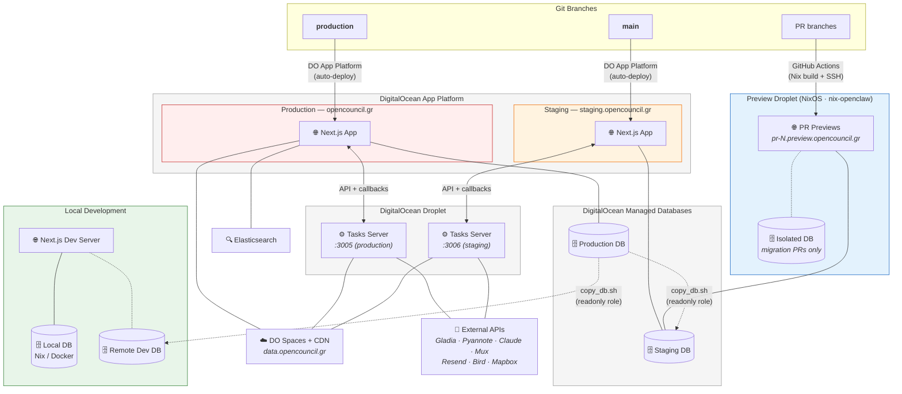

# Infrastructure & Deployment

How OpenCouncil's environments, databases, and services are connected. For database access procedures (roles, copying data), see [guides/database-access.md](./guides/database-access.md).

## Deployment Topology



> **Diagram legend:** Solid lines (──) are runtime connections. Dashed lines (╌╌) are manual/scripted data flows. Arrows with labels show deployment mechanisms.

## Environments

| Environment | URL | Branch | Database | Tasks Server |
|-------------|-----|--------|----------|-------------|
| **Production** | opencouncil.gr | `production` | Production DB (DO Managed PostgreSQL) | `:3005` |
| **Staging** | staging.opencouncil.gr | `main` | Staging DB (DO Managed PostgreSQL) | `:3006` (tasks.opencouncil.gr) |
| **PR Previews** | pr-N.preview.opencouncil.gr | PR branch | Staging DB (shared), or isolated DB for migration PRs | — |
| **Local** | localhost:3000 | any | Local (Nix/Docker) or Remote Dev DB | — |

## How Deployments Work

**Production & Staging** are deployed via [DigitalOcean App Platform](https://www.digitalocean.com/products/app-platform). Both environments are configured to auto-deploy when their respective branches are pushed — `production` for opencouncil.gr, `main` for staging.opencouncil.gr. No CI/CD workflow in this repo; App Platform handles the build and deploy.

**PR Previews** are deployed to a NixOS droplet managed by [nix-openclaw](https://github.com/schemalabz/nix-openclaw), via GitHub Actions workflows in this repo (`.github/workflows/preview-deploy.yml` and `preview-cleanup.yml`). The workflow builds the app with Nix, pushes to Cachix, then SSHs into the droplet to create the preview. PRs that include Prisma migrations get an isolated PostgreSQL instance on the droplet itself (instead of the shared staging DB), seeded via [opencouncil-seed-data](https://github.com/schemalabz/opencouncil-seed-data) — the same seed script contributors use locally. See [guides/preview-deployments.md](./guides/preview-deployments.md) for the full setup.

**Tasks Server** (opencouncil-tasks) runs on a DigitalOcean droplet — both the production (`:3005`) and staging (`:3006`) instances run on the same machine. Deployed manually via SSH from the opencouncil-tasks repo.

### Preview Task Linking

PR previews can be linked to an opencouncil-tasks preview for end-to-end testing. Add this HTML comment to your PR body:

```
<!-- preview-link: tasks=<TASKS_PR_NUMBER> -->
```

When the preview is created, the `opencouncil-preview-create` script detects this and configures the preview's `TASK_API_URL` to point to the linked tasks preview instead of the shared staging tasks server. This allows testing changes across both repos in isolation.

## Application Architecture

Two repositories, connected via callbacks:

| Repository | Role | Stack |
|------------|------|-------|
| **opencouncil** (this repo) | Web app, API, database schema | Next.js, Prisma, PostgreSQL + PostGIS |
| **opencouncil-tasks** | Heavy processing (transcription, AI, media) | Express, Node.js |

The app queues a task in the database and sends a request to the tasks server. The tasks server does the work (calling external APIs) and POSTs results back to the app via a callback URL. See [task-architecture.md](./task-architecture.md) for details. For the full meeting processing pipeline, see [guides/meeting-lifecycle.md](./guides/meeting-lifecycle.md).

## Known Limitations

**Elasticsearch is production-only.** There is a single Elasticsearch index used by production. Staging, previews, and local development do not have search — search features will be hidden or return empty results.
