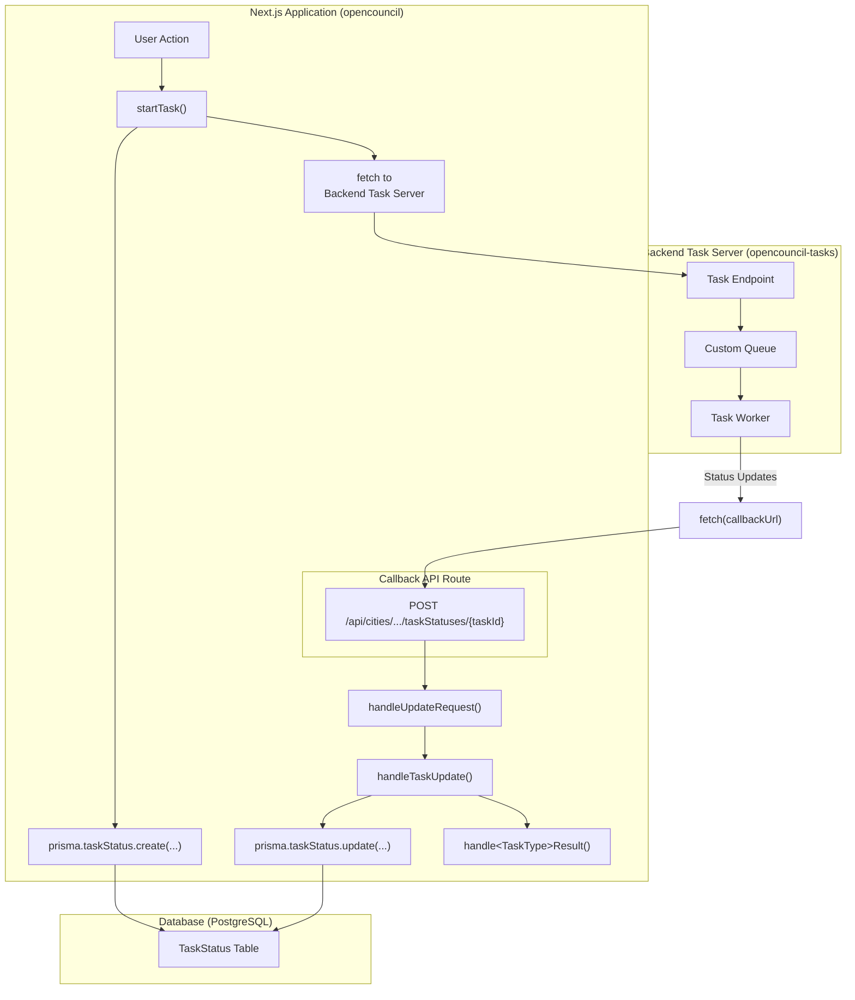

# Task Workflow Architecture

This document outlines the architecture and workflow for handling asynchronous tasks in the OpenCouncil platform. It serves as a reference for understanding the system and as a guide for adding new tasks.

## Table of Contents

1. [High-Level Overview](#1-high-level-overview)
2. [Component Descriptions](#2-component-descriptions)
3. [Automated Task Initiation (Cron)](#3-automated-task-initiation-cron)
4. [The Lifecycle of a Task](#4-the-lifecycle-of-a-task)
5. [Task Handler Registry Pattern](#5-task-handler-registry-pattern)
6. [Task Reprocessing](#6-task-reprocessing)
7. [Error Handling](#7-error-handling)
8. [Adding a New Task](#8-adding-a-new-task)

## 1. High-Level Overview

The task workflow is designed to offload long-running processes, such as media transcription and AI-powered analysis, from the main Next.js application to a dedicated backend task server. This ensures that the main application remains responsive and that resource-intensive tasks are handled efficiently.

The architecture consists of three main components:

1.  **Next.js Application (opencouncil):** The user-facing web application that initiates tasks and receives status updates.
2.  **Backend Task Server ([opencouncil-tasks](https://github.com/schemalabz/opencouncil-tasks)):** A Node.js server responsible for executing the tasks.
3.  **PostgreSQL Database:** Stores task-related information, including status, request payloads, and results.

### Architecture Diagram



## 2. Component Descriptions

### Next.js Application (opencouncil)

-   **Role:** Initiates tasks and handles updates.
-   **Key Files:**
    -   `src/lib/tasks/tasks.ts`: Contains the core logic for starting tasks (`startTask`), handling updates (`handleTaskUpdate`), and the task handler registry (`taskHandlers`).
    -   `src/lib/tasks/types.ts`: Centralized task configuration and type definitions with automatic derivation of pipeline tasks and stages.
    -   `src/app/api/cities/[cityId]/meetings/[meetingId]/taskStatuses/[taskStatusId]/route.ts`: The API endpoint that receives all callback requests from the task server. Uses the task handler registry for routing.
    -   `src/lib/apiTypes.ts`: Defines the TypeScript interfaces for task requests and results.
    -   Task-specific handlers (e.g., `src/lib/tasks/transcribe.ts`): Contain the logic for processing the results of a specific task type. All handlers follow a consistent signature supporting optional `force` flag.
    -   `src/components/meetings/admin/TaskStatus.tsx`: UI component for displaying and reprocessing tasks, with special handling for tasks that require data cleanup.

### Backend Task Server (opencouncil-tasks)

-   **Role:** Executes long-running tasks.
-   **Technology:** Node.js
-   **Queueing:** Uses a custom in-memory queue to manage tasks.
-   **Deployment:** Deployed as a droplet on DigitalOcean.

### PostgreSQL Database

-   **Role:** Persists task-related data.
-   **Key Table:** `TaskStatus`
    -   `id`: Unique identifier for the task.
    -   `type`: The type of the task (e.g., "transcribe", "summarize").
    -   `status`: The current status of the task ("pending", "processing", "succeeded", "failed").
    -   `requestBody`: The JSON payload sent to the task server.
    -   `responseBody`: The JSON result received from the task server.
    -   `councilMeetingId`: Foreign key to the `CouncilMeeting` table.
    -   `version`: A version number for the task, allowing for reprocessing.
    -   ...and other relevant fields.

## 3. Automated Task Initiation (Cron)

Some tasks are initiated automatically on a schedule rather than by a user action. These use cron-triggered API routes that authenticate via a shared secret (`CRON_SECRET`).

### Diavgeia Decision Polling

The `pollDecisions` task can be triggered automatically to fetch decisions from [Diavgeia](https://diavgeia.gov.gr) (the Greek government transparency portal) for recent council meetings.

**Endpoint:** `GET /api/cron/poll-decisions`
**Authentication:** `Authorization: Bearer <CRON_SECRET>`

**What it does:**
1. Finds meetings from the last 90 days in cities that have `diavgeiaUid` configured
2. Filters to meetings that still have subjects with no linked decision
3. Applies progressive backoff based on previous polling history (see below)
4. Dispatches `pollDecisions` tasks to the backend task server for up to 10 meetings per invocation
5. Only polls for subjects that don't already have a decision

**Progressive backoff:**
Some subjects may never have decisions on Diavgeia, so the cron uses time-based backoff to avoid polling forever. It derives the first and last poll dates from existing `TaskStatus` records (type `pollDecisions`, status `succeeded`) for each meeting:

| Days since first poll | Minimum interval between polls |
|-----------------------|-------------------------------|
| 0–7 (week 1)         | None (every cron run)         |
| 7–14 (week 2)        | 2 days                        |
| 14–21 (week 3)       | 3 days                        |
| 21+ (week 4+)        | 7 days                        |
| 90+                   | Automatic polling stops        |

With the cron running 2x/day, this means ~14 polls in week 1, ~3-4 in week 2, ~2-3 in week 3, then ~1/week.

After automatic polling stops, users can still manually fetch decisions from the subject page. The backoff schedule is defined as `BACKOFF_SCHEDULE` at the top of `pollDecisions.ts` and is easy to adjust.

**Polling stats:**
To fine-tune the backoff schedule, use the stats endpoint:

```bash
curl -H "Authorization: Bearer $CRON_SECRET" https://your-domain.com/api/cron/poll-decisions-stats
```

This returns per-decision data showing: when Diavgeia published it, when the cron found it, how many poll attempts it took, and the delay between the meeting date and publication. Use the summary stats (average/median discovery delay, publish delay) to decide if the schedule needs tuning.

**Setup:**
1. Set the `CRON_SECRET` environment variable (generate with `openssl rand -base64 32`)
2. Configure an external cron scheduler (e.g., Vercel Cron, GitHub Actions, or a simple crontab) to call the endpoint periodically:

```bash
# Poll every 12 hours (2x/day)
0 0,12 * * * curl -s -H "Authorization: Bearer $CRON_SECRET" https://your-domain.com/api/cron/poll-decisions
```

**Key files:**
- `src/app/api/cron/poll-decisions/route.ts` — Cron API route
- `src/app/api/cron/poll-decisions-stats/route.ts` — Polling effectiveness stats
- `src/lib/tasks/pollDecisions.ts` — `pollDecisionsForRecentMeetings()` (cron logic), `getPollingStats()` (stats), `pollDecisionsForMeeting()` (core logic shared with admin UI and cron)

**Prerequisites per city:**
- City must have `diavgeiaUid` set (configured in city settings)
- Optionally, administrative bodies can have `diavgeiaUnitIds` for more precise matching

### Adding New Cron Tasks

To add a new cron-triggered task:
1. Create a new API route under `src/app/api/cron/<task-name>/route.ts`
2. Authenticate with `CRON_SECRET` (see the poll-decisions route for the pattern)
3. Call `startTask()` for each unit of work — the rest of the task lifecycle (execution, callbacks, result handling) follows the standard flow described below

## 4. The Lifecycle of a Task

1.  **Initiation:**
    -   A user action (or cron job) in the Next.js application triggers the `startTask` function.
    -   A new entry is created in the `TaskStatus` table with a status of `"pending"`.
    -   A `POST` request is sent to the backend task server's corresponding endpoint (e.g., `/transcribe`). The request body includes the task parameters and a `callbackUrl`.

2.  **Execution:**
    -   The backend task server receives the request and adds the task to its queue.
    -   A worker process picks up the task and begins execution.
    -   During execution, the worker can send status updates back to the `callbackUrl` with a status of `"processing"` and the current progress.

3.  **Completion:**
    -   Upon completion, the worker sends a final update to the `callbackUrl`:
        -   If successful, the status is `"success"`, and the `result` field contains the task's output.
        -   If an error occurred, the status is `"error"`, and the `error` field contains the error message.

4.  **Update Handling:**
    -   The Next.js application's callback endpoint receives the update.
    -   The `handleTaskUpdate` function updates the corresponding `TaskStatus` record in the database.
    -   If the task was successful, a task-specific result handler (e.g., `handleTranscribeResult`) is called to process the results.

## 5. Task Handler Registry Pattern

To maintain clean, scalable code, the system uses a centralized task handler registry. This pattern is defined in `src/lib/tasks/registry.ts`:

```typescript
// Task handler registry - maps task types to their result handlers
export type TaskResultHandler = (taskId: string, result: any, options?: { force?: boolean }) => Promise<void>;

export const taskHandlers: Record<string, TaskResultHandler> = {
    transcribe: handleTranscribeResult,
    summarize: handleSummarizeResult,
    generatePodcastSpec: handleGeneratePodcastSpecResult,
    // ... other handlers
};
```

### Handler Signature

All task handlers follow a consistent signature:

```typescript
async function handleTaskResult(
    taskId: string, 
    result: TaskResult, 
    options?: { force?: boolean }
): Promise<void>
```

The optional `options` parameter allows handlers to accept flags like `force` for special processing modes (see Task Reprocessing section).

## 6. Task Reprocessing

A key feature of the task architecture is the ability to reprocess the results of a task without having to re-run the entire task on the backend server. This is made possible by storing the complete `responseBody` from the task server in the `TaskStatus` table.

### Basic Reprocessing

The `processTaskResponse` function in `src/lib/tasks/tasks.ts` uses the task handler registry to reprocess stored results:

```typescript
import { taskHandlers } from './registry';

export const processTaskResponse = async (taskType: string, taskId: string, options?: { force?: boolean }) => {
    const task = await prisma.taskStatus.findUnique({ where: { id: taskId } });
    if (!task) {
        console.error(`Task ${taskId} not found`);
        return;
    }

    const handler = taskHandlers[taskType];
    if (!handler) {
        throw new Error(`Unsupported task type: ${taskType}`);
    }

    await handler(taskId, JSON.parse(task.responseBody!), options);
}
```

### Force Mode for Data Cleanup

Some tasks, particularly `transcribe`, create data that cannot be simply updated in place. For these tasks, the `force` flag enables cleanup before reprocessing:

**Transcribe Task Cleanup:**
When reprocessing a transcribe task with `force: true`, the system:
1. Delete all `SpeakerTag` records used by the meeting's segments, which cascades to delete `SpeakerSegment` and then `Utterance` records.
2. Recreates everything from the stored response

This prevents duplicate data and ensures a clean slate.

**Other Tasks (Summarize, etc.):**
Most other tasks use `upsert` operations, so they can safely reprocess without the `force` flag. They simply update existing records or create new ones as needed.

### UI Integration

The `TaskStatus` component (`src/components/meetings/admin/TaskStatus.tsx`) provides a user-friendly interface for reprocessing:

**All tasks show a dialog with:**
- Clear explanation that reprocessing uses saved database results (doesn't re-run the task on the server)
- Loading states with spinners during reprocessing
- Success/error feedback messages

**Task-specific behavior:**
- **For transcribe tasks:** Shows two action buttons:
  - "Reprocess Only" - Attempts reprocessing without cleanup (may create duplicates)
  - "Delete & Reprocess" - Cleans up existing data first (recommended)
  
- **For other tasks:** Shows single "Reprocess from Database" button
  - Uses upsert operations to safely update existing data
  - No risk of duplicates

This approach provides clear feedback, prevents user confusion, and handles both idempotent and non-idempotent tasks appropriately.

## 7. Error Handling

-   If the initial `fetch` call from the Next.js app to the task server fails, the task status is immediately set to `"failed"`.
-   If the task fails on the backend server, it reports the `"error"` status back to the Next.js app.
-   There is no automatic retry mechanism. Failed tasks can be reprocessed using the TaskStatus UI component.
-   Result processing errors are caught and logged, with the task status updated to `"failed"` and Discord alerts sent to admins.

## 8. Adding a New Task

Thanks to the task handler registry pattern, adding a new task type is straightforward. Follow these steps:

### 1. Add to Task Configuration
In `src/lib/tasks/types.ts`, add your new task to the `TASK_CONFIG` object:

```typescript
export const TASK_CONFIG = {
    // ... existing tasks
    myNewTask: {
        requiredForPipeline: false, // or true if it's part of the main pipeline
    },
} as const;
```

The system will automatically derive the task type and include it in the appropriate categories.

### 2. Define Types
In `src/lib/apiTypes.ts`, create interfaces for the task's request and result:

```typescript
export interface MyNewTaskRequest extends TaskRequest {
    // ... task-specific parameters
    myParam: string;
}

export interface MyNewTaskResult {
    // ... task-specific result data
    outputData: string;
}
```

### 3. Create a Result Handler
Create a new file in `src/lib/tasks/` (e.g., `myNewTask.ts`) with a handler function:

```typescript
import { MyNewTaskResult } from '@/lib/apiTypes';
import prisma from '@/lib/db/prisma';

export const handleMyNewTaskResult = async (
    taskId: string, 
    result: MyNewTaskResult,
    options?: { force?: boolean }
) => {
    const task = await prisma.taskStatus.findUnique({ 
        where: { id: taskId } 
    });

    if (!task) {
        throw new Error('Task not found');
    }

    // If your task creates data that might need cleanup on reprocess:
    if (options?.force) {
        // Clean up existing data
        await prisma.myEntity.deleteMany({
            where: { meetingId: task.councilMeetingId }
        });
    }

    // Process the result and update the database
    // Use upsert operations when possible for idempotency
    await prisma.myEntity.upsert({
        where: { /* unique identifier */ },
        update: { /* fields to update */ },
        create: { /* fields to create */ }
    });
};
```

### 4. Register the Handler
In `src/lib/tasks/registry.ts`, add your handler to the registry:

```typescript
import { handleMyNewTaskResult } from './myNewTask';

export const taskHandlers: Record<string, TaskResultHandler> = {
    // ... existing handlers
    myNewTask: handleMyNewTaskResult,
};
```

That's it! The registry pattern automatically handles routing for:
- The API callback endpoint (`route.ts`)
- Task reprocessing (`processTaskResponse`)
- Type safety and consistency

### 5. Implement the Backend Task
On the `opencouncil-tasks` server:
- Create a new endpoint (e.g., `/my-new-task`)
- Accept the `MyNewTaskRequest` payload
- Send status updates to the `callbackUrl`

### 6. Update the Frontend
Create UI elements that call `startTask` with your new task type:

```typescript
import { startTask } from '@/lib/tasks/tasks';

const requestBody: MyNewTaskRequest = {
    myParam: 'value',
    // callbackUrl is added automatically
};

await startTask('myNewTask', requestBody, councilMeetingId, cityId);
```

### Key Principles for New Tasks

1. **Idempotency:** Use `upsert` operations when possible so tasks can be safely reprocessed
2. **Force Mode:** If your task creates data that can't be upserted, implement cleanup logic when `options?.force` is true
3. **Error Handling:** Let errors bubble up; the system handles logging and status updates
4. **Transactions:** Use Prisma transactions for operations that create multiple related records
5. **Consistent Signature:** Always follow the `TaskResultHandler` signature for compatibility with the registry
