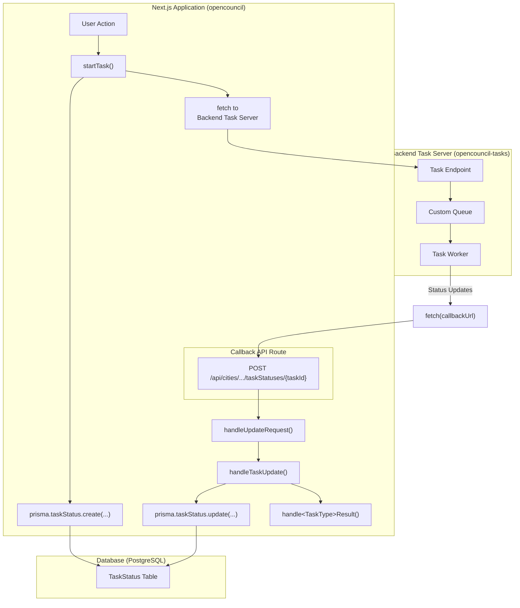

# Task Workflow Architecture

This document outlines the architecture and workflow for handling asynchronous tasks in the OpenCouncil platform. It serves as a reference for understanding the system and as a guide for adding new tasks.

## 1. High-Level Overview

The task workflow is designed to offload long-running processes, such as media transcription and AI-powered analysis, from the main Next.js application to a dedicated backend task server. This ensures that the main application remains responsive and that resource-intensive tasks are handled efficiently.

The architecture consists of three main components:

1.  **Next.js Application (opencouncil):** The user-facing web application that initiates tasks and receives status updates.
2.  **Backend Task Server ([opencouncil-tasks](https://github.com/schemalabz/opencouncil-tasks)):** A Node.js server responsible for executing the tasks.
3.  **PostgreSQL Database:** Stores task-related information, including status, request payloads, and results.

### Architecture Diagram



## 2. Component Descriptions

### Next.js Application (opencouncil)

-   **Role:** Initiates tasks and handles updates.
-   **Key Files:**
    -   `src/lib/tasks/tasks.ts`: Contains the core logic for starting tasks (`startTask`) and handling updates (`handleTaskUpdate`).
    -   `src/lib/tasks/types.ts`: Centralized task configuration and type definitions with automatic derivation of pipeline tasks and stages.
    -   `src/app/api/cities/[cityId]/meetings/[meetingId]/taskStatuses/[taskStatusId]/route.ts`: The API endpoint that receives all callback requests from the task server.
    -   `src/lib/apiTypes.ts`: Defines the TypeScript interfaces for task requests and results.
    -   Task-specific handlers (e.g., `src/lib/tasks/transcribe.ts`): Contain the logic for processing the results of a specific task type.

### Backend Task Server (opencouncil-tasks)

-   **Role:** Executes long-running tasks.
-   **Technology:** Node.js
-   **Queueing:** Uses a custom in-memory queue to manage tasks.
-   **Deployment:** Deployed as a droplet on DigitalOcean.

### PostgreSQL Database

-   **Role:** Persists task-related data.
-   **Key Table:** `TaskStatus`
    -   `id`: Unique identifier for the task.
    -   `type`: The type of the task (e.g., "transcribe", "summarize").
    -   `status`: The current status of the task ("pending", "processing", "succeeded", "failed").
    -   `requestBody`: The JSON payload sent to the task server.
    -   `responseBody`: The JSON result received from the task server.
    -   `councilMeetingId`: Foreign key to the `CouncilMeeting` table.
    -   `version`: A version number for the task, allowing for reprocessing.
    -   ...and other relevant fields.

## 3. The Lifecycle of a Task

1.  **Initiation:**
    -   A user action in the Next.js application triggers the `startTask` function.
    -   A new entry is created in the `TaskStatus` table with a status of `"pending"`.
    -   A `POST` request is sent to the backend task server's corresponding endpoint (e.g., `/transcribe`). The request body includes the task parameters and a `callbackUrl`.

2.  **Execution:**
    -   The backend task server receives the request and adds the task to its queue.
    -   A worker process picks up the task and begins execution.
    -   During execution, the worker can send status updates back to the `callbackUrl` with a status of `"processing"` and the current progress.

3.  **Completion:**
    -   Upon completion, the worker sends a final update to the `callbackUrl`:
        -   If successful, the status is `"success"`, and the `result` field contains the task's output.
        -   If an error occurred, the status is `"error"`, and the `error` field contains the error message.

4.  **Update Handling:**
    -   The Next.js application's callback endpoint receives the update.
    -   The `handleTaskUpdate` function updates the corresponding `TaskStatus` record in the database.
    -   If the task was successful, a task-specific result handler (e.g., `handleTranscribeResult`) is called to process the results.

## 4. Reprocessing Task Results

A key feature of the task architecture is the ability to reprocess the results of a task without having to re-run the entire task on the backend server. This is made possible by storing the complete `responseBody` from the task server in the `TaskStatus` table.

If the logic for processing a task's result needs to be updated (e.g., to fix a bug or add an enhancement), you can simply re-trigger the result processing for the affected tasks. The `processTaskResponse` function in `src/lib/tasks/tasks.ts` is designed for this purpose. It retrieves the stored `responseBody` and passes it to the appropriate `handle[TaskType]Result` function, effectively re-running the result processing logic with the original data.

This capability significantly speeds up development and debugging, as you can iterate on the result handling logic without waiting for the long-running task to complete each time.

## 5. Error Handling

-   If the initial `fetch` call from the Next.js app to the task server fails, the task status is immediately set to `"failed"`.
-   If the task fails on the backend server, it reports the `"error"` status back to the Next.js app.
-   There is no automatic retry mechanism. Failed tasks must be re-initiated manually.

## 6. Adding a New Task

To add a new task type to the system, follow these steps:

1.  **Add to Task Configuration:**
    -   In `src/lib/tasks/types.ts`, add your new task to the `TASK_CONFIG` object with appropriate `requiredForPipeline` setting.
    -   The system will automatically derive the task type and include it in the appropriate categories.

2.  **Define Types:**
    -   In `src/lib/apiTypes.ts`, create new interfaces for the task's request and result data. For example:

    ```typescript
    export interface MyNewTaskRequest extends TaskRequest {
        // ... task-specific parameters
    }

    export interface MyNewTaskResult {
        // ... task-specific result data
    }
    ```

3.  **Create a Result Handler:**
    -   Create a new file in `src/lib/tasks/` for the new task (e.g., `myNewTask.ts`).
    -   In this file, create a handler function to process the task's result. This function will be called when the task completes successfully.

    ```typescript
    import { MyNewTaskResult } from '@/lib/apiTypes';

    export const handleMyNewTaskResult = async (taskId: string, result: MyNewTaskResult) => {
        // ... logic to process the result and update the database
    };
    ```

4.  **Update the Callback Handler:**
    -   In `src/app/api/cities/[cityId]/meetings/[meetingId]/taskStatuses/[taskStatusId]/route.ts`, add a new `else if` block to the `handleUpdateRequest` function to handle the new task type.

    ```typescript
    // ... inside handleUpdateRequest
    import { handleMyNewTaskResult } from '@/lib/tasks/myNewTask';
    import { MyNewTaskResult } from '@/lib/apiTypes';

    // ...
    } else if (taskStatus.type === 'myNewTask') {
        await handleTaskUpdate(taskStatusId, update as TaskUpdate<MyNewTaskResult>, handleMyNewTaskResult);
    }
    // ...
    ```

5.  **Update the `processTaskResponse` function:**
    - In `src/lib/tasks/tasks.ts`, update `processTaskResponse` to include your new task. This is used for reprocessing tasks.

6.  **Implement the Backend Task:**
    -   On the `opencouncil-tasks` server, create a new endpoint (e.g., `/my-new-task`) that accepts the `MyNewTaskRequest` payload.
    -   Implement the task logic, ensuring that it sends status updates to the `callbackUrl`.

7.  **Update the Frontend:**
    -   In the frontend, create a new UI element that calls the `startTask` function with the new task type and request body.
    
That's it! By following these steps, you can easily extend the platform with new asynchronous task capabilities. 

## 6. Task Reprocessing
A key feature of the task architecture is the ability to reprocess task results without re-executing the entire task on the backend server. This is made possible by persisting the complete, raw `responseBody` from the task server in the `TaskStatus` table.

This design choice provides significant flexibility. For example, if a bug is discovered in a result handler (e.g., in `handleTranscribeResult`), we can deploy a fix and then re-run the handler on the existing `responseBody` to correct the data in our database. This avoids the cost and time of reprocessing the original media files.

The `processTaskResponse` function in `src/lib/tasks/tasks.ts` is the entry point for this reprocessing logic. It takes a `taskId` and `taskType`, retrieves the stored `responseBody`, and passes it to the appropriate result handler.